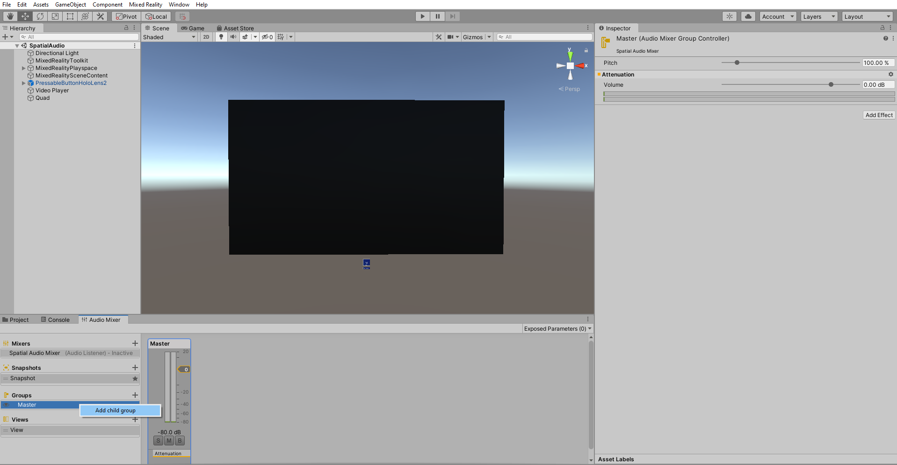
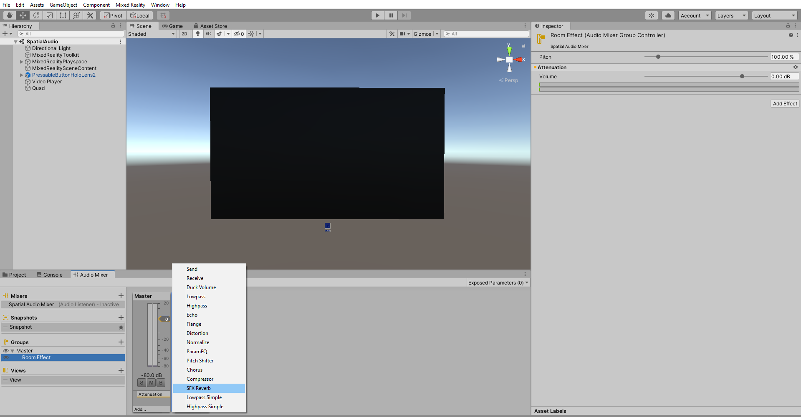
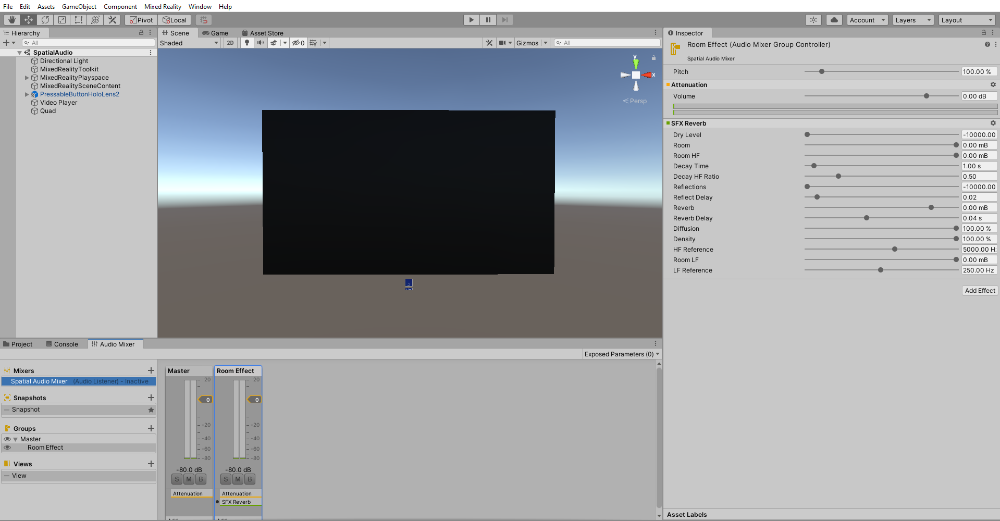
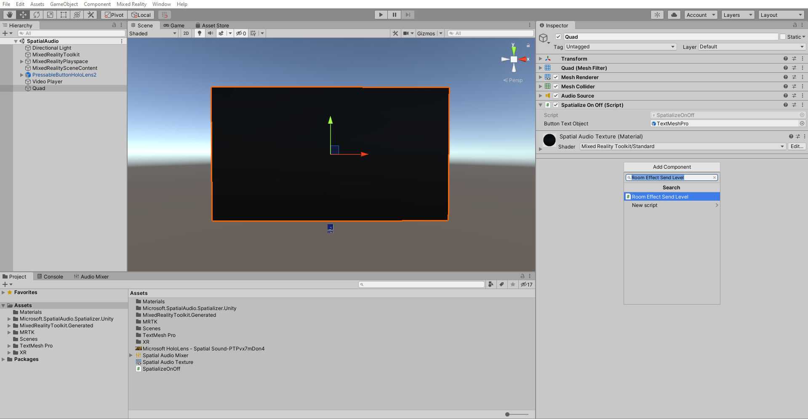
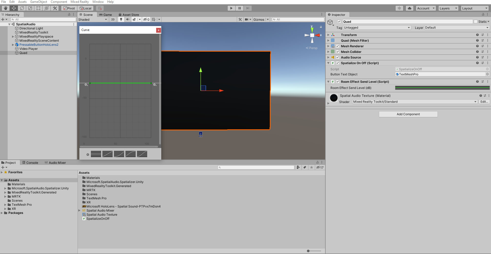
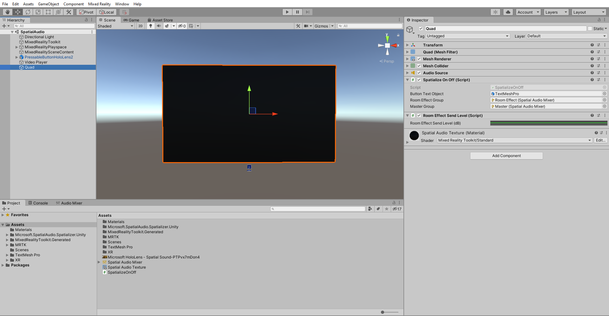

# 5. Using reverb to add distance to spatial audio

## Overview

In previous tutorial, you have added spatialization for the sounds to give them a sense of direction in this tutorial you'll add a reverb effect to give sounds a sense of distance.

## Objectives

* Improve perceived distance of sound sources by adding reverb.
* Control perceived distance of the sound using the listener's distance to the hologram.

## Add a mixer group and a reverb effect

In [Spatializing button interaction sounds Tutorial](unity-spatial-audio-ch2.md), we added a mixer. The mixer includes one **Group** by default called **Master**. Because we'll only want to apply a reverb effect to some sounds, let's add a second Group for those sounds. To add a Group, right click on the Master group in the **Audio Mixer** choose **Add child group** and give suitable name for example _Room Effect_:



Each **Group** has its own set of effects. Add a reverb effect to the new group by clicking **Add...** on the new group, and choosing **SFX Reverb**:



In audio terminology, the original, unreverberated audio is called the _dry path_, and the audio after filtering with the reverb filter is called the _wet path_. Both paths are sent to the audio output, and their relative strengths in this mixture is called the _wet/dry mix_. The wet/dry mix strongly affects the sense of distance.

The **SFX Reverb** includes controls to adjust the wet/dry mix within the effect. Because the **Microsoft Spatializer** plugin handles the dry path, we'll be using the **SFX Reverb** only for the wet path. On the Inspector pane of your **SFX Reverb**:

* Set the **Dry Level** property to the lowest setting (-10000 mB)
* Set the **Room property** to the highest setting (0 mB)



The other settings control the feel of the simulated room. In particular, **Decay Time** is related to perceived room size.

## Enable reverb on the video playback

There are two steps to enable reverb on an audio source:

* Route the **Audio Source** to the appropriate **Group**
* Set the **Microsoft Spatializer** plugin to pass audio into the **Group** for processing

In the following steps, you will adjust the script to control the audio routing, and attach a control script provided with the **Microsoft Spatializer** plugin to feed data into the reverb.

With the **Quad** selected in the Hierarchy click **Add Component** On the Inspector window and add the **Room Effect Send Level(Script)**:



> [!NOTE]
> Unless you enable **Room Effect Send Level** feature of the **Microsoft Spatializer** plugin, it doesn't send any audio back to the Unity audio engine for effect processing.

The **Room Effect Send Level** component includes a graph control that sets the level of the audio sent to the Unity audio engine for reverb processing. To open the graph control, click on the **Room Effect Send Level**.  Click and drag the green curve downwards to set the level to about -30dB:



Next, uncomment the 4 commented lines in the **SpatializeOnOff** script. The script will now look like this:

```c#
using System.Collections;
using System.Collections.Generic;
using UnityEngine;
using UnityEngine.Audio;

[RequireComponent(typeof(AudioSource))]
public class SpatializeOnOff : MonoBehaviour
{
    public GameObject ButtonTextObject;
    public AudioMixerGroup RoomEffectGroup;
    public AudioMixerGroup MasterGroup;

    private AudioSource m_SourceObject;
    private bool m_IsSpatialized;
    private TMPro.TextMeshPro m_TextMeshPro;

    public void Start()
    {
        m_SourceObject = gameObject.GetComponent<AudioSource>();
        m_TextMeshPro = ButtonTextObject.GetComponent<TMPro.TextMeshPro>();
        SetSpatialized();
    }

    public void SwapSpatialization()
    {
        if (m_IsSpatialized)
        {
            SetStereo();
        }
        else
        {
            SetSpatialized();
        }
    }

    private void SetSpatialized()
    {
        m_IsSpatialized = true;
        m_SourceObject.spatialBlend = 1;
        m_TextMeshPro.SetText("Set Stereo");
        m_SourceObject.outputAudioMixerGroup = RoomEffectGroup;
    }

    private void SetStereo()
    {
        m_IsSpatialized = false;
        m_SourceObject.spatialBlend = 0;
        m_TextMeshPro.SetText("Set Spatialized");
        m_SourceObject.outputAudioMixerGroup = MasterGroup;
    }

}
```

Once these lines are Uncommented  it adds two properties to the Inspector of the **SpatializeOnOff script**. assign these on the Inspector window of **SpatializeOnOff** component of the **Quad**.

With the Quad object still selected in the Hierarchy , in the Inspector window locate the **SpatializeOnOff Script** component and :

* Set the **Room Effect Group** property to your new Room Effect mixer group
* Set the **Master Group** property to the Master mixer group



## Congratulations

You've completed the HoloLens 2 spatial audio tutorials for Unity. Try out the app on a HoloLens 2 or Unity. When you click the button in the app to activate spatialization, the script will route the video's audio to the Room Effect Group to add reverb. When switching to stereo, it will route the audio to the Master group, and avoid adding reverb.

> [!TIP]
> For a reminder on how to build and deploy your Unity project to HoloLens 2, you can refer to the [Building your app to your HoloLens 2](mr-learning-base-02.md#building-your-application-to-your-hololens-2) instructions.
