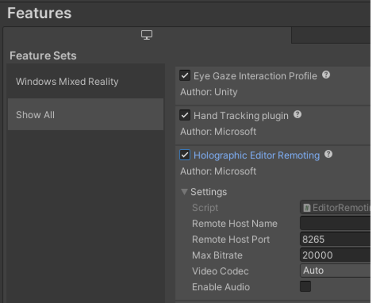

# Preview your work with Holographic Remoting

You can use Holographic Remoting to stream holographic content to your HoloLens 2 in real time. This is a great way to quickly debug your app without building and deploying a full project. 

A fast way to work on your Unity project is to use "Play Mode", which runs your app locally in the Unity editor on your PC. Unity uses Holographic Remoting to provide a fast way to preview your content on a real HoloLens device. Play Mode can also be used with a Windows Mixed Reality headset attached to your development PC.

## Run Holographic Remoting Player on HoloLens 2

1. First, you need to [install the Holographic Remoting Player app](https://www.microsoft.com/store/productId/9NBLGGH4SV40) from the Microsoft Store on your HoloLens 2
2. Run the Holographic Remoting Player app on the HoloLens 2 and you'll see the version number and IP address to connect to
    * You'll need v2.4 or later to work with the OpenXR plugin

    

## Unity Play Mode with Holographic Remoting

With Holographic Remoting, you can experience your app on the HoloLens while it runs in the Unity editor on your PC. Gaze, gesture, voice, and spatial mapping input is sent from your HoloLens to your PC. Rendered frames are then sent back to your HoloLens. This is a great way to quickly debug your app without building and deploying a full project.

[!INCLUDE]

Holographic Remoting requires a fast PC and Wi-Fi connection. You can find more details in the [Holographic Remoting Overview](../native/holographic-remoting-overview.md) documentation.

For best results, make sure your app properly sets the [focus point](focus-point-in-unity.md). This helps Holographic Remoting to best adapt your scene to the latency of your wireless connection.

## See Also

* [Holographic Remoting Overview](../native/holographic-remoting-overview.md)
