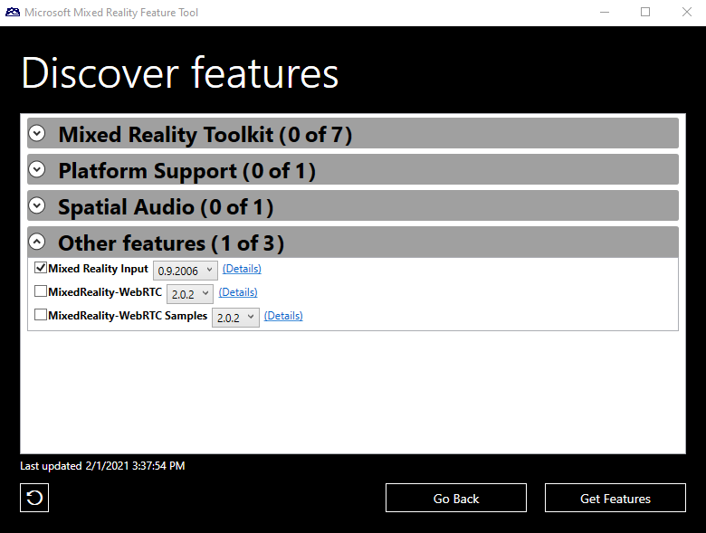

# HP Reverb G2 Controllers in Unity

HP Motion controllers are a brand new type of Windows Mixed Reality controllers: all the same tracking technology with a slightly different set of available inputs: 

* Touchpad has been replaced by two buttons: A and B for the right controller, and X and Y for the left controller. 
* Grasp is now a trigger that publishes a stream of values between 0.0 and 1.0 instead of a button with Pressed and Not Pressed states. 

Since the new inputs aren't accessible through existing Windows and Unity APIs, you need the dedicated **Microsoft.MixedReality.Input** UPM Package. 

> [!IMPORTANT]
> **Classes in this package do not replace existing Windows and Unity APIs but complement them.** Features commonly available to both classic Windows Mixed Reality controllers and HP Motion Controllers are accessible through the same code path using existing APIs. Only the new inputs require the use of the additional Microsoft.MixedReality.Input package. 

## HP Motion Controller overview

*Microsoft.MixedReality.Input.MotionController* represents a motion controller. Each *MotionController* instance has an *XR.WSA.Input.InteractionSource* peer, which can be correlated using handedness, vendor ID, product ID, and version. 

You can grab MotionController instances by creating a *MotionControllerWatcher* and subscribing to its events, similar to using *InteractionManager* events to discover new *InteractionSource* instances. The MotionController’s methods and properties describe the inputs supported by the controller, including its buttons, triggers, 2D axis, and thumbstick. The MotionController class also exposes methods for accessing input states through the *MotionControllerReading* class. The MotionControllerReading class represents a snapshot of the controller’s state at a given time. 

## Installing Microsoft.MixedReality.Input with the Mixed Reality Feature Tool

Install the Microsoft.MixedReality.Input plugin with the new Mixed Reality Feature Tool application. Follow the [installation and usage instructions](welcome-to-mr-feature-tool.md) and select the **Mixed Reality Input** package in the Mixed Reality Toolkit category:



## Using Microsoft.MixedReality.Input 

### Input values

A MotionController can expose two kinds of inputs: 

* Buttons and trigger states are expressed by a unique float value between 0.0 and 1.0 that indicates how much they're pressed.
    * A button can only return 0.0 (when not pressed) or 1.0 (when pressed) while a trigger can return continuous values between 0.0 (fully released) to 1.0 (fully pressed). 
* Thumbstick state is expressed by a Vector2 whose X and Y components are between -1.0 and 1.0. 

You can use *MotionController.GetPressableInputs()* to return a list of inputs returning a pressed value (buttons and triggers) or the *MotionController.GetXYInputs()* method to return a list of inputs returning a 2-axis value. 

A MotionControllerReading instance represents the state of the controller at a given time: 

* *GetPressedValue()* retrieves the state of a button or a trigger. 
* *GetXYValue()* retrieves the state of a thumbstick. 

### Creating a cache to maintain a collection of MotionController instances and their states 

Start by instantiating a MotionControllerWatcher and registering handlers for its *MotionControllerAdded* and *MotionControllerRemoved* events to keep a cache of available MotionController instances. This cache should be a MonoBehavior attached to a GameObject as demonstrated in the following code:

```csharp
public class MotionControllerStateCache : MonoBehaviour 
{ 
    /// <summary> 
    /// Internal helper class which associates a Motion Controller 
    /// and its known state 
    /// </summary> 
    private class MotionControllerState 
    { 
        /// <summary> 
        /// Construction 
        /// </summary> 
        /// <param name="mc">motion controller</param>` 
        public MotionControllerState(MotionController mc) 
        { 
            this.MotionController = mc; 
        } 

        /// <summary> 
        /// Motion Controller that the state represents 
        /// </summary> 
        public MotionController MotionController { get; private set; } 
        … 
    } 

    private MotionControllerWatcher _watcher; 
    private Dictionary<Handedness, MotionControllerState> 
        _controllers = new Dictionary<Handedness, MotionControllerState>(); 

    /// <summary> 
    /// Starts monitoring controller's connections and disconnections 
    /// </summary> 
    public void Start() 
    { 
        _watcher = new MotionControllerWatcher(); 
        _watcher.MotionControllerAdded += _watcher_MotionControllerAdded; 
        _watcher.MotionControllerRemoved += _watcher_MotionControllerRemoved; 
        var nowait = _watcher.StartAsync(); 
    } 

    /// <summary> 
    /// Stops monitoring controller's connections and disconnections 
    /// </summary> 
    public void Stop() 
    { 
        if (_watcher != null) 
        { 
            _watcher.MotionControllerAdded -= _watcher_MotionControllerAdded; 
            _watcher.MotionControllerRemoved -= _watcher_MotionControllerRemoved; 
            _watcher.Stop(); 
        } 
    }

    /// <summary> 
    /// called when a motion controller has been removed from the system: 
    /// Remove a motion controller from the cache 
    /// </summary> 
    /// <param name="sender">motion controller watcher</param> 
    /// <param name="e">motion controller </param> 
    private void _watcher_MotionControllerRemoved(object sender, MotionController e) 
    { 
        lock (_controllers) 
        { 
            _controllers.Remove(e.Handedness); 
        } 
    }

    /// <summary> 
    /// called when a motion controller has been added to the system: 
    /// Remove a motion controller from the cache 
    /// </summary> 
    /// <param name="sender">motion controller watcher</param> 
    /// <param name="e">motion controller </param> 
    private void _watcher_MotionControllerAdded(object sender, MotionController e) 
    { 
        lock (_controllers) 
        { 
            _controllers[e.Handedness] = new MotionControllerState(e); 
        } 
    } 
} 
```

### Reading new inputs by polling 

You can read the current state of each known controller through *MotionController.TryGetReadingAtTime* during the *Update* method of the MonoBehavior class. You want to pass *DateTime.Now* as the timestamp parameter to ensure that the latest state of the controller is read. 

```csharp
public class MotionControllerStateCache : MonoBehaviour 
{ 
    … 

    private class MotionControllerState 
    {
        … 

        /// <summary> 
        /// Update the current state of the motion controller 
        /// </summary> 
        /// <param name="when">time of the reading</param> 
        public void Update(DateTime when) 
        { 
            this.CurrentReading = this.MotionController.TryGetReadingAtTime(when); 
        } 

        /// <summary> 
        /// Last reading from the controller 
        /// </summary> 
        public MotionControllerReading CurrentReading { get; private set; } 
    } 

    /// <summary> 
    /// Updates the input states of the known motion controllers 
    /// </summary> 
    public void Update() 
    { 
        var now = DateTime.Now; 

        lock (_controllers) 
        { 
            foreach (var controller in _controllers) 
            { 
                controller.Value.Update(now); 
            } 
        } 
    } 
} 
```

You can grab the controllers current input value using the Handedness of the controller: 

```csharp
public class MotionControllerStateCache : MonoBehaviour 
{ 
    … 
    /// <summary> 
    /// Returns the current value of a controller input such as button or trigger 
    /// </summary> 
    /// <param name="handedness">Handedness of the controller</param> 
    /// <param name="input">Button or Trigger to query</param> 
    /// <returns>float value between 0.0 (not pressed) and 1.0 
    /// (fully pressed)</returns> 
    public float GetValue(Handedness handedness, ControllerInput input) 
    { 
        MotionControllerReading currentReading = null; 

        lock (_controllers) 
        { 
            if (_controllers.TryGetValue(handedness, out MotionControllerState mc)) 
            { 
                currentReading = mc.CurrentReading; 
            } 
        } 

        return (currentReading == null) ? 0.0f : currentReading.GetPressedValue(input); 
    } 

    /// <summary> 
    /// Returns the current value of a controller input such as button or trigger 
    /// </summary> 
    /// <param name="handedness">Handedness of the controller</param> 
    /// <param name="input">Button or Trigger to query</param> 
    /// <returns>float value between 0.0 (not pressed) and 1.0 
    /// (fully pressed)</returns> 
    public float GetValue(UnityEngine.XR.WSA.Input.InteractionSourceHandedness handedness, ControllerInput input) 
    { 
        return GetValue(Convert(handedness), input); 
    } 

    /// <summary> 
    /// Returns a boolean indicating whether a controller input such as button or trigger is pressed 
    /// </summary> 
    /// <param name="handedness">Handedness of the controller</param> 
    /// <param name="input">Button or Trigger to query</param> 
    /// <returns>true if pressed, false if not pressed</returns> 
    public bool IsPressed(Handedness handedness, ControllerInput input) 
    { 
        return GetValue(handedness, input) >= PressedThreshold; 
    } 
} 
```

For example, to read the analog grasp value of an InteractionSource: 

```csharp
/// Read the analog grasp value of all connected interaction sources 
void Update() 
{ 
    … 
    var stateCache = gameObject.GetComponent<MotionControllerStateCache>(); 
    foreach (var sourceState in InteractionManager.GetCurrentReading()) 
    { 
        float graspValue = stateCache.GetValue(sourceState.source.handedness, 
            Microsoft.MixedReality.Input.ControllerInput.Grasp);
        … 
    }
} 
```

### Generating events from the new inputs 

Instead of polling for a controller's state once per frame, you have the option of handling all state changes as events, which lets you handle even the quickest actions lasting less than a frame. In order for this approach to work, the cache of motion controllers needs to process all states published by a controller since the last frame, which you can do by storing the timestamp of the last MotionControllerReading retrieved from a MotionController and calling *MotionController.TryGetReadingAfterTime()*: 

```csharp
private class MotionControllerState 
{ 
    … 
    /// <summary> 
    /// Returns an array representng buttons which are pressed 
    /// </summary> 
    /// <param name="reading">motion controller reading</param> 
    /// <returns>array of booleans</returns> 
    private bool[] GetPressed(MotionControllerReading reading) 
    { 
        if (reading == null) 
        { 
            return null; 
        } 
        else 
        { 
            bool[] ret = new bool[this.pressableInputs.Length]; 
            for (int i = 0; i < pressableInputs.Length; ++i) 
            { 
                ret[i] = reading.GetPressedValue(pressableInputs[i]) >= PressedThreshold; 
            } 

            return ret; 
        } 
    } 

    /// <summary> 
    /// Get the next available state of the motion controller 
    /// </summary> 
    /// <param name="lastReading">previous reading</param> 
    /// <param name="newReading">new reading</param> 
    /// <returns>true is a new reading was available</returns> 
    private bool GetNextReading(MotionControllerReading lastReading, out MotionControllerReading newReading) 
    { 
        if (lastReading == null) 
        { 
            // Get the first state published by the controller 
            newReading = this.MotionController.TryGetReadingAfterSystemRelativeTime(TimeSpan.FromSeconds(0.0)); 
        } 
        else 
        { 
            // Get the next state published by the controller 
            newReading = this.MotionController.TryGetReadingAfterTime(lastReading.InputTime); 
        } 

        return newReading != null; 
    } 

    /// <summary> 
    /// Processes all the new states published by the controller since the last call 
    /// </summary> 
    public IEnumerable<MotionControllerEventArgs> GetNextEvents() 
    {
        MotionControllerReading lastReading = this.CurrentReading; 
        bool[] lastPressed = GetPressed(lastReading); 
        MotionControllerReading newReading; 
        bool[] newPressed; 

        while (GetNextReading(lastReading, out newReading)) 
        { 
            newPressed = GetPressed(newReading); 

            // If we have two readings, compare and generate events 
            if (lastPressed != null) 
            { 
                for (int i = 0; i < pressableInputs.Length; ++i) 
                { 
                    if (newPressed[i] != lastPressed[i]) 
                    { 
                        yield return new MotionControllerEventArgs(this.MotionController.Handedness, newPressed[i], this.pressableInputs[i], newReading.InputTime); 
                    } 
                } 
            } 

            lastPressed = newPressed; 
            lastReading = newReading; 
        } 

        // No more reading 
        this.CurrentReading = lastReading; 
    } 
} 
```

Now that you've updated the cache internal classes, the MonoBehavior class can expose two events – Pressed and Released – and raise them from its Update() method: 

```csharp
/// <summary> 
/// Event argument class for InputPressed and InputReleased events 
/// </summary> 
public class MotionControllerEventArgs : EventArgs 
{ 
    public MotionControllerEventArgs(Handedness handedness, bool isPressed, rollerInput input, DateTime inputTime) 
    { 
        this.Handedness = handedness; 
        this.Input = input; 
        this.InputTime = inputTime; 
        this.IsPressed = isPressed; 
    } 

    /// <summary> 
    /// Handedness of the controller raising the event 
    /// </summary> 
    public Handedness Handedness { get; private set; } 

    /// <summary> 
    /// Button pressed or released 
    /// </summary> 
    public ControllerInput Input { get; private set; } 

    /// <summary> 
    /// Time of the event 
    /// </summary> 
    public DateTime InputTime { get; private set; } 

    /// <summary> 
    /// true if button is pressed, false otherwise 
    /// </summary> 
    public bool IsPressed { get; private set; } 
} 

/// <summary> 
/// Event raised when a button is pressed 
/// </summary> 
public event EventHandler<MotionControllerEventArgs> InputPressed; 

/// <summary> 
/// Event raised when a button is released 
/// </summary> 
public event EventHandler<MotionControllerEventArgs> InputReleased; 

/// <summary> 
/// Updates the input states of the known motion controllers 
/// </summary> 
public void Update() 
{ 
    // If some event handler has been registered, we need to process all states  
    // since the last update, to avoid missing a quick press / release 
    if ((InputPressed != null) || (InputReleased != null)) 
    { 
        List<MotionControllerEventArgs> events = new <MotionControllerEventArgs>(); 

        lock (_controllers) 
        { 
            foreach (var controller in _controllers) 
            { 
                events.AddRange(controller.Value.GetNextEvents()); 
            } 
        } 
 
        // Sort the events by time 
        events.Sort((e1, e2) => DateTime.Compare(e1.InputTime, e2.InputTime)); 

        foreach (MotionControllerEventArgs evt in events) 
        { 
            if (evt.IsPressed && (InputPressed != null)) 
            { 
                InputPressed(this, evt); 
            } 
            else if (!evt.IsPressed && (InputReleased != null)) 
            { 
                InputReleased(this, evt); 
            } 
        } 
    } 
    else 
    { 
        // As we do not predict button presses and the timestamp of the next e is in the future 
        // DateTime.Now is correct in this context as it will return the latest e of controllers 
        // which is the best we have at the moment for the frame. 
        var now = DateTime.Now; 
        lock (_controllers) 
        { 
            foreach (var controller in _controllers) 
            { 
                controller.Value.Update(now); 
            } 
        } 
    } 
} 
```

The structure in the above code examples makes registering events much more readable: 

```csharp
public InteractionSourceHandedness handedness; 
public Microsoft.MixedReality.Input.ControllerInput redButton;

// Start of the Mono Behavior: register handlers for events from cache 
void Start() 
{ 
    var stateCache = gameObject.GetComponent<MotionControllerStateCache>(); 
    stateCache.InputPressed += stateCache_InputPressed; 
    stateCache.InputReleased += stateCache_InputReleased; 
    … 
} 

// Called when a button is released 
private void stateCache_InputReleased(object sender, MotionControllerStateCache.MotionControllerEventArgs e) 
{ 
    if ((e.SourceHandedness == handedness) && (e.Input == redButton)) 
    { 
        … 
    } 
} 

// Called when a button is pressed 
private void stateCache_InputPressed(object sender, MotionControllerStateCache.MotionControllerEventArgs e) 
{ 
    if ((e.SourceHandedness == handedness) && (e.Input == redButton)) 
    { 
        … 
    } 
} 
```

## See also

<!-- ## Getting started

There's no additional setup required to use the HP Reverb G2 controller if you're developing for SteamVR or using the Windows Mixed Reality Input API (XR.WSA.Input). However, the A, B, X, Y buttons and the squeeze trigger are not currently accessible through the Input Manager unless you're using SteamVR. Support for the extra Reverb G2 inputs will be available in the near future, so be sure to check back!

## Porting existing applications

If you already have an existing app that you're developing for Windows Mixed Reality immersive headsets, check out our [porting guide](../porting-apps/porting-guides.md) and [project settings](../porting-apps/porting-guides.md?tabs=project#unity-porting-guidance) sections for general suggestions.

## Mapping input

When you're ready to get your input mapping up and running for your new controllers, start at the [input mapping](../porting-apps/porting-guides.md?tabs=input#unity-porting-guidance) section of the immersive porting guide. Instructions on how to configure inputs in Unity is detailed in [Gestures and motion controllers](gestures-and-motion-controllers-in-unity.md), along with a full [button and axis mapping table](gestures-and-motion-controllers-in-unity.md#using-hp-reverb-g2-controllers) for reference.

## See also
* [Updating for SteamVR](../porting-apps/updating-your-steamvr-application-for-windows-mixed-reality.md) -->