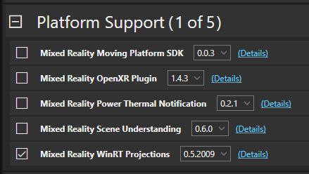

# WinRT APIs with Unity for HoloLens

This page describes how to make use of WinRT APIs in your Unity project for HoloLens.

## Mixed Reality APIs

A Mixed Reality focused subset of the Windows SDK has been made available in a .NET Standard 2.0 compatible projection, which you can use in your project without preprocessor directives. Most APIs in the Windows. Perception and Windows.UI.Input.Spatial namespaces are included and may expand to include additional APIs in the future. The projected APIs can be used while running in the Editor, which enables the use of [Play Mode](/windows/mixed-reality/unity-play-mode). To use this projection, make the following modifications to your project:

1. Add a reference to the Mixed Reality WinRT Projections UPM package using the [Mixed Reality Feature Tool](welcome-to-mr-feature-tool.md).

    

1. Prefix references to the `Windows` namespace with `Microsoft.`:

    ```cs
    using namespace Microsoft.Windows.Perception.Spatial;
    ```

    > [!NOTE]
    > Importing this package can cause namespace resolution issues if your project has inline references to any `Windows.*` namespaces, with the compiler attempting to resolve against a corresponding `Microsoft.Windows.*` namespace.
    > In this case, it's recommended to either update those references to use `global::Windows.*` or to update those scripts to import the specific `Windows.*` namespace as a `using` statement.

1. Replace native pointer casts with `FromNativePtr`:

    ```cs
    var worldOrigin = SpatialCoordinateSystem.FromNativePtr(unityWorldOriginPtr);
    ```

## Conditionally include WinRT API calls

You can also use the WinRT APIs in Unity projects built for the Universal Windows Platform and Xbox One platform by using preprocessor directives. Any code that you write in Unity scripts that target WinRT APIs must be conditionally included for only those builds.

This can be done via two steps in Unity:

1. API compatibility level must be set to **.NET 4.6** or **.NET Standard 2.0** in the player settings
    - **Edit** > **Project Settings** > **Player** > **Configuration** > **Api Compatibility Level** to **.NET 4.6** or **.NET Standard 2.0**
1. The preprocessor directive **ENABLE_WINMD_SUPPORT** must be wrapped around any WinRT-leveraged code

The following code snippet is from the Unity manual page for [Universal Windows Platform: WinRT API in C# scripts](https://docs.unity3d.com/Manual/windowsstore-scripts.html). In this example, an advertising ID is returned, but only on UWP and Xbox One builds:

```cs
using UnityEngine;
public class WinRTAPI : MonoBehaviour {
    void Update() {
        auto adId = GetAdvertisingId();
        // ...
    }

    string GetAdvertisingId() {
        #if ENABLE_WINMD_SUPPORT
            return Windows.System.UserProfile.AdvertisingManager.AdvertisingId;
        #else
            return "";
        #endif
    }
}
```

## Edit your scripts in a Unity C# project

When you double-click a script in the Unity editor, it will by default launch your script in an editor project. The WinRT APIs will appear to be unknown because the Visual Studio project doesn't reference the Windows Runtime. The **ENABLE_WINMD_SUPPORT** directive is undefined and any *#if* wrapped code is ignored until you build your project into a UWP Visual Studio solution.

## See also

- [Build and deploy a Unity Visual Studio solution to the HoloLens](build-and-deploy-to-hololens.md)
- [Windows Runtime Support Unity](https://docs.unity3d.com/Manual/IL2CPP-WindowsRuntimeSupport.html)
