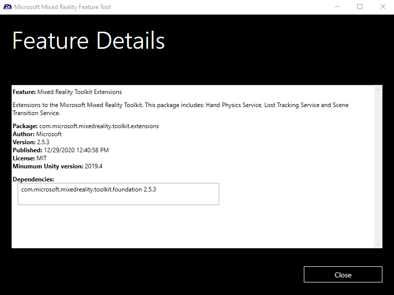

# Feature package details

The **Feature details** view enables reviewing key informatiom about a feature, including:

* Description
* Package name
* Author 
* License
* Required dependencies

## See also

- [Welcome to the Mixed Reality Feature Tool](welcome-to-mr-feature-tool.md)
- [Configuring the feature tool](configuring-feature-tool.md)
- [Discovery and acquisition](discovering-features.md)
- [Importing selected packages](importing-features.md)
- [Reviewing and approving project modifications](reviewing-changes.md)