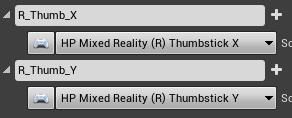
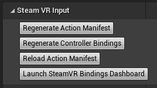

# [OpenXR](#tab/openxr)

# [SteamVR](#tab/steamvr)

Input in Unreal using SteamVR has a few differences.  When setting up the project, first ensure it is using SteamVR’s new input system by adding **vr.SteamVR.EnableVRInput=1** to the **Startup** section in **Engine/Config/ConsoleVariables.ini**.  This ini is found in the engine install directory, not the project directory.

The HP Motion Controller plugin will enable OpenXR.  If you're not using OpenXR, you will need to edit the HMDPluginPriority of SteamVR in BaseEngine.ini in the same directory as ConsoleVariables.ini.  Change the SteamVR value to be greater than the OpenXRHMD value.

When using thumbstick axis events, the name of the axis event must end in “_X” or “_Y” corresponding to the key used.

Finally, register the actions in the game with SteamVR by using the **Regenerate Action Manifest** and 
**Regenerate Controller Bindings** buttons in Project Settings > Steam VR Input.

