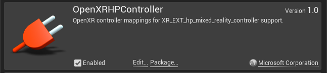
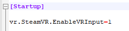
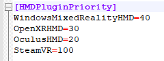

# [All platforms](#tab/all)

### Enabling HP Motion Controller Plugin 

The interaction profile and controller mappings are in the HP Motion Controller plugin, which must be enabled to expose the controller mappings to Unreal’s input system.

# [SteamVR](#tab/steamvr)

### Configuring Startup and HMDPluginPriority

Input in Unreal using SteamVR has a few differences.  When setting up the project, first ensure it is using SteamVR’s new input system by adding **vr.SteamVR.EnableVRInput=1** to the **Startup** section in **Engine/Config/ConsoleVariables.ini**.  This ini is found in the engine install directory, not the project directory.

The HP Motion Controller plugin will enable OpenXR.  If you're not using OpenXR, you will need to edit the HMDPluginPriority of SteamVR in BaseEngine.ini in the same directory as ConsoleVariables.ini.  Change the SteamVR value to be greater than the OpenXRHMD value.

