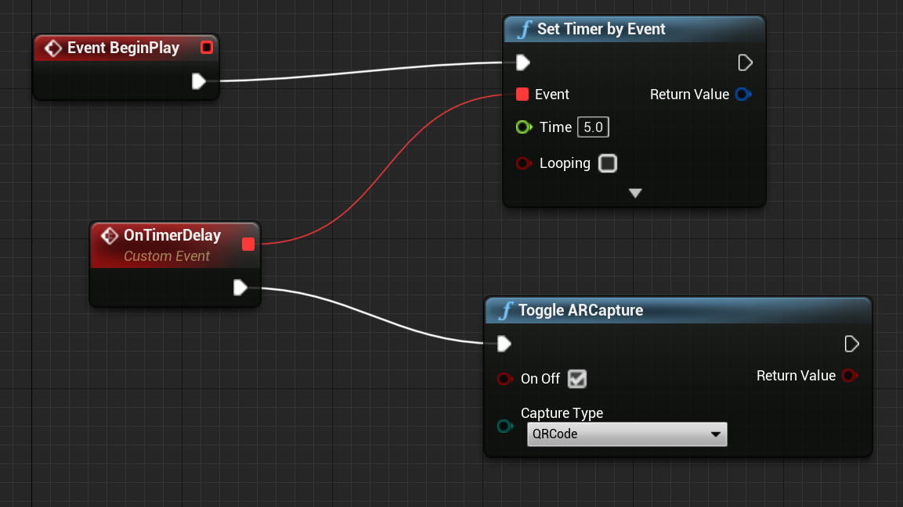

# [4.26](#tab/426)

If you're using UE 4.26, we recommend using the following blueprint setup to add a small delay, because QR code tracking must be initialized AFTER starting an AR Session:

# [4.25](#tab/425)

There are no additional enabling steps specific to UE 4.25.

