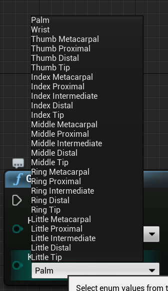
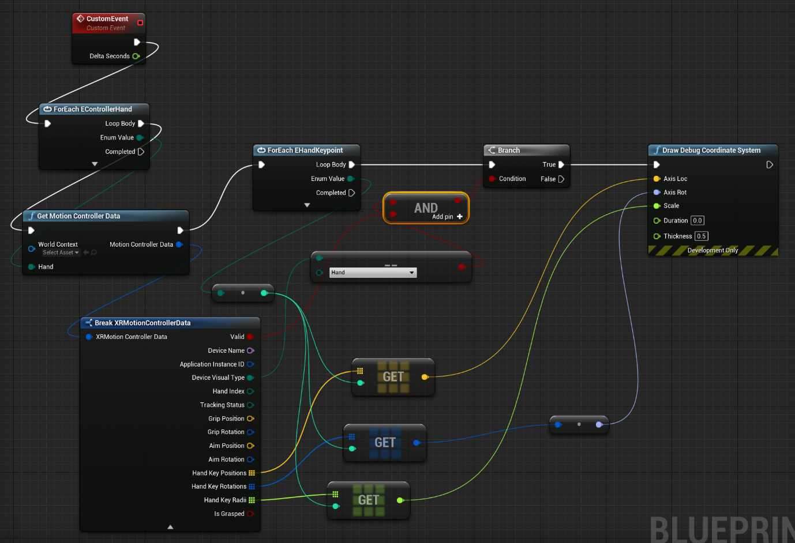
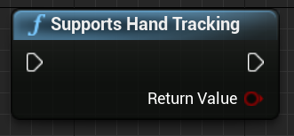

# [4.26](#tab/426)

The hierarchy is described by `EHandKeypoint` enum:



You can get all this data from a user’s hands using the **Get Motion Controller Data** function. That function returns an **XRMotionControllerData** structure. Below is a sample Blueprint script that parses the XRMotionControllerData structure to get hand joint locations and draws a debug coordinate system at each joint’s location.



It's important to check if the structure is valid and that it's a hand. Otherwise, you may get undefined behavior in access to positions, rotations, and radii arrays.

# [4.25](#tab/425)

The `EWMRHandKeypoint` enum describes the Hand’s bone hierarchy. You can find each hand keypoint listed in your Blueprints:


The full C++ enum is listed below:
```cpp
enum class EWMRHandKeypoint : uint8
{
	Palm,
	Wrist,
	ThumbMetacarpal,
	ThumbProximal,
	ThumbDistal,
	ThumbTip,
	IndexMetacarpal,
	IndexProximal,
	IndexIntermediate,
	IndexDistal,
	IndexTip,
	MiddleMetacarpal,
	MiddleProximal,
	MiddleIntermediate,
	MiddleDistal,
	MiddleTip,
	RingMetacarpal,
	RingProximal,
	RingIntermediate,
	RingDistal,
	RingTip,
	LittleMetacarpal,
	LittleProximal,
	LittleIntermediate,
	LittleDistal,
	LittleTip
};
```

You can find the numerical values for each enum case in the [Windows.Perception.People.HandJointKind](/uwp/api/windows.perception.people.handjointkind) table.

### Supporting Hand Tracking

You can use hand tracking in Blueprints by adding **Supports Hand Tracking** from **Hand Tracking > Windows Mixed Reality**:


This function returns `true` if hand tracking is supported on the device and `false` if hand tracking isn't available.



C++:

Include `WindowsMixedRealityHandTrackingFunctionLibrary.h`.

```cpp
static bool UWindowsMixedRealityHandTrackingFunctionLibrary::SupportsHandTracking()
```

### Getting Hand Tracking

You can use **GetHandJointTransform** to return spatial data from the hand. The data updates every frame, but if you're inside a frame the returned values are cached. It's not recommended to have heavy logic in this function for performance reasons.


C++:
```cpp
static bool UWindowsMixedRealityHandTrackingFunctionLibrary::GetHandJointTransform(EControllerHand Hand, EWMRHandKeypoint Keypoint, FTransform& OutTransform, float& OutRadius)
```

Here's a breakdown of GetHandJointTransform's function parameters:

* **Hand** – can be the users left or right hand.
* **Keypoint** – the bone of the hand.
* **Transform** – coordinates and orientation of bone’s base. You can request the base of the next bone to get the transform data for the end of a bone. A special Tip bone gives end of distal.
* **Radius—radius of the base of the bone.
* **Return Value—true if the bone is tracked this frame, false if the bone isn't tracked.