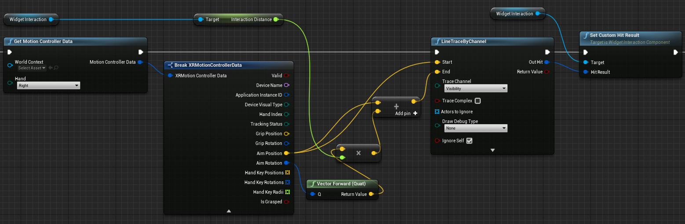
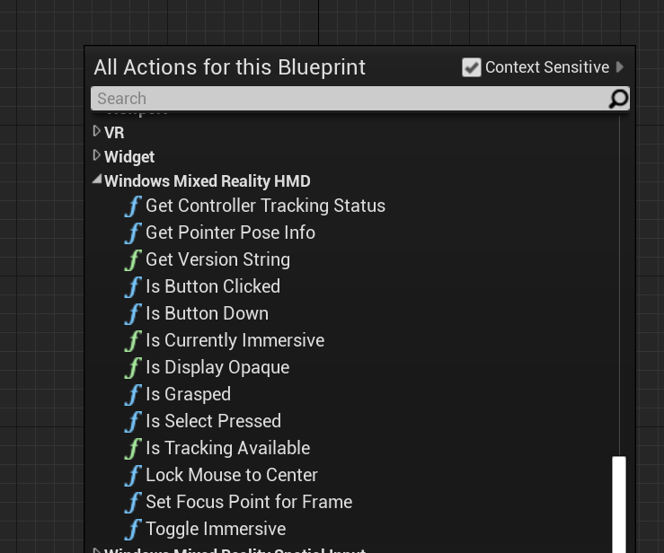
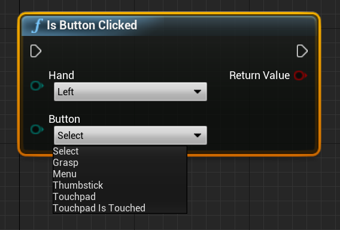

# [4.26](#tab/426)

To get the data for the hand rays, you should use the Get Motion Controller Data function from the previous section. The returned structure contains two parameters you can use to create a hand ray – **Aim Position** and **Aim Rotation**. These parameters form a ray directed by your elbow. You should take them and find a hologram being pointed by.

Below is an example of determining whether a hand ray hits a Widget and setting a custom hit result:

 

# [4.25](#tab/425)

To use Hand Rays in Blueprints, search for any of the actions under **Windows Mixed Reality HMD**:



To access them in C++, include `WindowsMixedRealityFunctionLibrary.h` to the top of your calling code file.

### Enum

You also have access to input cases under **EHMDInputControllerButtons**, which can be used in Blueprints:


For access in C++, use the `EHMDInputControllerButtons` enum class:
```cpp
enum class EHMDInputControllerButtons : uint8
{
	Select,
	Grasp,
//......
};
```

Below is a breakdown of the two applicable enum cases:

* **Select** - User triggered Select event.
    * Triggered in HoloLens 2 by air-tap, gaze, and commit, or by saying “Select” with [voice input](../unreal-voice-input.md) enabled.
* **Grasp** - User triggered Grasp event.
    * Triggered in HoloLens 2 by closing the user’s fingers on a hologram.

You can access the tracking status of your hand mesh in C++ through the `EHMDTrackingStatus` enum shown below:

```cpp
enum class EHMDTrackingStatus : uint8
{
	NotTracked,
	//......
	Tracked
};
```

Below is a breakdown of the two applicable enum cases:

* **NotTracked** –- the hand isn’t visible
* **Tracked** –- the hand is fully tracked

### Struct

The PointerPoseInfo struct can give you information on the following hand data:

* **Origin** – origin of the hand
* **Direction** – direction of the hand
* **Up** – up vector of the hand
* **Orientation** – orientation quaternion
* **Tracking Status** – current tracking status

You can access the PointerPoseInfo struct through Blueprints, as shown below:


Or with C++:

```cpp
struct FPointerPoseInfo
{
	FVector Origin;
	FVector Direction;
	FVector Up;
	FQuat Orientation;
	EHMDTrackingStatus TrackingStatus;
};
```

### Functions

All of the functions listed below can be called on every frame, which allows continuous monitoring.

1. **Get Pointer Pose Info** returns complete information about the hand ray direction in the current frame.

Blueprint:


C++:
```cpp
static FPointerPoseInfo UWindowsMixedRealityFunctionLibrary::GetPointerPoseInfo(EControllerHand hand);
```

2. **Is Grasped** returns true if the hand is grasped in the current frame.

Blueprint:


C++:
```cpp
static bool UWindowsMixedRealityFunctionLibrary::IsGrasped(EControllerHand hand);
```

3. **Is Select Pressed** returns true if the user triggered Select in the current frame.

Blueprint:


C++:
```cpp
static bool UWindowsMixedRealityFunctionLibrary::IsSelectPressed(EControllerHand hand);
```

4. **Is Button Clicked** returns true if the event or button is triggered in the current frame.

Blueprint:



C++:
```cpp
static bool UWindowsMixedRealityFunctionLibrary::IsButtonClicked(EControllerHand hand, EHMDInputControllerButtons button);
```

5. **Get Controller Tracking Status** returns the tracking status in the current frame.

Blueprint:


C++:
```cpp
static EHMDTrackingStatus UWindowsMixedRealityFunctionLibrary::GetControllerTrackingStatus(EControllerHand hand);
```