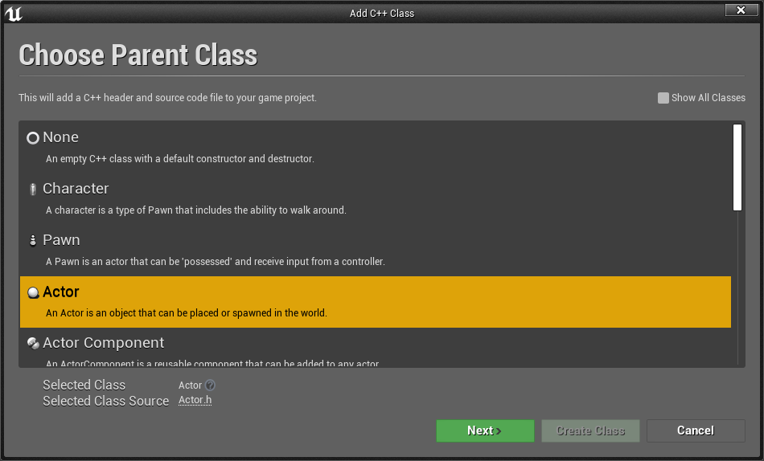
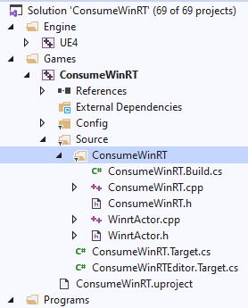
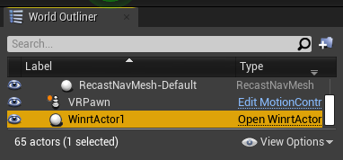

# [4.26](#tab/426)

## The standard WinRT APIs

The most common and easiest way to use WinRT is to call methods from WinSDK. To do so, open YourModule.Build.cs file and add the following lines:

```csharp
if (Target.Platform == UnrealTargetPlatform.Win64 || Target.Platform == UnrealTargetPlatform.HoloLens)
{
	// These parameters are mandatory for winrt support
	bEnableExceptions = true;
	bUseUnity = false;
	CppStandard = CppStandardVersion.Cpp17;
	PublicSystemLibraries.AddRange(new string[] { "shlwapi.lib", "runtimeobject.lib" });
	PrivateIncludePaths.Add(Path.Combine(Target.WindowsPlatform.WindowsSdkDir,        
                                        "Include", 
                                        Target.WindowsPlatform.WindowsSdkVersion, 
                                        "cppwinrt"));
}
```

Next, you need to add the following WinRT headers: 

```cpp
#if (PLATFORM_WINDOWS || PLATFORM_HOLOLENS) 
//Before writing any code, you need to disable common warnings in WinRT headers
#pragma warning(disable : 5205 4265 4268 4946)

#include "Windows/AllowWindowsPlatformTypes.h"
#include "Windows/AllowWindowsPlatformAtomics.h"
#include "Windows/PreWindowsApi.h"

#include <unknwn.h>
#include <winrt/Windows.Foundation.h>
#include <winrt/Windows.Perception.Spatial.h>
#include <winrt/Windows.Foundation.Collections.h>

#include "Windows/PostWindowsApi.h"
#include "Windows/HideWindowsPlatformAtomics.h"
#include "Windows/HideWindowsPlatformTypes.h"
#endif
```

WinRT code can only be compiled in the Win64 and HoloLens platforms, so the if statement prevents WinRT libraries from being included on other platforms. unknwn.h was added for having the IUnknown interface. 


## WinRT from a NuGet package

It’s a little more complicated if you need to add a NuGet package with WinRT support. In this case, Visual Studio can do practically all job for you, but the Unreal build system can’t. Luckily, it’s not too difficult. Below is an example of how you would go about downloading the Microsoft.MixedReality.QR package. You can replace it with another, just make sure you don’t lose the winmd file and copy the correct dll. 

Windows SDK dlls from the previous section are handled by the OS. NuGet’s dlls must be managed by the code in your module. We recommend adding code to download them, copying into binaries folder, and load into the process memory at the module startup.

At the first step, you should add a packages.config (/nuget/reference/packages-config) into the root folder of your module. There you should add all packages you want to download, including all their dependencies. Here I added Microsoft.MixedReality.QR as a primary payload and two others as dependencies to it. The format of that file is same as in Visual Studio:

```xml
<?xml version="1.0" encoding="utf-8"?>
<packages>
  <package id="Microsoft.MixedReality.QR" version="0.5.2102" targetFramework="native" />
  <package id="Microsoft.VCRTForwarders.140" version="1.0.6" targetFramework="native" />
  <package id="Microsoft.Windows.CppWinRT" version="2.0.200729.8" targetFramework="native" />
</packages>
```

Now you can download the NuGet, the required packages, or refer to the NuGet [documentation](/nuget/consume-packages/install-use-packages-nuget-cli).

Open YourModule.Build.cs and add the following code:

```csharp
// WinRT with Nuget support
if (Target.Platform == UnrealTargetPlatform.Win64 || Target.Platform == UnrealTargetPlatform.HoloLens)
{
	// these parameters mandatory for winrt support
	bEnableExceptions = true;
	bUseUnity = false;
	CppStandard = CppStandardVersion.Cpp17;
	PublicSystemLibraries.AddRange(new string [] { "shlwapi.lib", "runtimeobject.lib" });

	// prepare everything for nuget
	string MyModuleName = GetType().Name;
	string NugetFolder = Path.Combine(PluginDirectory, "Intermediate", "Nuget", MyModuleName);
	Directory.CreateDirectory(NugetFolder);

	string BinariesSubFolder = Path.Combine("Binaries", "ThirdParty", Target.Type.ToString(), Target.Platform.ToString(), Target.Architecture);

	PrivateDefinitions.Add(string.Format("THIRDPARTY_BINARY_SUBFOLDER=\"{0}\"", BinariesSubFolder.Replace(@"\", @"\\")));

	string BinariesFolder = Path.Combine(PluginDirectory, BinariesSubFolder);
	Directory.CreateDirectory(BinariesFolder);

	ExternalDependencies.Add("packages.config");

	// download nuget
	string NugetExe = Path.Combine(NugetFolder, "nuget.exe");
	if (!File.Exists(NugetExe))
	{
		using (System.Net.WebClient myWebClient = new System.Net.WebClient())
		{
			// we aren't focusing on a specific nuget version, we can use any of them but the latest one is preferable
			myWebClient.DownloadFile(@"https://dist.nuget.org/win-x86-commandline/latest/nuget.exe", NugetExe);
		}
	}

	// run nuget to update the packages
	{
		var StartInfo = new System.Diagnostics.ProcessStartInfo(NugetExe, string.Format("install \"{0}\" -OutputDirectory \"{1}\"", Path.Combine(ModuleDirectory, "packages.config"), NugetFolder));
		StartInfo.UseShellExecute = false;
		StartInfo.CreateNoWindow = true;
		var ExitCode = Utils.RunLocalProcessAndPrintfOutput(StartInfo);
		if (ExitCode < 0)
		{
			throw new BuildException("Failed to get nuget packages.  See log for details.");
		}
	}

	// get list of the installed packages, that's needed because the code should get particular versions of the installed packages
	string[] InstalledPackages = Utils.RunLocalProcessAndReturnStdOut(NugetExe, string.Format("list -Source \"{0}\"", NugetFolder)).Split(new char[] { '\r', '\n' });

	// winmd files of the packages
	List<string> WinMDFiles = new List<string>();

	// WinRT lib for some job
	string QRPackage = InstalledPackages.FirstOrDefault(x => x.StartsWith("Microsoft.MixedReality.QR"));
	if (!string.IsNullOrEmpty(QRPackage))
	{
		string QRFolderName = QRPackage.Replace(" ", ".");

		// copying dll and winmd binaries to our local binaries folder
		// !!!!! please make sure that you use the path of file! Unreal can't do it for you !!!!!
		string WinMDFile = Path.Combine(NugetFolder, QRFolderName, @"lib\uap10.0.18362\Microsoft.MixedReality.QR.winmd");
		SafeCopy(WinMDFile, Path.Combine(BinariesFolder, "Microsoft.MixedReality.QR.winmd"));

		SafeCopy(Path.Combine(NugetFolder, QRFolderName, string.Format(@"runtimes\win10-{0}\native\Microsoft.MixedReality.QR.dll", Target.WindowsPlatform.Architecture.ToString())),
			Path.Combine(BinariesFolder, "Microsoft.MixedReality.QR.dll"));

		// also both both binaries must be in RuntimeDependencies, unless you get failures in Hololens platform
		RuntimeDependencies.Add(Path.Combine(BinariesFolder, "Microsoft.MixedReality.QR.dll"));
		RuntimeDependencies.Add(Path.Combine(BinariesFolder, "Microsoft.MixedReality.QR.winmd"));

		//add winmd file to the list for further processing using cppwinrt.exe
		WinMDFiles.Add(WinMDFile);
	}

	if (Target.Platform == UnrealTargetPlatform.Win64)
	{
		// Microsoft.VCRTForwarders.140 is needed to run WinRT dlls in Win64 platforms
		string VCRTForwardersPackage = InstalledPackages.FirstOrDefault(x => x.StartsWith("Microsoft.VCRTForwarders.140"));
		if (!string.IsNullOrEmpty(VCRTForwardersPackage))
		{
			string VCRTForwardersName = VCRTForwardersPackage.Replace(" ", ".");
			foreach (var Dll in Directory.EnumerateFiles(Path.Combine(NugetFolder, VCRTForwardersName, "runtimes/win10-x64/native/release"), "*_app.dll"))
			{
				string newDll = Path.Combine(BinariesFolder, Path.GetFileName(Dll));
				SafeCopy(Dll, newDll);
				RuntimeDependencies.Add(newDll);
			}
		}
	}

	// get WinRT package 
	string CppWinRTPackage = InstalledPackages.FirstOrDefault(x => x.StartsWith("Microsoft.Windows.CppWinRT"));
	if (!string.IsNullOrEmpty(CppWinRTPackage))
	{
		string CppWinRTName = CppWinRTPackage.Replace(" ", ".");
		string CppWinRTExe = Path.Combine(NugetFolder, CppWinRTName, "bin", "cppwinrt.exe");
		string CppWinRTFolder = Path.Combine(PluginDirectory, "Intermediate", CppWinRTName, MyModuleName);
		Directory.CreateDirectory(CppWinRTFolder);

		// all downloaded winmd file with WinSDK to be processed by cppwinrt.exe
		var WinMDFilesStringbuilder = new System.Text.StringBuilder();
		foreach (var winmd in WinMDFiles)
		{
			WinMDFilesStringbuilder.Append(" -input \"");
			WinMDFilesStringbuilder.Append(winmd);
			WinMDFilesStringbuilder.Append("\"");
		}

		// generate winrt headers and add them into include paths
		var StartInfo = new System.Diagnostics.ProcessStartInfo(CppWinRTExe, string.Format("{0} -input \"{1}\" -output \"{2}\"", WinMDFilesStringbuilder, Target.WindowsPlatform.WindowsSdkVersion, CppWinRTFolder));
		StartInfo.UseShellExecute = false;
		StartInfo.CreateNoWindow = true;
		var ExitCode = Utils.RunLocalProcessAndPrintfOutput(StartInfo);
		if (ExitCode < 0)
		{
			throw new BuildException("Failed to get generate WinRT headers.  See log for details.");
		}

		PrivateIncludePaths.Add(CppWinRTFolder);
	}
	else
	{
		// fall back to default WinSDK headers if no winrt package in our list
		PrivateIncludePaths.Add(Path.Combine(Target.WindowsPlatform.WindowsSdkDir, "Include", Target.WindowsPlatform.WindowsSdkVersion, "cppwinrt"));
	}
}
```

You'll need to define the SafeCopy method as follows:

```csharp
private void SafeCopy(string source, string destination)
{
	if(!File.Exists(source))
	{
		Log.TraceError("Class {0} can't find {1} file for copying", this.GetType().Name, source);
		return;
	}

	try
	{
		File.Copy(source, destination, true);
	}
	catch(IOException ex)
	{
		Log.TraceWarning("Failed to copy {0} to {1} with exception: {2}", source, destination, ex.Message);
		if (!File.Exists(destination))
		{
			Log.TraceError("Destination file {0} does not exist", destination);
			return;
		}

		Log.TraceWarning("Destination file {0} already existed and is probably in use.  The old file will be used for the runtime dependency.  This may happen when packaging a Win64 exe from the editor.", destination);
	}
}
```

NuGet DLLs needs to load into your Win32 process memory manually; we recommend adding manual loading into the startup method of your module:

```cpp
void StartupModule() override
{
#if PLATFORM_WINDOWS
	const FString LibrariesDir = FPaths::ProjectPluginsDir() / "MyModule" / THIRDPARTY_BINARY_SUBFOLDER;
	FPlatformProcess::PushDllDirectory(*LibrariesDir);

	const FString DllName = "Microsoft.MixedReality.QR.dll";
	if (!FPlatformProcess::GetDllHandle(*DllName))
	{
		UE_LOG(LogHMD, Warning, TEXT("Dll \'%s\' can't be loaded from \'%s\'"), *DllName, *LibrariesDir);
	}

	FPlatformProcess::PopDllDirectory(*LibrariesDir);
#endif
}
```

Finally, you can include WinRT headers into your code as described in the previous section.

# [4.25](#tab/425)

Unreal doesn't natively compile WinRT code in version 4.25, so it's your job to build a separate binary that Unreal’s build system can consume. 

## Objectives

- Create a Universal Windows DLL that opens a FileSaveDialogue
- Link that DLL to an Unreal game project
- Save a file on the HoloLens from an Unreal blueprint using the new DLL

## Getting started

1. Check that you have all [required tools](../tutorials/unreal-uxt-ch1.md) installed
2. [Create a new Unreal project](../tutorials/unreal-uxt-ch2.md#creating-a-new-unreal-project) and name it **Consumewinrt**
3. Enable the [required plugins](../tutorials/unreal-uxt-ch2.md#enabling-required-plugins) for HoloLens development
4. [Setup for deployment](../tutorials/unreal-uxt-ch6.md) to a device or emulator

## Creating a WinRT DLL 

1. Open a new Visual Studio project and create a **DLL (Universal Windows)** project in the same directory as the Unreal game’s **uproject** file. 


2. Name the project **HoloLensWinrtDLL** and set the location as a **ThirdParty** subdirectory to the Unreal game’s uproject file. 
    * Select **Place solution and project in the same directory** to simplify looking for paths later. 


> [!IMPORTANT]
> After the new project compiles, pay special attention to the blank cpp and header files, named **HoloLensWinrtDLL.cpp** and **HoloLensWinrtDLL.h** respectively. The header is the include file that uses the DLL in Unreal, while the cpp holds the body of any functions you export and includes any WinRT code that Unreal wouldn't otherwise be able to compile. 

3. Before you add any code, you need to update the project properties to ensure the WinRT code you need can compile: 
    * Right-click on the HoloLensWinrtDLL project and select **properties**  
    * Change the **Configuration** dropdown to **All Configurations** and the **Platform** dropdown to **All Platforms**  
    * Under **Configuration Properties> C/C++> All Options**:
        * Add **await** to **Additional Options** to ensure we can wait on async tasks  
        * Change **C++ Language Standard** to **ISO C++17 Standard (/std:c++17)** to include any WinRT code


Your project is ready to update the DLL’s source with WinRT code that opens a file dialogue and saves a file to the HoloLens disk.  

## Adding the DLL code

1. Open **HoloLensWinrtDLL.h** and add a dll exported function for Unreal to consume: 

```cpp
#pragma once

class HoloLensWinrtDLL
{
public:
    _declspec(dllexport) static void OpenFileDialogue();
};
```

2. Open **HoloLensWinrtDLL.cpp** and add all headers the class will use:  

```cpp
#include "pch.h"
#include "HoloLensWinrtDLL.h"

#include <winrt/Windows.Storage.h>
#include <winrt/Windows.Storage.Streams.h>
#include <winrt/Windows.Storage.Pickers.h>
#include <winrt/Windows.Foundation.h>
#include <winrt/Windows.Foundation.Collections.h>

#include <string>
#include <vector>
#include <thread>
```

> [!NOTE]
> All WinRT code is stored in **HoloLensWinrtDLL.cpp** so Unreal doesn't try to include any WinRT code when referencing the header. 

3. Still in **HoloLensWinrtDLL.cpp**, add a function body for OpenFileDialogue() and all supported code: 

```cpp
// sgm is declared outside of OpenFileDialogue so it doesn't
// get destroyed when OpenFileDialogue goes out of scope.
SaveGameManager sgm;

void HoloLensWinrtDLL::OpenFileDialogue()
{
    sgm.SaveGame();
}
```

4. Add a SaveGameManager class to **HoloLensWinrtDLL.cpp** to handle the file dialogue and saving the file: 

```cpp
class SaveGameManager
{
public:
    SaveGameManager()
    {
    }

    ~SaveGameManager()
    {
        // Wait for currently running thread to complete before terminating.
        if(m_thread.joinable())
        {
            m_thread.join();
        }
    }

    void SaveGame()
    {
        OpenFileDialogueAction();
    }

private:
    winrt::Windows::Storage::StorageFile m_file = winrt::Windows::Storage::StorageFile(nullptr);
    std::thread m_thread;

    winrt::Windows::Foundation::IAsyncAction OpenFileDialogueAction()
    {
        std::vector<winrt::hstring> extensions;
        extensions.push_back(L".txt");

        auto picker = winrt::Windows::Storage::Pickers::FileSavePicker();

        // FileSavePicker needs a file type to open without errors.
        picker.FileTypeChoices().Insert(L"Plain Text",
                                        winrt::single_threaded_vector<winrt::hstring>(
                                        std::move(extensions)));

        // Opening the FilePicker must be done on the Game UI thread.
        // Any other IAsyncOperations should be done on a background thread.
        m_file = co_await picker.PickSaveFileAsync();

        if(m_file)
        {
            // Unreal's game thread is an STA, async tasks need to run on
            // a background MTA thread, or waiting on them will deadlock.    
            std::thread thread([this]() { RunThread(); });
            m_thread = std::move(thread);
        }
    }

    void RunThread()
    {
        // Ensure this thread is an MTA
        winrt::init_apartment();
        Run().get();
    }

    winrt::Windows::Foundation::IAsyncAction Run()
    {
        co_await winrt::Windows::Storage::FileIO::WriteTextAsync(
                m_file, L"Hello WinRT");
    }
};
```

5. Build the solution for **Release > ARM64** to build the DLL to the child directory ARM64/Release/HoloLensWinrtDLL from the DLL solution. 

## Adding the WinRT binary to Unreal 
Linking and using a DLL in Unreal requires a C++ project. If you're using a Blueprint project, it can be easily converted to a C++ project by adding a C++ class:  

1. In the Unreal editor, open **File > New C++ Class…** and create a new **Actor** named **WinrtActor** to run the code in the DLL: 



> [!NOTE]
> A solution has now been created in the same directory as the uproject file along with a new build script named Source/ConsumeWinRT/ConsumeWinRT.Build.cs.

2. Open the solution, browse for the **Games/ConsumeWinRT/Source/ConsumeWinRT** folder, and open **ConsumeWinRT.build.cs**:



### Linking the DLL
1. In **ConsumeWinRT.build.cs**, add a property to find the include path for the DLL (the directory containing HoloLensWinrtDLL.h). The DLL is in a child directory to the include path, so this property will be used as the binary root dir:

```cs
using System.IO;

public class ConsumeWinRT : ModuleRules
{
    private string WinrtIncPath
    {
        get 
        {
            string ModulePath = Path.GetDirectoryName(
                   RulesCompiler.GetFileNameFromType(this.GetType()));

            // Third party directory is at the project root,
            // which is two directories up from the game .exe (Binaries/HoloLens)
            return Path.GetFullPath(
                   Path.Combine(ModulePath,
                   "../../ThirdParty/HoloLensWinrtDLL"));
        }
    }
}
```

2. In the class constructor, add the following code to update the include path, link the new lib, and delay-load and copy the DLL to the packaged appx location:

```cs
public ConsumeWinRT(ReadOnlyTargetRules target) : base(Target)
{
    // This is the directory the DLL's include header is in.
    PublicIncludePaths.Add(WinrtIncPath);

    // The code in HoloLensWinrtDLL will only work in a Windows Store app.
    // Only link these binaries for HoloLens.
    // Similar code can be written for desktop and similarly linked 
    // to use the same features when using Holographic Remoting.
    if(Target.Platform == UnrealTargetPlatform.HoloLens)
    {
        // Link the lib
        PublicAdditionalLibraries.Add(Path.Combine(
              WinrtIncPath, "ARM64", "Release",
              "HoloLensWinrtDLL","HoloLensWinrtDLL.lib"));

        string winrtDLL = "HoloLensWinrtDLL.dll";
        // Mark the dll to be DelayLoaded
        PublicDelayLoadDLLs.Add(winrtDLL);
        // RuntimeDependencies are included in packaged builds.
        RuntimeDependencies.Add(Path.Combine(WinrtIncPath,
                "ARM64", "Release", "HoloLensWinrtDLL", winrtDLL));
    }

    // Preserve the original code in build.cs below:
}
```

3. Open **WinrtActor.h** and add one function definition, one that a blueprint will call: 

```cpp
public:
    UFUNCTION(BlueprintCallable)
    static void OpenFileDialogue();
```

4. Open **WinrtActor.cpp** and update BeginPlay to load the DLL: 

```cpp
void AWinrtActor::BeginPlay()
{
	Super::BeginPlay();

    // Gets path to DLL location
	const FString BinDir = FPaths::ProjectDir() / 
		"ThirdParty" / "HoloLensWinrtDLL" / 
		"arm64" / "Release" / "HoloLensWinrtDLL";

    // Loads DLL into application
	void * dllHandle = FPlatformProcess::GetDllHandle(
		*(BinDir / "HoloLensWinrtDLL.dll"));
}

void AWinrtActor::OpenFileDialogue()
{
#if PLATFORM_HOLOLENS
	HoloLensWinrtDLL::OpenFileDialogue();
#endif
}
``` 

>[!CAUTION]
> The DLL must be loaded before calling any of its functions.

### Building the game
1. Build the game solution to launch the Unreal editor opened to the game project: 
    * In the **Place Actors** tab, search for the new **WinrtActor** and drag it into the scene 
    * Open the level blueprint to execute the blueprint callable function in the **WinrtActor** 


2. In the **World Outliner**, find the **WindrtActor** previously dropped into the scene and drag it into the level blueprint: 



3. In the level blueprint, drag the output node from WinrtActor, search for **Open File Dialogue**, then route the node from any user input.  In this case, Open File Dialogue is being called from a speech event: 


4. [Package this game for HoloLens](../tutorials/unreal-uxt-ch6.md), deploy it, and run.  

When Unreal calls OpenFileDialogue, a File Dialogue opens on the HoloLens prompting for a .txt file name.  After the file is saved, go to the **File explorer** tab in the device portal to see the contents “Hello WinRT”. 

## Summary 

We encourage you to use this tutorial as a starting point for consuming WinRT code in Unreal when you need to save files to the HoloLens disk using the same file dialogue as Windows.  The same process applies to exporting additional functions from the HoloLensWinrtDLL header and used in Unreal.  Pay special attention to the DLL code that waits on async WinRT code in a background MTA thread, which avoids deadlocking the Unreal game thread.