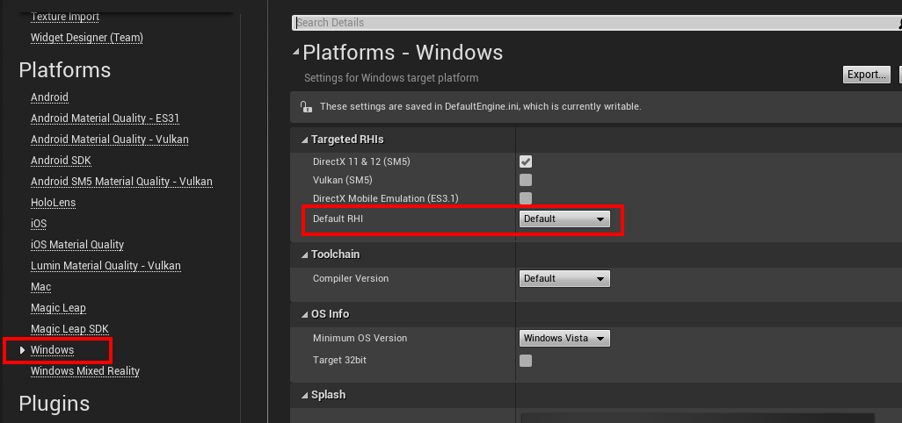
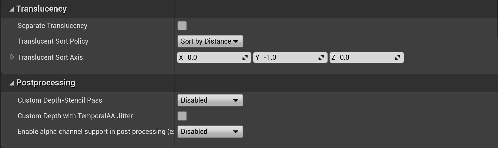

# Performance recommendations for Unreal

Unreal Engine has several features that can increase an apps performance, all based on the discussion outlined in [performance recommendations for mixed reality](../advanced-concepts/understanding-performance-for-mixed-reality.md). You're encouraged to read up on application bottlenecks, analyzing and profiling mixed reality apps, and general performance fixes before continuing.

## Recommended Unreal project settings

You can find each of the following settings in **Edit > Project Settings**.

1. Using the mobile VR renderer:
    * Scroll to the **Project** section, select **Target Hardware**, and set the target platform to **Mobile/Tablet**

2. Using the Forward Renderer: 
    * Forward Renderer is much better for Mixed Reality than the default Deferred rendering pipeline because of the number of features that can be individually turned off. 
    * You can find more information in [Unreal's documentation](https://docs.unrealengine.com/Platforms/VR/DevelopVR/VRPerformance/index.html).

3. Using mobile multi-view:
    * Scroll to the **Engine** section, select **Rendering**, expand the **VR** section, and enable both **Instanced Stereo** and **Mobile Multi-View**. Mobile HDR should be unchecked.

4. **[OpenXR only]** Ensure **Default** or **D3D12** is the selected **Default RHI**:
    * Selecting **D3D11** will have a negative performance impact due to the platform performing an additional render pass. **D3D12** should provide rendering performance improvements besides avoiding the additional render pass.

5. Disabling Vertex Fogging: 
    * Vertex fogging applies fog calculations at each vertex in a polygon and then interpolates the results across the face of the polygon. If your game does not use fog, we recommend disabling Vertex Fogging to increase shading performance.

6. Disabling occlusion culling:
    * Scroll to the **Engine** section, select **Rendering**, expand the **Culling** section, and uncheck **Occlusion Culling**.
        + If you need occlusion culling for a detailed scene being rendered, it's recommended that you enable **Support Software Occlusion Culling** in **Engine > Rendering**. Unreal will do the work on the CPU and avoid GPU occlusion queries, which perform poorly on HoloLens 2.
    * Occlusion culling on the GPU on mobile devices is slow. Generally, you want the GPU to be primarily concerned with rendering. If you feel that occlusion will help performance, try enabling software occlusion instead. 

> [!NOTE]
> Enabling software occlusion could make performance worse if you're already CPU bound by a large number of draw-calls.

7. Disabling Custom Depth-Stencil Pass:
    * Disabling Custom Depth-Stencil requires an extra pass, meaning it's slow. Translucency is also slow on Unreal. You can find more information in [Unreal's documentation](https://docs.unrealengine.com/Engine/Performance/Guidelines/index.html).

8. Reducing Cascaded Shadow Maps: 
    * Reducing the number of shadow maps will improve performance. Generally, you should set the property to 1 unless there's a visible quality loss. 

## Optional settings

> [!NOTE]
> The following settings may improve performance, but at the cost of disabling certain features. Only use these settings if you're sure you don't need the features in question.

1. Mobile Shader Permutation Reduction
    * If your lights don't move independently of the camera, then you can safely set the property value to 0. The primary benefit is that it will allow Unreal to cull several shader permutations, speeding up shader compilation.

## See also

* [Unreal Engine mobile performance guidelines]( https://docs.unrealengine.com/Platforms/Mobile/Performance/index.html)