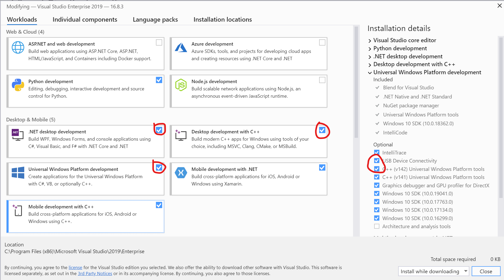

# 1. Getting started

Whether you're new to mixed reality or a seasoned pro, you're in the right place to start your [HoloLens 2](../../../index.yml) and [Unreal Engine](https://www.unrealengine.com/en-US/) journey. This tutorial series will give you a step-by-step guide on how to build an interactive chess app with the [UX Tools plugin](https://github.com/microsoft/MixedReality-UXTools-Unreal) - part of the [Mixed Reality Toolkit for Unreal](https://github.com/microsoft/MixedRealityToolkit-Unreal). The plugin will help you add common UX features to your projects with code, blueprints, and examples. 

By the end of the series you'll have experience with:
* Starting a new project
* Setting up for mixed reality
* Working with user input
* Adding buttons
* Playing on an emulator or device

## Prerequisites

Make sure you've installed the following before jumping in:
* Windows 10 1809 or later
* Windows 10 SDK 10.0.18362.0 or later
* [Unreal Engine](https://www.unrealengine.com/en-US/get-now) 4.25 or later
* Microsoft HoloLens 2 device [configured for development](../../platform-capabilities-and-apis/using-visual-studio.md#enabling-developer-mode) or [Emulator](../../platform-capabilities-and-apis/using-the-hololens-emulator.md#hololens-2-emulator-overview)
* Visual Studio 2019 with the workloads below

### Installing Visual Studio 2019

First, make sure your setup with all the required Visual Studio packages:
1. Install the latest version of [Visual Studio 2019](https://visualstudio.microsoft.com/downloads/)
1. Install the following [workloads](/visualstudio/install/modify-visual-studio#modify-workloads):
    * Desktop development with C++
    * .NET desktop development
    * Universal Windows Platform development
1. Expand Universal Windows Platform development and select: 
    * USB Device Connectivity
    * C++ (v142) Universal Windows Platform tools

1. Install the following [components](/visualstudio/install/modify-visual-studio#modify-individual-components):
    * Compilers, build tools, and runtimes > MSVC v142 - VS 2019 C++ ARM64 build tools (latest version)

You can confirm the installation with the following picture

That's it! You're all set to move on to starting the chess project.

[Next section: 2. Initializing your project and first application](unreal-uxt-ch2.md)