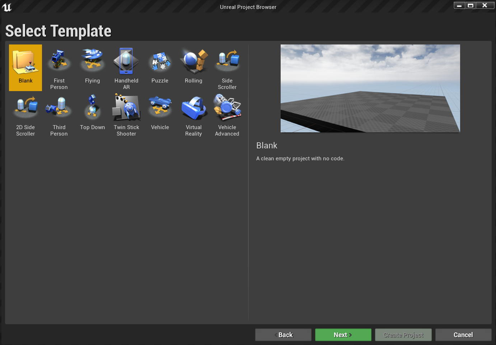
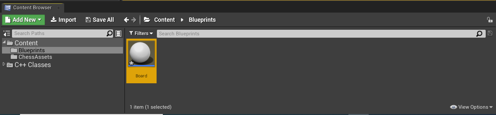
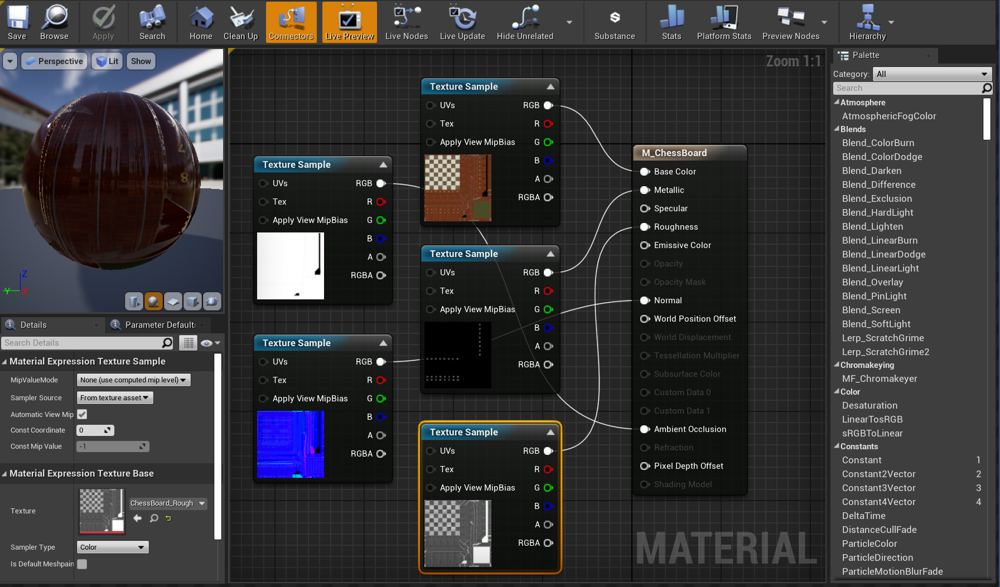
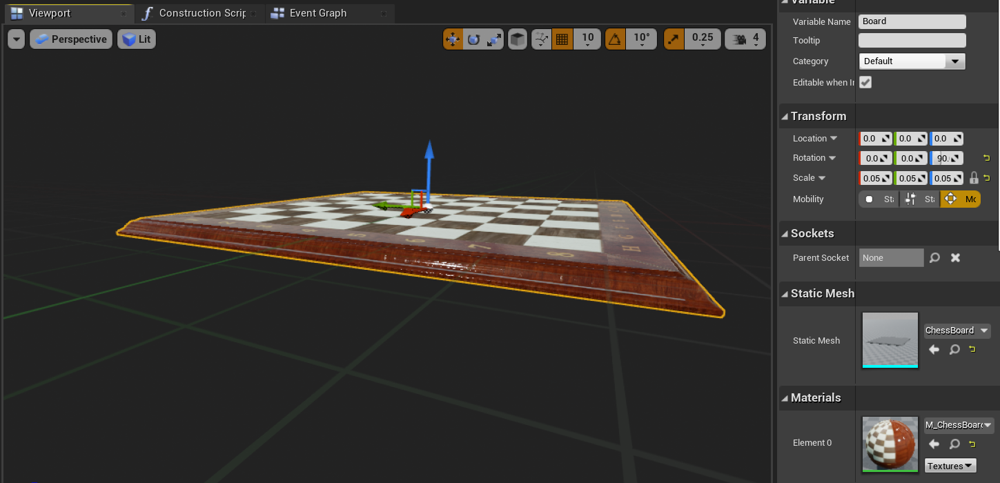
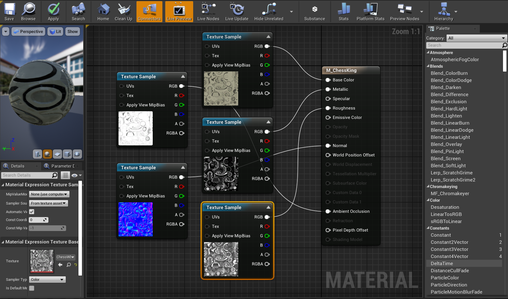

# 2. Initializing your project and first application

In the first tutorial, you'll start out with a new Unreal project and enable the HoloLens plugin, create and light a level, and add chess pieces. You'll be using our pre-made assets for all 3D objects and materials, so don't worry about modeling anything yourself. By the end of this tutorial, you'll have a blank canvas that's ready for mixed reality.

> [!IMPORTANT]
> Make sure you have all the prerequisites from the [Getting Started](/windows/mixed-reality/unreal-uxt-ch1) page.

## Objectives

* Configuring an Unreal project for HoloLens development
* Importing assets and setting up a scene
* Creating Actors and script-level events with blueprints

## Creating a new Unreal project

The first thing you need is a project to work with. If you're a first-time Unreal developer, you'll need to [download supporting files](./unreal-uxt-ch6.md#packaging-and-deploying-the-app-via-device-portal) from the Epic Launcher.

1. Launch Unreal Engine

2. Select **Games** in **New Project Categories** and click **Next**. 

3. Select the **Blank** Template and click **Next**. 

4. Set **C++**, **Scalable 3D or 2D, Mobile/Tablet**, and **No Starter Content** as your **Project Settings**, then choose a save location and click **Create Project**. 

> [!NOTE]
> You must select a C++ project rather than a Blueprint project in order to build the UX Tools plugin, which you'll be setting up later on in section 4.

The project should open up automatically in the Unreal editor, which means you're ready for the next section.

## Enabling required plugins

You'll need to enable two plugins before you can start adding objects to the scene.

1. Open **Edit > Plugins** and select **Augmented Reality** from the built-in options list. 
    * Scroll down to **HoloLens** and check **Enabled**. 

2. Select **Virtual Reality** from the built-in options list. 
    * Scroll down to **Microsoft Windows Mixed Reality**, check **Enabled**, and restart your editor. 

> [!NOTE]
> Both plugins are required for HoloLens 2 development.

With the plugins enabled, your empty level is ready for company.

## Creating a level
Your next task is to create a player setup with a starting point and a cube for reference and scale.

1. Select **File > New Level** and choose **Empty Level**. The default scene in the viewport should now be empty.

2. Select **Basic** from the **Modes** tab and drag **PlayerStart** into the scene. 
    * Set **Location** to **X = 0**, **Y = 0**, and **Z = 0** in the **Details** tab to set the user at the center of the scene when the app starts up.

3. Drag a **Cube** from the **Basic** tab into the scene. 
    * Set **Location** to **X = 50**, **Y = 0**, and **Z = 0**. to position the cube 50 cm away from the player at start time. 
    * Change **Scale** to **X = 0.2**, **Y = 0.2**, and **Z = 0.2** to shrink the cube down. 

You can't see the cube unless you add a light to your scene, which is your last task before testing the scene.

4. Switch to the **Lights** tab in the **Modes** panel and drag a **Directional Light** into the scene. Position the light above **PlayerStart** so you can see it.

5. Go to **File > Save Current**, name your level **Main**, and select **Save**. 

With the scene set, press **Play** in the toolbar to see your cube in action! When you're finished admiring your work, press **Esc** to stop the application.

Now that the scene is set up, you can start adding in the chess board and piece to round out the application environment.

## Importing assets
The scene is looking a bit empty at the moment, but you'll fix that by importing the ready-made assets into the project.

1. Download and unzip the [GitHub](https://github.com/microsoft/MixedReality-Unreal-Samples/blob/master/ChessApp/ChessAssets.7z) assets folder using [7-zip](https://www.7-zip.org/).

2. Select **Add New > New Folder** from the **Content Browser** and name it **ChessAssets**. 
    * Double-click the new folder where you'll import the 3D assets.

3. Select **Import** from the **Content Browser**, select all the items in the unzipped assets folder and click **Open**. 
    * Assets include the 3D object meshes for the chess board and pieces in FBX format and texture maps in TGA format that you'll use to for materials.  

4. When the FBX Import Options window pops up, expand the **Material** section and change **Material Import Method** to **Do Not Create Material**.
    * Select **Import All**.

That's all you need to do for the assets. Your next set of tasks is to create the building blocks of the application with blueprints.

## Adding blueprints

1. Select **Add New > New Folder** in the **Content Browser** and name it **Blueprints**. 

> [!NOTE]
> If you're new to [blueprints](https://docs.unrealengine.com/en-US/Engine/Blueprints/index.html), they're special assets that provide a node-based interface for creating new types of Actors and script level events. 

2. Double-click into the **Blueprints** folder, then right-click and select **Blueprint Class**.         
    * Select **Actor** and name the blueprint **Board**. 

The new **Board** blueprint now shows up in the **Blueprints** folder as seen in the following screenshot. 

You're all set to start adding materials to the created objects.

## Working with materials
The objects you've created are default grey, which isn't much fun to look at. Adding materials and meshes to your objects is the last set of tasks in this tutorial.

1. Double-click **Board** to open the blueprint editor. 

2. Select **Add Component > Scene** from the **Components** panel and name it **Root**. Notice that **Root** shows up as a child of **DefaultSceneRoot** in the screenshot below:

3. Click-and-drag **Root** onto **DefaultSceneRoot** to replace it and get rid of the sphere in the viewport. 

4. Select **Add Component > Static Mesh** from the **Components** panel and name it **SM_Board**. It will appear as a child object under **Root**.

4. Select **SM_Board**, scroll down to the **Static Mesh** section of the **Details** panel, and select **ChessBoard** from the dropdown. 

5.	Still in the **Details** panel, expand the **Materials** section and select **Create New Asset > Material** from the dropdown. 
    * Name the material **M_ChessBoard** and save it to the **ChessAssets** folder. 

6.	Double-click the **M_ChessBoard** material imaged to open the Material Editor. 

7. In the Material Editor, right-click and search for **Texture Sample**. 
    * Expand the **Material Expression Texture Base** section in the **Details** panel and set **Texture** to **ChessBoard_Albedo**. 
    * Drag the **RGB** output pin to the Base Color pin of **M_ChessBoard**. 

8.	Repeat the previous step 4 more times to create four more **Texture Sample** nodes with the following settings:
    * Set **Texture** to **ChessBoard_AO** and link the **RGB** to the **Ambient Occlusion** pin.
    * Set **Texture** to **ChessBoard_Metal** and link the **RGB** to the **Metallic** pin. 
    * Set **Texture** to **ChessBoard_Normal** and link the **RGB** to the **Normal** pin.
    * Set **Texture** to **ChessBoard_Rough** and link the **RGB** to the **Roughness** pin. 
    * Click **Save**. 

Make sure your material setup looks like the above screenshot before continuing.

## Populating the scene
If you go back to the **Board** blueprint, you'll see that the material you just created has been applied. All that's left is setting up the scene! First, change the following properties to make sure the board is a reasonable size and angled correctly when it's placed in the scene:
1.	Set **Scale** to **(0.05, 0.05, 0.05)** and **Z Rotation** to **90**. 
    * Click **Compile** in the top toolbar, then **Save** and return to the Main window. 

2.	Right-click **Cube > Edit > Delete** and drag **Board** from the **Content Browser** into the viewport. 
    * Set **Location** to **X = 80**, **Y = 0**, and **Z = -20**. 

3.	Select the **Play** button to view your new board in the level. Press **Esc** to return to the editor. 

Now you'll follow the same steps to create a chess piece as you did with the board:

1. Go to the **Blueprints** folder, right-click, and select **Blueprint Class** and choose **Actor**. Name the actor **WhiteKing**.

2. Double-click **WhiteKing** to open it in the Blueprint Editor, select **Add Component > Scene** and name it **Root**. 
    * Drag-and-drop **Root** onto **DefaultSceneRoot** to replace it. 

3. Click **Add Component > Static Mesh** and name it **SM_King**. 
    * Set **Static Mesh** to **Chess_King** and **Material** to a new Material called **M_ChessWhite** in the Details panel. 

4. Open **M_ChessWhite** in the Material editor and hook up the following **Texture Sample** nodes to the following:
   * Set **Texture** to **ChessWhite_Albedo** and link the **RGB** to the **Base Color** pin.
    * Set **Texture** to **ChessWhite_AO** and link the **RGB** to the **Ambient Occlusion** pin.
    * Set **Texture** to **ChessWhite_Metal** and link the **RGB** to the **Metallic** pin. 
    * Set **Texture** to **ChessWhite_Normal** and link the **RGB** to the **Normal** pin.
    * Set **Texture** to **ChessWhite_Rough** and link the **RGB** to the **Roughness** pin. 
    * Click **Save**. 

Your **M_ChessKing** material should look like the following image before continuing.

You're almost there, just need to add the new chess piece into the scene: 

1. Open the **WhiteKing** blueprint and change the **Scale** to **(0.05, 0.05, 0.05)** and **Z Rotation** to **90**.
    * Compile and save your blueprint, then head back to the main window. 

2.	Drag **WhiteKing** into the viewport, switch to the **World Outliner** panel drag **WhiteKing** onto **Board** to make it a child object.

3.	In the **Details** panel under **Transform**, set **WhiteKing**'s **Location** to **X = -26**, **Y = 4**, and **Z = 0**.

That's a wrap! Select **Play** to see your populated level in action, and press **Esc** when you're ready to exit. You covered a lot of ground just creating a simple project, but now you're ready to move on to the next part of the series: setting up for mixed reality. 

[Next Section: 3. Set up your project for mixed reality](unreal-uxt-ch3.md)