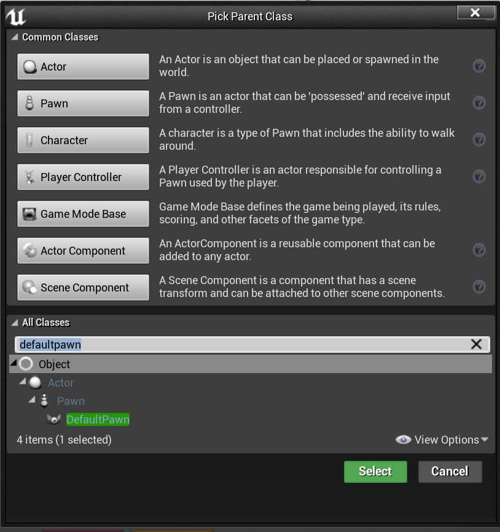
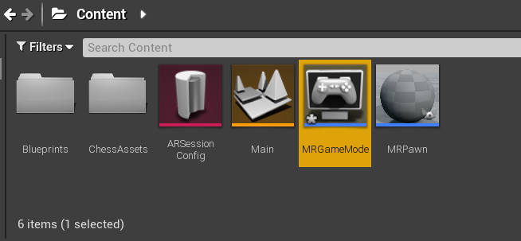
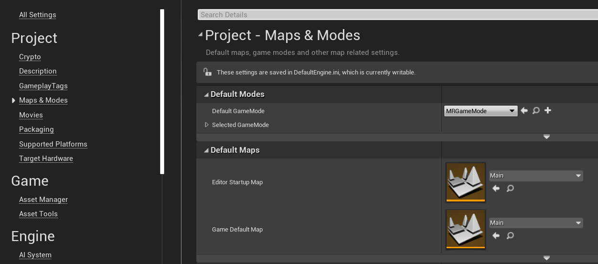

# 3. Setting up your project for mixed reality

In the previous tutorial, you spent time setting up the chess app project. This section is going to walk you through setting up the app for mixed reality development, which means adding an AR session. You'll be using an ARSessionConfig data asset for this task, which has useful AR settings like spatial mapping and occlusion. You can find more details about the [ARSessionConfig](https://docs.unrealengine.com/en-US/PythonAPI/class/ARSessionConfig.html) asset and the [UARSessionConfig](https://docs.unrealengine.com/en-US/API/Runtime/AugmentedReality/UARSessionConfig/index.html) class in Unreal's documentation.

## Objectives

* Working with Unreal Engine's AR settings
* Using an ARSessionConfig data asset
* Setting up a Pawn and game mode

## Adding the session asset

AR sessions in Unreal don't happen by themselves. To use a session, you need an ARSessionConfig data asset to work with, which is your next task:

1. Click **Add New > Miscellaneous > Data Asset** in the **Content Browser**. Make sure you're at the root **Content** folder level.
    * Select **ARSessionConfig**, click **Select**, and name the asset **ARSessionConfig**.

3. Double-click **ARSessionConfig** to open it, leave all default settings and hit **Save**. Return to the Main window.

With that done, your next step is to make sure the AR session starts and stops when the level loads and ends. Luckily, Unreal has a special blueprint called a **Level Blueprint** that acts as a level-wide global event graph. Connecting the ARSessionConfig asset in the **Level Blueprint** guarantees the AR session will fire right when the game starts playing.

1. Click **Blueprints > Open Level Blueprint** from the editor toolbar:

5. Drag the execution node (left-facing arrow icon) off **Event BeginPlay** and release, then search for the **Start AR Session** node and hit enter.  
    * Click the **Select Asset** dropdown under **Session Config** and choose the **ARSessionConfig** asset.

6. Right-click anywhere in the EventGraph and create a new **Event EndPlay** node. Drag the execution pin and release, then search for a **Stop AR Session** node and hit enter. If the AR session is still running when the level ends, certain features may stop working if you restart your app while streaming to a headset.
    * Hit **Compile**, then **Save** and return to the Main window.

## Create a Pawn

At this point, the project still needs a player object. In Unreal, a **Pawn** represents the user in the game, but in this case it's going to be the HoloLens 2 experience.

1. Click **Add New > Blueprint Class** in the **Content** folder and expand the **All Classes** section at the bottom.
    * Search for **DefaultPawn**, click **Select**, name it **MRPawn**, and double-click the asset to open.

2. Click **Add Component > Camera** from the **Components** panel and name it **Camera**. Make sure that the **Camera** component is a direct child of the root (**CollisionComponent**). This allows the player camera to move with the HoloLens 2 device.

> [!NOTE]
> By default, Pawns have mesh and collision components. In most Unreal projects, Pawns are solid objects that can collide with other components. Since the Pawn and user are the same in mixed reality, you want to be able to pass through holograms without any collisions.

3. Select **CollisionComponent** from the **Components** panel and scroll down to the **Collision** section of the **Details** panel.
    * Click the **Collision Presets** dropdown and change the value to **NoCollision**.
    * Do the same for the **MeshComponent**

4. **Compile** and **Save** the Blueprint.

With your work here done, return to the Main Window.

## Create a Game Mode

The last puzzle piece of the mixed reality setup is the Game Mode. The Game Mode determines a number of settings for the game or experience, including the default pawn to use.

1.	Click **Add New > Blueprint Class** in the **Content** folder and select **Game Mode Base** as the parent class. Name it **MRGameMode** and double-click to open.

2.	Go to the **Classes** section in the **Details** panel and change the **Default Pawn Class** to **MRPawn**.
    * Hit **Compile**, then **Save** and return to the Main window.

3.	Select **Edit > Projects Settings** and click **Maps & Modes** in the left-hand list.
    * Expand **Default Modes** and change **Default Game Mode** to **MRGameMode**.
    * Expand **Default Maps** and change both **EditorStartupMap** and **GameDefaultMap** to **Main**. When you close and reopen the editor or play the game, the Main map will now be selected by default.

With the project fully set up for mixed reality, you're ready to move on to the next tutorial and start adding user input to the scene.

[Next Section: 4. Making your scene interactive](unreal-uxt-ch4.md)
