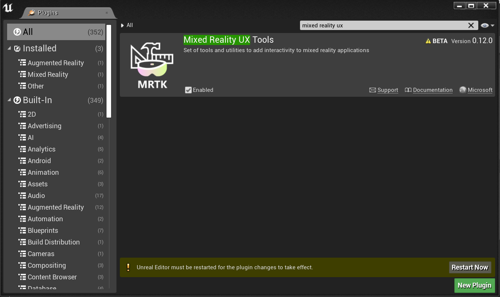
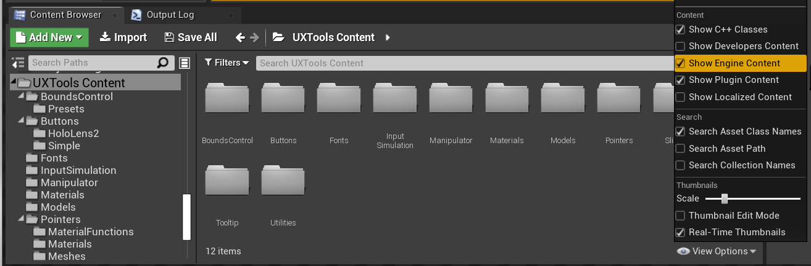
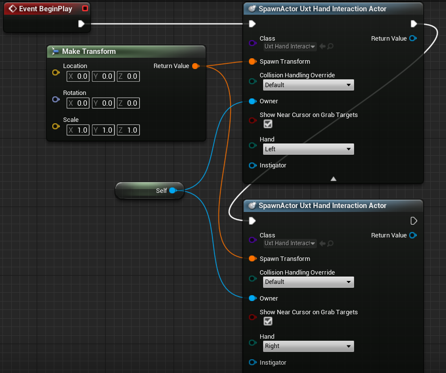
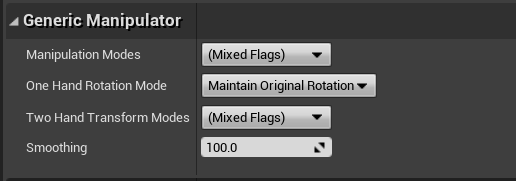
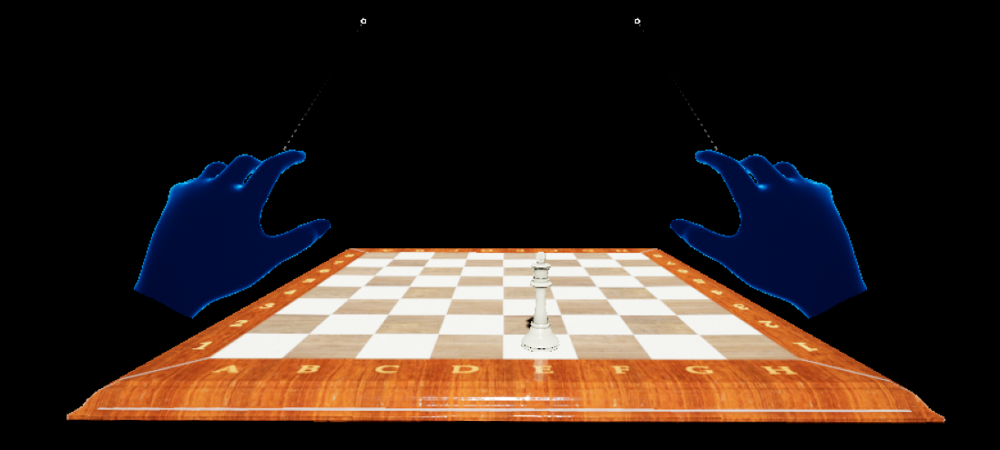

# 4. Making your scene interactive

In the previous tutorial, you added an ARSession, Pawn, and Game Mode to complete the mixed reality setup for the chess app. This section focuses on using the open source [Mixed Reality Toolkit UX Tools](https://github.com/microsoft/MixedReality-UXTools-Unreal) plugin, which provides tools to make the scene interactive. By the end of this section, your chess pieces will be moving by user input.

## Objectives

* Installing the Mixed Reality UX Tools plugin
* Adding Hand Interaction Actors to your fingertips
* Creating and adding Manipulators to objects in the scene
* Using input simulation to validate the project

## Downloading the Mixed Reality UX Tools plugin
Before you start working with user input, you'll need to add the Mixed Reality UX Tools plugin to the project. To learn more about UX Tools, you can check out the project on [GitHub](https://aka.ms/uxt-unreal).

1. Open the Epic Games Launcher. Navigate to Unreal Engine Marketplace and search for "[Mixed Reality UX Tools](https://www.unrealengine.com/marketplace/en-US/product/mixed-reality-ux-tools)". Install the plugin to your engine.

2. Back in the Unreal editor, go to **Project Settings** > **Plugins** and search for "Mixed Reality UX Tools". Ensure the plugin is enabled and restart the editor if prompted.

3.	The UXTools plugin has a Content folder with subfolders for components, including **Buttons**, **XR Simulation**, and **Pointers**, and a C++ Classes folder with additional code.  

> [!NOTE]
> If you don’t see the **UXTools Content** section in the **Content Browser**, click **View Options > Show Engine Content**.

Additional plugin documentation can be found on the Mixed Reality UX Tools GitHub [repository](https://aka.ms/uxt-unreal).

With the plugin installed, you're ready to start using the tools it has to offer, starting with hand interaction actors.

## Spawning Hand Interaction Actors

Hand interaction with UX elements is done with Hand Interaction Actors, which create and drive the pointers and visuals for near and far interactions.
- *Near interactions* - pinching elements between index finger and thumb or by poking them with a fingertip.
- *Far interactions* - pointing a ray from the virtual hand at an element and pressing index and thumb together.

In our case, adding a Hand Interaction Actor to **MRPawn** will:
- Add a cursor to the tips of the Pawn’s index fingers.
- Provide articulated hand input events that can be manipulated through the Pawn.
- Allow far interaction input events through hand rays extending from the palms of the virtual hands.

We recommend reading through the [documentation](https://microsoft.github.io/MixedReality-UXTools-Unreal/Docs/HandInteraction.html) on hand interactions before continuing.

Once you're ready, open the **MRPawn** Blueprint and go to the **Event Graph**.

1. Drag and release the execution pin from **Event BeginPlay** to place a new node.
    * Select **Spawn Actor from Class**, click the dropdown next to the **Class** pin and search for **Uxt Hand Interaction Actor**.  

2. Spawn a second **Uxt Hand Interaction Actor**, this time setting the **Hand** to **Right**. When the event begins, a Uxt Hand Interaction Actor will be spawned on each hand.

Your **Event Graph** should match the following screenshot:

Both Uxt Hand Interaction Actors need owners and initial transform locations. The initial transform doesn’t matter in this case because UX Tools will have the Hand Interaction Actors jump to the virtual hands as soon as they're visible. However, the `SpawnActor` function requires a Transform input to avoid a compiler error, so you'll use the default values.

1. Drag and release the pin off one of the **Spawn Transform** pins to place a new node.
    * Search for the **Make Transform** node, then drag the **Return Value** to the other hand’s **Spawn Transform** so that both **SpawnActor** nodes are connected.

2.	Select the **down arrow** at the bottom of both **SpawnActor** nodes to reveal the **Owner** pin.    
    * Drag the pin off one of the **Owner** pins and release to place a new node.
    * Search for **self** and select the **Get a reference to self** variable.
    * Create a link between the **Self** object reference node and the other Hand Interaction Actor’s **Owner** pin.
3. Lastly, check the **Show Near Cursor on Grab Targets** box for both Hand Interaction Actors. A cursor should appear on the grab target as your index finger gets close, so you can see where your finger is relative to the target.
    * **Compile**, **save**, and return to the Main window.

Make sure the connections match the following screenshot, but feel free to drag around nodes to make your Blueprint more readable.

You can find more information about Hand Interaction Actors in the [UX Tools documentation](https://microsoft.github.io/MixedReality-UXTools-Unreal/Docs/HandInteraction.html).

Now the virtual hands in the project have a way of selecting objects, but they still can't manipulate them. Your last task before testing the app is to add Manipulator components to the actors in the scene.

## Attaching Manipulators

A Manipulator is a component that responds to articulated hand input and can be grabbed, rotated, and translated. Applying the Manipulator’s transform to an Actors transform allows direct Actor manipulation.

1. Open the **Board** blueprint, click **Add Component** and search for **Uxt Generic Manipulator** in the **Components** panel.

2. Expand the **Generic Manipulator** section in the **Details** panel. You can set one-handed or two-handed manipulation, rotation mode, and smoothing from here. Feel free to select whichever modes you wish, then **Compile** and **Save** Board.

3. Repeat the steps above for the **WhiteKing** Actor.

You can find more information about the Manipulator Components provided in the Mixed Reality UX Tools plugin in the [documentation](https://microsoft.github.io/MixedReality-UXTools-Unreal/Docs/Manipulator.html).

## Testing the scene

Good news everyone! You're ready to test out the app with its new virtual hands and user input. Press **Play** in the Main Window and you'll see two mesh hands with rays extending from each hand’s palm. You can control the hands and their interactions as follows:
- Hold down the **left Alt** key to control the **left hand** and the **left Shift** key to control the **right hand**.
- Move your mouse to move the hand and scroll with your **mouse wheel** to move the hand **forwards** or **backwards**.
- Use the left mouse button to **pinch** and the middle mouse button to **poke**.

> [!NOTE]
> Input simulation may not work if you have multiple headsets plugged into your PC. If you're having issues, try unplugging your other headsets.

Try using the simulated hands to pick up, move, and set down the white chess king and manipulate the board! Experiment with both near and far interaction - notice that when your hands get close enough to grab the board and king directly, a finger cursor at the tip of the index finger replaces the hand ray.

You can find more information about the simulated hands feature provided by the MRTK UX Tools plugin in the [documentation](https://microsoft.github.io/MixedReality-UXTools-Unreal/Docs/InputSimulation.html).

Now that your virtual hands can interact with objects, you're ready to move on to the next tutorial and add user interfaces and events.

[Next Section: 5. Adding a button & resetting piece locations](unreal-uxt-ch5.md)
