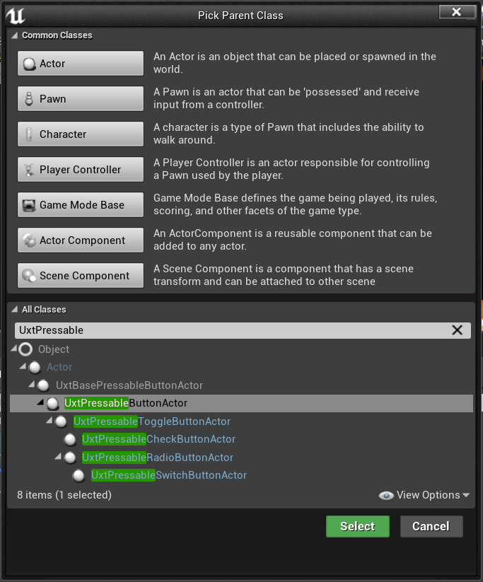
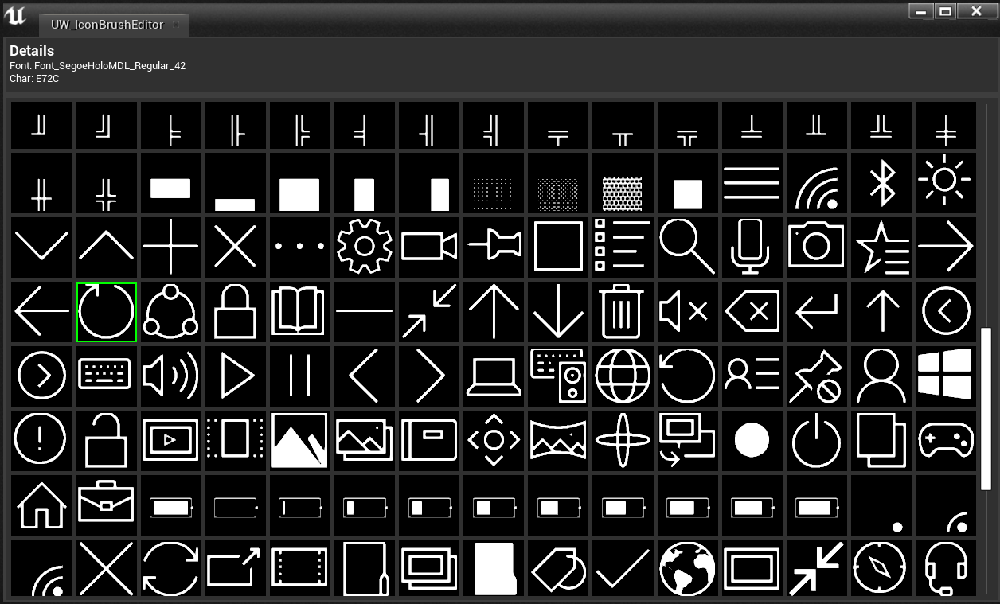
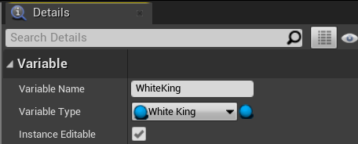
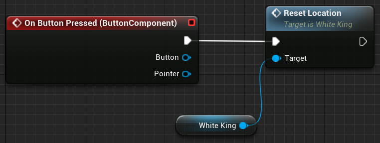
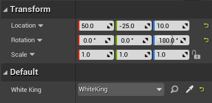

# 5. Adding a button & resetting piece locations

In the previous tutorial, you added Hand Interaction Actors to the Pawn and Manipulator components to the chess board to make them both interactive. In this section, you'll continue to use the Mixed Reality Toolkit UX Tools plugin to build out your chess app with new functions and Actor references in Blueprints. By the end of this section, you'll be ready to package and deploy the mixed reality app on a device or emulator.

## Objectives

* Adding an interactive button
* Creating a function to reset a pieces' location
* Hooking the button up to trigger the function when pressed

## Creating a reset function

Your first task is to create a function blueprint that resets a chess piece to its original position in the scene.

1.	Open **WhiteKing**, select the **+** icon next to the **Functions** section in the **My Blueprint** and name it **Reset Location**.

2.	Drag and release the execution from **Reset Location** on the Blueprint grid to create a **SetActorRelativeTransform** node.
    * This function sets the transform (location, rotation, and scale) of an actor relative to its parent. You’ll use this function to reset the king’s position on the board, even if the board has been moved from its original position.

3. Right-click inside the Event Graph, select **Make Transform**, and change its **Location** to **X = -26**, **Y = 4**, **Z = 0**.
    * Connect its **Return Value** to the **New Relative Transform** pin in **SetActorRelativeTransform**.

**Compile** and **Save** the project before returning to the Main window.

## Adding a button

Now that the function is set up correctly, your next task is to create a button that fires it off when touched.

1.	Click **Add New > Blueprint Class**, expand the **All Classes** section, and search for **UxtPressableButtonActor**.
    * Name it **ResetButton** and double click to open the Blueprint

2. Ensure **ResetButton(self)** is selected in the **Components** panel. In the **Details** panel, navigate to the **Button** section. Change the default **Button Label** to "Reset", expand the **Button Icon Brush** section, and press the **Open Icon Brush Editor** button.

The Icon Brush Editor will open, which you can use to select a new icon for your button.

There are plenty of other settings you can adjust to configure your button. To learn more about the UXT Pressable Button component, check out the [documentation](https://microsoft.github.io/MixedReality-UXTools-Unreal/Docs/PressableButton.html).

3. Click **ButtonComponent (Inherited)** in the **Components** panel and scroll down the **Details** panel to the **Events** section.
    * Click the green **+** button next to **On Button Pressed** to add an event to the Event Graph, which will be called when the button is pressed.

From here, you’ll want to call **WhiteKing**’s **Reset Location** function, which needs a reference to the **WhiteKing** Actor in the Level.

4.	In the **My Blueprint** panel, navigate to the **Variables** section, click the **+** button, and name the variable **WhiteKing**.
    * In the **Details** panel, select the dropdown next to **Variable Type**, search for **WhiteKing**, and select the **Object Reference**.
    * Check the box next to **Instance Editable**, which allows the variable to be set from the Main Level.

5.	Drag the WhiteKing variable from **My Blueprint > Variables** onto the Reset Button Event Graph and choose **Get WhiteKing**.

## Firing the function

All that's left is to officially fire off the reset function when the button is pressed.

1.	Drag the WhiteKing output pin and release to place a new node. Select the **Reset Location** function. Finally, drag the outgoing execution pin from **On Button Pressed** to the incoming execution pin on **Reset Location**. **Compile** and **Save** the ResetButton Blueprint, then return to the Main window.

2.	Drag **ResetButton** into the viewport and set its location to **X = 50**, **Y = -25**, and **Z = 10**. Set its rotation to **Z = 180**. Under **Default**, set the value of the **WhiteKing** variable to **WhiteKing**.

Run the app, move the chess piece to a new location, and press your HoloLens 2-style button to see the reset logic in action!

You now have a mixed reality app with an interactable chess piece and board, and a fully functioning button that resets the piece’s location. You can find the completed app up to this point in its [GitHub](https://github.com/microsoft/MixedReality-Unreal-Samples/tree/master/ChessApp) repo. Feel free to go beyond this tutorial and set up the rest of the chess pieces so that the entire board is reset when you press the reset button.

You're ready to move on to the final section of this tutorial where you'll learn how to package and deploy the app to a device or emulator.

> [!IMPORTANT]
> At this point, you should update your project with the recommended **[Unreal performance settings](../performance-recommendations-for-unreal.md)** before deploying your application to a device or emulator.

[Next Section: 6. Packaging & deploying to device or emulator](unreal-uxt-ch6.md)
