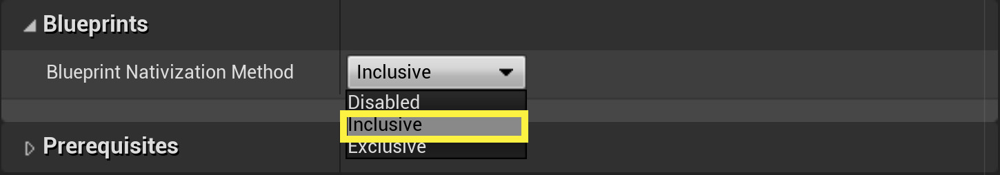

# General best practices

The following are some general best practices we recommend all developers follow when creating an Unreal Engine project for Mixed Reality.

## Constructors

If you need the equivalent of a "constructor" in blueprints, use Unreals' [construction script](https://docs.unrealengine.com/ProgrammingAndScripting/Blueprints/UserGuide/UserConstructionScript/index.html). The primary advantage over using "BeginPlay" events is the constructor script runs in the "editor" as well. Most of the time the values can be cached right at the start or even at compile time.

> [!NOTE]
> You can find more supporting information for Construction scripts in our [editor extensions overview](unreal-editor-extensions.md#construction-scripts).

## 3D buttons and textures

It's natural to think about performance when creating or planning to use 3D buttons in mixed reality applications. However, not everything has to be made from meshes to be perceived as 3D. You have the option of using Paper2D with carefully crafted textures to get that 3D look. This works really well for buttons that "seem" 3D, but are just photoshopped images on a quad. A fancy version of these is called a [sprite](https://docs.unrealengine.com/AnimatingObjects/Paper2D/Sprites/index.html).

## Variants

Use [Unreal Variants](https://docs.unrealengine.com/Basics/Levels/Variants/index.html) in scenarios where you're creating a scene with multiple object configurations at runtime. Variations can include changing materials or meshes. 

## Animation

Take advantage of the [Spline component](https://docs.unrealengine.com/API/Runtime/Engine/Components/USplineComponent/) (not the Spline "Mesh" Component) and [Timeline nodes](https://docs.unrealengine.com/ProgrammingAndScripting/Blueprints/UserGuide/Timelines/index.html) if you're creating lots of "interactable animations". 

<!-- You can find a comprehensive [video tutorial here](https://www.youtube.com/watch?v=bWXI91FdMtk&ab_channel=DoubleCrossGames). -->

## Communications

Use a [Level Blueprint](https://docs.unrealengine.com/ProgrammingAndScripting/Blueprints/UserGuide/Types/LevelBlueprint/index.html) if you're having trouble dynamically finding objects or using too much bandwidth to communicate between multiple actors and blueprints. Remember, Unreal Engine 4 isn't like Unity, not everything has to be inside a component. Level Blueprints are a perfectly valid and recommended way of simplifying the communication between multiple actors. Object references can even be "cached" at startup in the Level Blueprint's OnBeginPlay.

## Global state

You'll often need to store level-specific state like score, level data, player-specific information, or anything else that doesn't quite belong to a particular object. Don't overlook the [GameMode](https://docs.unrealengine.com/en-US/InteractiveExperiences/Framework/GameMode/index.html). Most people forget that it exists, but the GameMode can be created per level, and contain data specific to each level.

## Optimizing Blueprints

If you're finding your blueprints to be too slow, let Unreal "nativize" your blueprints before resorting to rewriting the code in c++. Try using the automatic [nativization](https://docs.unrealengine.com/ProgrammingAndScripting/Blueprints/TechnicalGuide/NativizingBlueprints/index.html) before creating your own custom solution.

