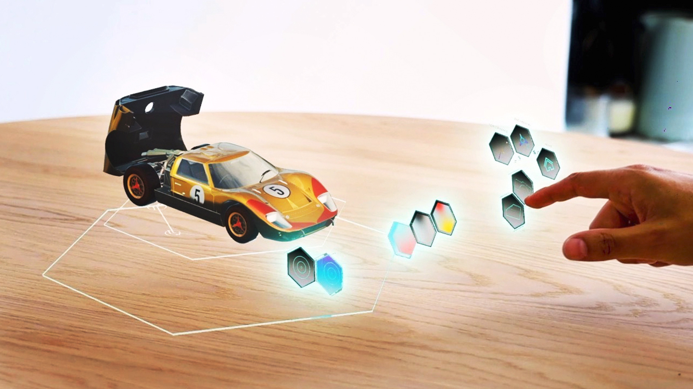
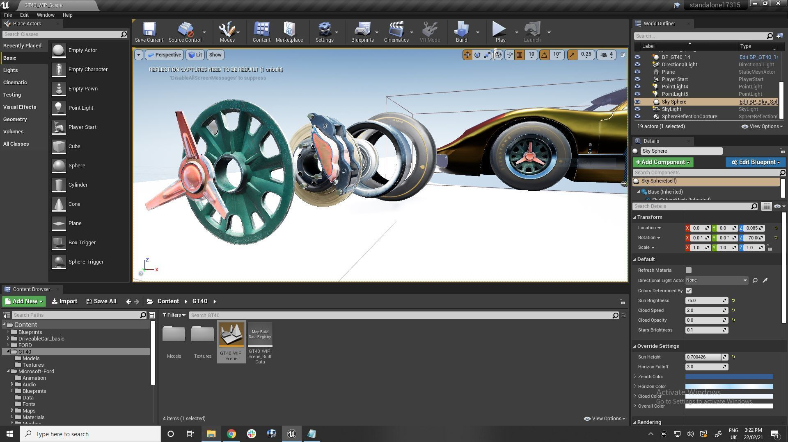

# The making of the Ford GT40 experience

*“Pre-MRTK, developing for HoloLens 2 using Unreal was a bit tedious because all of the spatial interactions had to be coded by hand, in C++. The MRTK for Unreal made a lot of those same tasks trivial. I’d estimate it cut the time required for the initial prototype in half.”* - Jose Rodriguez, Software Developer

*“The Ford GT40 Experience is proof that a high-fidelity HoloLens 2 app can be completed in just a few months, with a modest budget, yet still deliver highly impactful results.”*  - Daniel Cheetham, Chief Innovation Officer, Happy Finish

Using the Mixed Reality Toolkit (MRTK) for Unreal, creative production company Happy Finish delivered a HoloLens 2 experience that provides a fresh perspective on the Ford GT40, the legendary race car that beat Ferrari at the 24 Hours of Le Mans!

Using a range of natural and intuitive spatial interactions, users can explore the GT40’s beauty, performance, and engineering—all delivered in a way that takes advantage of the high visual fidelity provided by the Unreal Engine. Software development for the entire project was completed by a single developer in less than three months, made possible by MRTK for Unreal's visual scripting and design environment.

## Download app from Microsoft Store in HoloLens 2
If you have HoloLens 2 device, you can directly download and install the app in your device.

## The ask

Happy Finish is one of the world’s leading creative production companies, with a client base that includes, Ford, Microsoft, Nike, Netflix, Vodafone, and other household names. The company got its start as a high-end photo-retouch agency, branching-out into film and CGI before extending its dedication to excellence in immersive storytelling with 3D spatial design and interaction.

In mid-2020, Microsoft approached Happy Finish to produce a demo app that could help showcase the possibilities enabled by the new Mixed Reality Toolkit (MRTK) for Unreal, which builds on the support for HoloLens 2 in the Unreal Engine. At this point, the company already had two successful Unreal-on-HoloLens 2 projects under its belt. Both were for a globally recognized consumer brand, which chose Unreal on HoloLens 2 for an internal R&D/B2B sales tool for its high visual fidelity, as required to best showcase that client’s own high-end products.

Although the solution itself would be left up to Happy Finish, it had to meet a few key guidelines. First, it had to focus on an enterprise scenario to illustrate the utility of Unreal on HoloLens 2 outside of the gaming industry. Second, it had to be device-only, meaning it could serve as a standalone demo—without requiring a network connection and external processing power to get the target frame rates and visual quality. Third, it should blend the range of intuitive interactions supported by the MRTK into a seamless and natural experience. Finally, the proposed solution should showcase the inherent visual fidelity and other benefits of the Unreal Engine itself, such as shader efficiencies. 

Given these guidelines, Happy Finish began to brainstorm the possibilities, coming up with the idea for a mixed reality experience that used spatial interaction to communicate the worth of a brand-name, high-value product. After considering a range of objects that included watches, cameras, cars, and private jets, Happy Finish ultimately decided on the Ford GT40, an automotive legend that achieved notoriety in 1966 when Ford beat Ferrari at the 24 Hours of Le Mans—as shown in the 2019 blockbuster film Ford vs. Ferrari. 

Upon obtaining buy-in from Ford, an existing Happy Finish client, the company set out to deliver a fresh perspective on the classic automotive icon.

## The solution

The work began on May 7, 2020. After obtaining the GT40 model files, a 3D artist spent three weeks optimizing polygon models, UV mapping, repainting texture maps, and condensing those maps into as few textures as possible. A technical artist worked in parallel to benchmark the output of the 3D artist, determine optimal texture sizes given target frame rates, and figure out the best way to apply custom shaders in Unreal. All of this preproduction work was done to optimize the on-device experience.

Creative Director Alex Lambert entered the picture after the preproduction work was finished. He started by watching Ford vs. Ferrari, thinking about how to weave together a narrative around the scenarios and interactions. He also collected visual references for the UI artist, such as images of the GT40 dashboard and visuals of the Le Mans racetrack, and collected audio recordings of the GT40 in action for the sound designer.

With the narrative defined and optimized preproduction assets in hand, freelance software developer Jose Rodriguez was enlisted to bring it all together. Rodriguez had been the developer on the previous two Unreal-on-HoloLens 2 projects that Happy Finish had done, before the MRTK for Unreal had been released.

The value provided by the MRTK for Unreal became evident early-on, helping Rodriguez deliver an initial prototype in one week. He implemented three unique scenarios, one for each of the key aspects of the GT40 that Lambert had identified: its beauty, its performance, and its engineering. For each scenario, Rodriguez used the MRTK to integrate the optimized 3D assets from the preproduction phase into a range of spatial interactions. 

With the MRTK for Unreal, Rodriguez built out each scenario using the visual Unreal Motion Graphics (UMG) UI Designer instead of having to implement everything in C++. [UX Tools for Unreal](https://www.unrealengine.com/marketplace/product/mixed-reality-ux-tools), the plug-in containing UX building blocks and components within the MRTK, gave him [Unreal Blueprints](https://docs.unrealengine.com/ProgrammingAndScripting/Blueprints/index.html) for input simulation, visually scripting hand interactions, pressable buttons, 3D image manipulation, surface magnetism, and more—all within a no-code, drag-and-drop design environment.

“Pre-MRTK, developing for HoloLens 2 using Unreal was a bit tedious because all of the spatial interactions had to be coded by hand, in C++,” says Rodriguez. “The MRTK for Unreal made a lot of those same tasks trivial. I’d estimate it cut the time required for the initial prototype in half.”

With a prototype in hand, the team began weekly iterations to refine the experience. “This is when the Mixed Reality Capture feature and the Windows Device Portal became really helpful,” recalls Lambert. “I used them to capture my design reviews, broadcast my feedback to others, and collaborate on changes. Working in isolation like that would have been impossible to do without such tools.”

As Lambert requested changes, such as repositioning UI elements or changing a button’s behavior, Rodriguez implemented them. While some of the changes required small code tweaks, most of them were handled in the Unreal visual designer. “I was surprised at how fast I could iterate,” says Rodriguez. “No time was wasted; I would make a change in the designer and then press play to immediately view it on-device. The MRTK really streamlined my work.”

Rodriguez also recalls being impressed by how production-ready all of the development tooling was. “We progressed smoothly from initial prototype through final production, without having to come back and reimplement or optimize things in code,” he says.  

## The final build

Happy Finish completed production of the Ford GT40 Experience for HoloLens 2 on July 28, 2020, delivering a fresh perspective on the legendary race car. The experience starts with a welcome screen, then guides the user to set up an anchor by grabbing the Ford logo and placing it on a flat surface like a table or desktop. 

### Beauty

The **beauty** segment brings the user to a GT40 configurator, which displays the GT40 on a rotating pedestal, similar to how a physical car might be displayed at an automotive show. The user can apply different wheel options, choose from different color schemes, and open and close the doors and trunk (or boot, as they call it in the UK). Throughout the beauty experience, the user can pick up the car and freely manipulate it for a closer look.

### Performance

The **performance** segment showcases the GT40’s speed and durability. The voiceover starts by describing how the car was developed and put through its paces at Ford’s Kingman, Arizona proving grounds, with 3D visuals showing the GT40 in motion on the test track. As the introduction to the performance segment concludes, the voiceover prompts the user to “Press the Le Mans button to hit the racetrack.”

The second part of the performance segment showcases the GT40 under the range of conditions drivers might experience at the 24 Hours of Le Mans, which is held annually at the Circuit de la Sarthe near Le Mans, France. A 3D view shows the car in motion on the Le Mans track, with buttons provided for making the car go faster or slower. Images of the GT40’s analog speedometer and tachometer float above the racetrack view, with more race telemetry displayed in the background. The user can toggle between day and night views and between dry and wet driving conditions, providing a realistic and lifelike perspective of what Ken Miles and the other GT40 drivers experienced in the actual race.

### Engineering

The **engineering** segment of the Ford GT40 Experience showcases one of the engineering innovations that helped Ford win the race: the ability to change brake rotors and pads in less than a minute, as compared to the 20-30 minutes needed by all the other teams. Using intuitive gestures, the user can manipulate a detailed 3D model of the GT40 wheel and brake assembly. To expand the assembly, the user picks up a lug wrench, aligns it to the center lock on the wheel, turns it counterclockwise, and then pulls it away from the wheel. Other gestures are used to remove the worn brake rotors and pads, replace them with new ones, collapse the assembly, and resecure the center lock. In the background, a timer displays the elapsed time, letting the user see if they can complete the process as quickly as the pit crew at Le Mans.

The Ford GT40 Experience can be [downloaded from the Microsoft store](https://www.microsoft.com/p/ford-gt40/9p4vllktfvfp?activetab=pivot:overviewtab), enabling anyone with a HoloLens 2 to explore how Happy Finish brought a fresh perspective to legendary race car.

### Getting impressive visual fidelity

While the range of spatial interactions supported by the Ford GT40 Experience are impressive on their own, the creativity and visual fidelity the experience delivers is what really makes it shine. Through its optimization of 3D models and use of Unreal custom shaders, Happy Finish hit its target of 60 frames per second, even with the performance segment of the app approaching 315,000 polygons in size. 

“I’m really happy with how we were able to pull together a set of fluid, intuitive interactions into a coherent and engaging narrative,” says Lambert. “Clearly, the power of Unreal Engine on HoloLens 2 opens up a new world of opportunity for more surprising and exciting mixed reality experiences. Uncompromised visual fidelity isn’t always the end goal for enterprise applications on HoloLens 2, but when it is, support for Unreal on HoloLens 2 becomes invaluable.”

### Rapid solution delivery

As impressive as the end-user Ford GT40 Experience is how quickly Happy Finish delivered it, with the entire project—from preproduction to final delivery—completed in just under 12 weeks. In summary, the project consumed 1088 hours of effort, broken down as follows: creative director (80 hours), UX designer (56 hours), UI designer (40 hours), sound designer (40 hours), 3D/technical artist (328 hours), software developer (408 hours), technical director (40 hours), producer (56 hours), and quality assurance (40 hours).

“Overall, we came in pretty close to our original project estimates,” says Daniel Cheetham, Chief Innovation Officer at Happy Finish, who heads up the company’s interactive division. “The Ford GT40 Experience is proof that a high-fidelity HoloLens 2 app can be completed in just a few months, with a modest budget, yet still deliver highly impactful results.” 

From a development perspective, based on his previous experience with Unreal on HoloLens 2, Rodriguez estimates that the MRTK for Unreal cut the total time and effort required on his part in half. He also notes how the MRTK can help developers who have never worked with HoloLens 2 get started. “When other developers say they’re interested in mixed reality, I encourage them to just jump in, install the HoloLens 2 development stack and MRTK, and go for it. The MRTK makes building an app quick and easy, and the Unreal visual editor works so well that you don’t even need a HoloLens 2 device to get started. It’s not complicated at all—everything just works.”

### Potential Azure service enhancements

Lambert sees several ways that Azure mixed reality services could be used to enhance the Ford GT40 Experience, such as using Azure Spatial Anchors to deliver a multi-user experience anchored in the real world. “From a creative perspective, Azure Spatial Anchors open up an entirely new range of possibilities through the ability they provide to map, persist, and restore 3D content or points of interest within our physical world,” he says.

Lambert also envisions how either Azure Remote Rendering or streaming the app from Azure could be used to achieve desired frame rates while working with more detailed and complex 3D models. “We had to implement some highly optimized custom shaders in Unreal to hit our on-device target of 60 frames per second,” he explains. “With Azure Remote Rendering, we could do a lot more—and do it a lot more easily, without as much work required to optimize polygon models, repaint texture maps, and so on.”

### Endless new possibilities

So what’s next for Happy Finish? Ford’s feedback on the Ford GT40 experience has been overwhelmingly positive, leading to further discussions between Happy Finish and Ford on future HoloLens 2 projects. Outside its relationship with Ford, Happy Finish is already starting a new project on HoloLens 2, where the MRTK for Unreal will be a foundational building block for most the user experience. 

“We’ve always maintained a technology-agnostic approach to each new project, proposing whichever tool-set is best-suited to helping the client achieve desired outcomes,” says Cheetham. “That said, HoloLens 2 has emerged as the de-facto gold standard for mixed reality, especially in the enterprise, standing head-and-shoulders above all other options in terms of both device capabilities and the pervasiveness of the supporting ecosystem.”

According to Cheetham, the global pandemic has fueled immense new interest in immersive mixed reality among potential customers. “We’re busier than ever, with about 50 percent of potential clients being open to discussing a mixed reality option,” he says. “The key is to get people to try it. You can tell them about mixed reality all day, but when you hand them a HoloLens 2 to experience for themselves, they immediately get how it can be a game-changer. Support for Unreal Engine in HoloLens 2 only increases the value we can offer, enabling us to deliver visually stunning experiences that are sure to satisfy even the most demanding clients.”

## Try it out!

> [!div class="nextstepaction"]
> [Download the Ford GT40 app](https://www.microsoft.com/p/ford-gt40/9p4vllktfvfp)

Check out our [introduction to Mixed Reality development on HoloLens 2](../development.md) or [MRTK for Unreal](https://github.com/microsoft/MixedRealityToolkit-Unreal) on GitHub.

<!-- ## About the team

<table style="border-collapse:collapse" padding-left="0px">
<tr>
<td style="border-style: none" width="60"></td>
<td style="border-style: none"><b>Jack Caron</b> <i>Lead Game Designer</i> Jack currently works on Mixed Reality experiences for Microsoft, including HoloLens 2 projects and AltspaceVR, and was previously a designer on the HoloLens platform team.</td>
</tr>
</table>

<table style="border-collapse:collapse" padding-left="0px">
<tr>
<td style="border-style: none" width="60"></td>
<td style="border-style: none"><b>Summer Wu</b> <i>Producer</i> Summer works on the mixed reality developer platform and heads the team’s Unreal Engine related efforts.</td>
</tr>
</table> -->