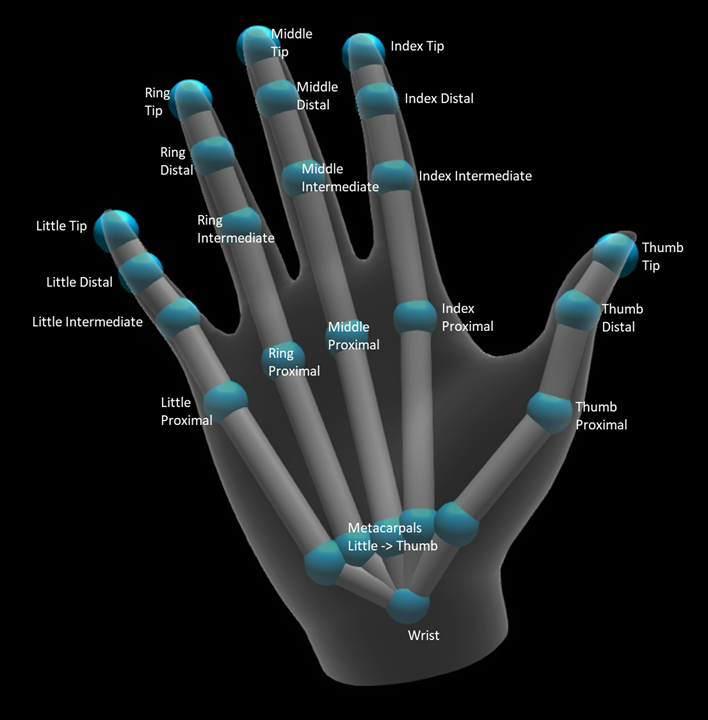
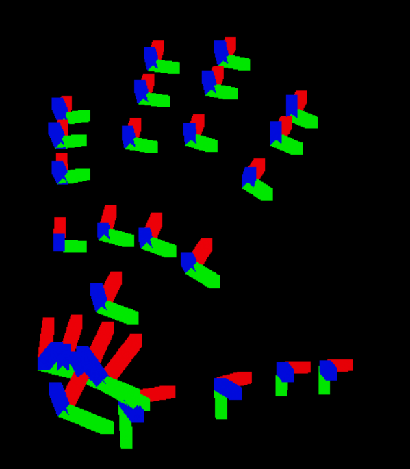
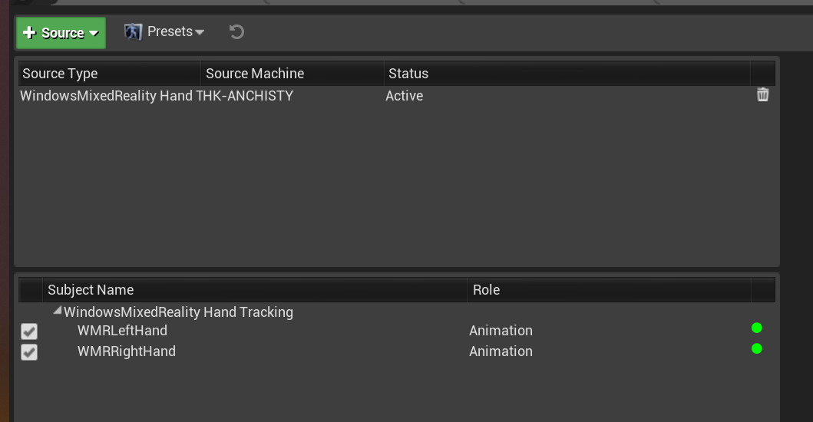
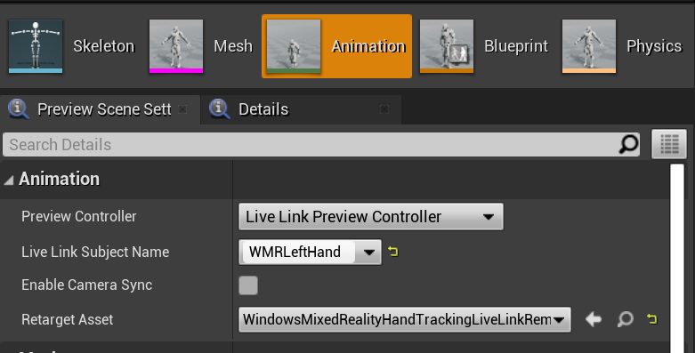
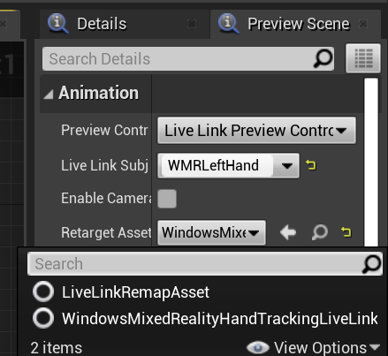
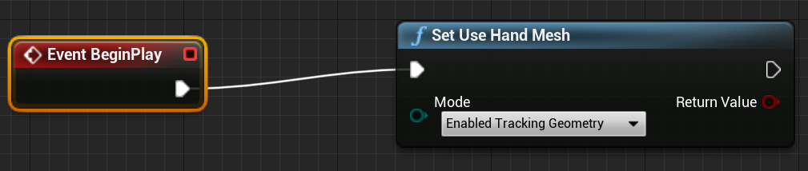
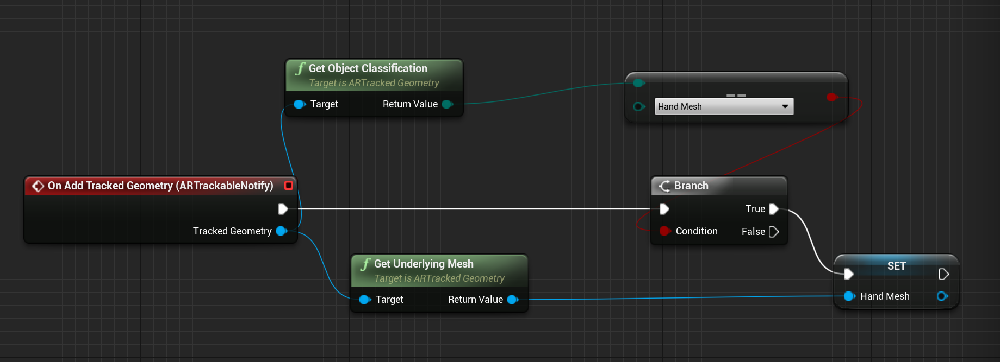
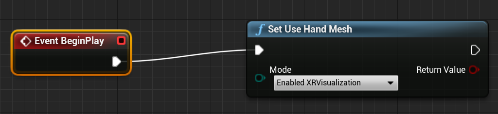
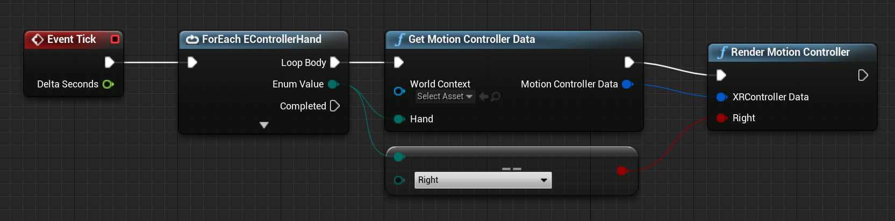
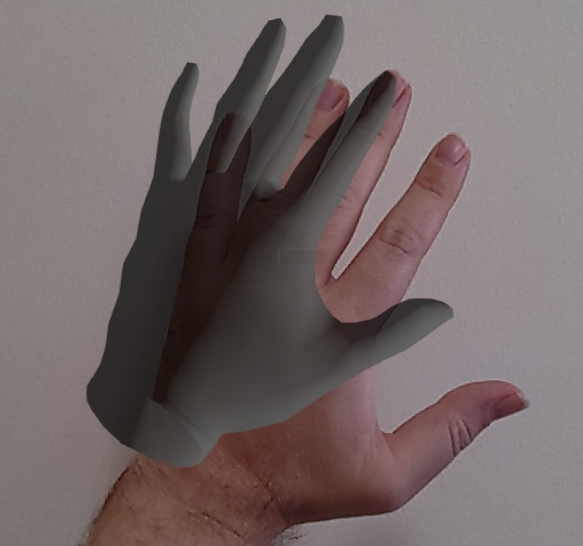

# Hand tracking in Unreal

The hand tracking system uses a person’s palms and fingers as input. Data on position and rotation of every finger, the entire palm, and hand gestures is available. Starting in Unreal 4.26, hand tracking is based on the Unreal HeadMountedDisplay plugin and uses a common API across all XR platforms and devices. Functionality is the same for both Windows Mixed Reality and OpenXR systems.

## Hand pose

Hand pose lets you track and use the hands and fingers of your users as input, which can be accessed in both Blueprints and C++. The Unreal API sends the data as a coordinate system, with ticks synchronized with the Unreal Engine.




[!INCLUDE[](includes/tabs-tracking-hand-pose.md)]

## Hand Live Link Animation

Hand poses are exposed to Animation using the [Live Link plugin](https://docs.unrealengine.com/Engine/Animation/LiveLinkPlugin/index.html).

If the Windows Mixed Reality and Live Link plugins are enabled:
1. Select **Window > Live Link** to open the Live Link editor window.
2. Select **Source** and enable **Windows Mixed Reality Hand Tracking Source**



After you enable the source and open an animation asset, expand the **Animation** section in the **Preview Scene** tab too see additional options.



The hand animation hierarchy is the same as in `EWMRHandKeypoint`. Animation can be retargeted using **WindowsMixedRealityHandTrackingLiveLinkRemapAsset**:



It can also be subclassed in the editor:


## Hand Mesh

### Hand Mesh as a Tracked Geometry

> [!IMPORTANT]
> Getting hand meshes as a tracked geometry in OpenXR requires you to call **Set Use Hand Mesh** with **Enabled Tracking Geometry**.

To enable that mode you should call **Set Use Hand Mesh** with **Enabled Tracking Geometry**:



> [!NOTE]
> It’s not possible for both modes to be enabled at the same time. If you enable one, the other is automatically disabled.

### Accessing Hand Mesh Data


Before you can access hand mesh data, you'll need to:
- Select your **ARSessionConfig** asset, expand the **AR Settings -> World Mapping** settings, and check **Generate Mesh Data from Tracked Geometry**.

Below are the default mesh parameters:

1.	Use Mesh Data for Occlusion
2.	Generate Collision for Mesh Data
3.	Generate Nav Mesh for Mesh Data
4.	Render Mesh Data in Wireframe – debug parameter that shows generated mesh

These parameter values are used as the spatial mapping mesh and hand mesh defaults. You can change them at any time in Blueprints or code for any mesh.

### C++ API Reference
Use `EEARObjectClassification` to find hand mesh values in all trackable objects.
```cpp
enum class EARObjectClassification : uint8
{
    // Other types
	HandMesh,
};
```

The following delegates are called when the system detects any trackable object, including a hand mesh.

```cpp
class FARSupportInterface
{
    public:
    // Other params
	DECLARE_AR_SI_DELEGATE_FUNCS(OnTrackableAdded)
	DECLARE_AR_SI_DELEGATE_FUNCS(OnTrackableUpdated)
	DECLARE_AR_SI_DELEGATE_FUNCS(OnTrackableRemoved)
};
```

Make sure your delegate handlers follow the function signature below:

```cpp
void UARHandMeshComponent::OnTrackableAdded(UARTrackedGeometry* Added)
```

You can access mesh data through the  `UARTrackedGeometry::GetUnderlyingMesh`:

```cpp
UMRMeshComponent* UARTrackedGeometry::GetUnderlyingMesh()
```

### Blueprint API Reference

To work with Hand Meshes in Blueprints:
1. Add an **ARTrackableNotify** Component to a Blueprint actor


2. Go to the **Details** panel and expand the **Events** section.


3. Overwrite On Add/Update/Remove Tracked Geometry with the following nodes in your Event Graph:



### Hand Mesh visualization in OpenXR

The recommended way to visualize hand mesh is to use Epic’s XRVisualization plugin together with the [Microsoft OpenXR plugin](https://github.com/microsoft/Microsoft-OpenXR-Unreal). 

Then in the blueprint editor, you should use **Set Use Hand Mesh** function from the [Microsoft OpenXR plugin](https://github.com/microsoft/Microsoft-OpenXR-Unreal) with **Enabled XRVisualization** as a parameter:



To manage the rendering process, you should use **Render Motion Controller** from XRVisualization:



The result:

 

If you need anything more complicated, such as drawing a hand mesh with a custom shader, you need to get the meshes as a tracked geometry. 

## Hand rays

Getting hand pose works for close interactions like grabbing objects or pressing buttons. However, sometimes you need to work with holograms that are far away from your users. This can be accomplished with hand rays, which can be used as pointing devices in both C++ and Blueprints. You can draw a ray from your hand to a far point and, with some help from Unreal ray tracing, select a hologram that would otherwise be out of reach. 

> [!IMPORTANT]
> Since all function results change every frame, they're all made callable. For more information about pure and impure or callable functions, see the Blueprint user guid on [functions](https://docs.unrealengine.com/Engine/Blueprints/UserGuide/Functions/index.html#purevs.impure).

[!INCLUDE[](includes/tabs-tracking-hand-ray.md)]

## Gestures

The HoloLens 2 tracks spatial gestures, which means you can capture those gestures as input. Gesture tracking is based on a subscription model. You should use the “Configure Gestures” function to tell the device which gestures you want to track.  You can find more details about gestures are the [HoloLens 2 Basic Usage](/hololens/hololens2-basic-usage) document.

[!INCLUDE[](includes/tabs-tracking-gestures.md)]

## Next Development Checkpoint

If you're following the Unreal development journey we've laid out, you're in the midst of exploring the MRTK core building blocks. From here, you can continue to the next building block:

> [!div class="nextstepaction"]
> [Local Spatial Anchors](unreal-spatial-anchors.md)

Or jump to Mixed Reality platform capabilities and APIs:

> [!div class="nextstepaction"]
> [HoloLens camera](unreal-hololens-camera.md)

You can always go back to the [Unreal development checkpoints](unreal-development-overview.md#2-core-building-blocks) at any time.