# Profiling with Unreal Insights 

[Unreal Insights](https://docs.unrealengine.com/TestingAndOptimization/PerformanceAndProfiling/UnrealInsights/Overview/index.html) is a profiling system that collects, analyzes, and visualizes data from Unreal Engine. The profiling system can help you find optimization bottlenecks and areas where you apps performance could use a boost. Normally, you enable Unreal Insights right from the editor, but for HoloLens 2 you'll need to use the command line.  

## Setup

Unreal lets you to create and configure a "Custom Profile" in the HoloLens launcher with the command line parameters that enable Unreal Insights.

1.	Find the IP address of your computer using the **ipconfig** command on the command prompt. The IP address is the IPv4 address listed by ipconfig. Keep this in mind for later when you set Command Line Parameters.

> [!IMPORTANT]
> If you're behind a VPN, you may need to provide the IP address provided via the VPN instead.

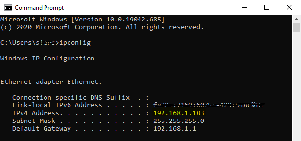

2.	Go to the top of the Unreal Engine panel and open **Device Manager** under the **Launch** button:

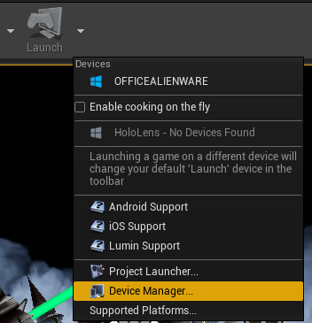

3.	In the Device Manager, select **Add an Unlisted Device**:

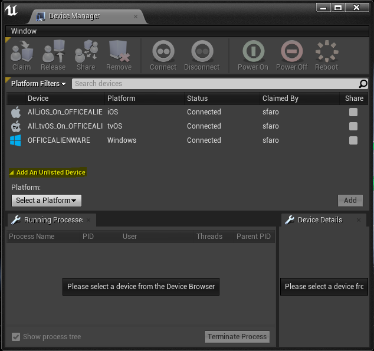

4. Click **Select a platform** and choose **HoloLens**:

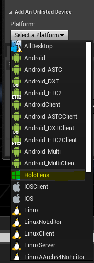

5.	If you're using IPoverUSB, enter 127.0.0.1:10080 as the Device Identifier. Enter your HoloLens user and password in their respective fields and fill **Display Name** as you wish.

> [!IMPORTANT]
> The Device Identifier is the IP address of the HoloLens, NOT of the computer running Unreal Insights you found in step 1.

6.	Select **Add** and your HoloLens should appear in the device list of the device manager:

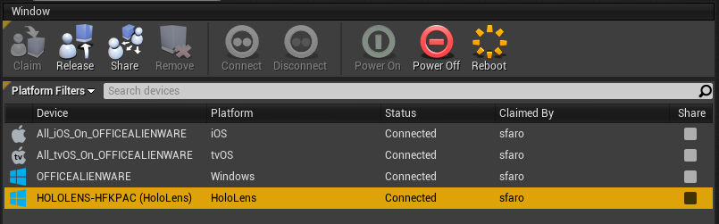

## Launch

1. Open **Project Launcher** from the UE4 panel under the **Launch** button:

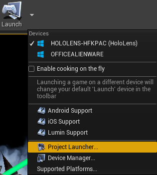

2. Select the **+** button to create a custom profile under **Custom Launch Profiles**. Once created, you can always edit this profile later:

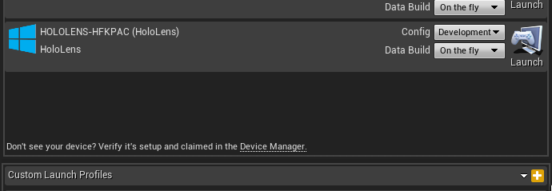

3. Select **edit profile** button on the HoloLens custom launch profile and configure:
    * Select **Cook** to **By the Book** to enable copying to device
    * You may want to check **Do you wish to archive?** in the **Archive** section to retain the generated .appxbundle rather than deleting to save disk space. Specify a location for the .appxbundle and switch to a development build if you wish

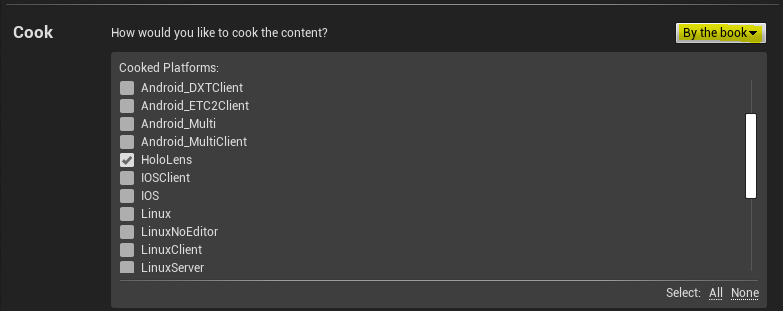

4. Set **How would you like to deploy the build?** to **Copy to device** to activate the **Launch** section of the UI:

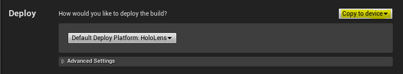

5. Set **Additional Command Line Parameters** in the **Launch** section. The parameters will be written into a ue4commandline.txt file, packaged into the bundle, and used at launch. 
    <!-- TODO: Need more detail on what this parameter does and where to find others. -->
    * Try these for starters: **-tracehost=IP_OF_YOUR_PC -trace=Log,Bookmark,Frame,CPU,GPU,LoadTime,File,Net**
    * You can find a complete list of available launch parameters in the [Unreal Insights reference documentation](https://docs.unrealengine.com/TestingAndOptimization/PerformanceAndProfiling/UnrealInsights/Reference/index.html).

> [!NOTE]
> "IP_OF_YOUR_PC" is the IP address we found in step 1. This is the IP address of the computer running Unreal Insights, NOT the IP address of the HoloLens.

> [!IMPORTANT]
> Traces can get large very quickly. Enable only those channels you need to keep trace size low.

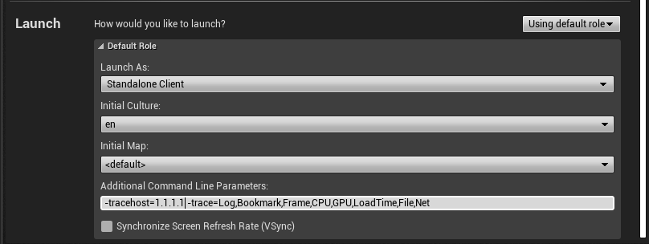

6. Launch Unreal Insights BEFORE app launch, otherwise Unreal Insights wont be able to initialize appropriately before the app:
    * The Unreal Insights executable is stored in the binaries engine folder, usually as follows: "C:\Program Files\Epic Games\UE_4.26\Engine\Binaries\Win64\UnrealInsights.exe"

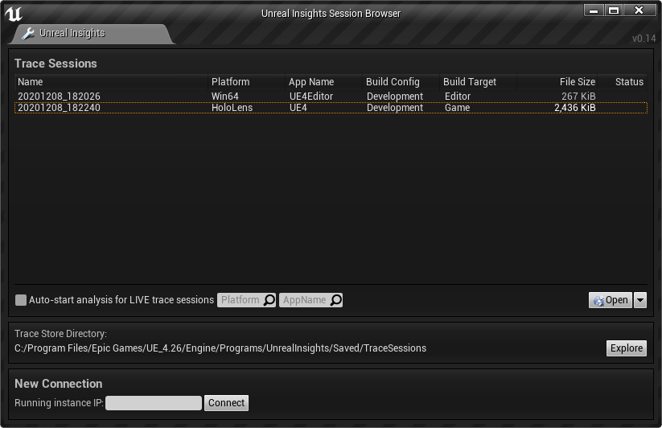

6.	Select **Back** to return to the root of the **Project Launcher** dialog
7.	Back in the editor, Click **Launch** on your custom launch profile

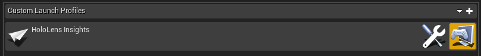

8.	Watch as your project is packaged up, installed on your device, and launched

## Profiling

Back in Unreal Insights, select the **Live** connection to your device to start profiling

The custom profile is shared between projects. From here on out, you can use the custom profile you created instead of having to do this every time. You only need to recreate the connection to the device every time you start Unreal with steps 3 to 6 in the [setup section](#setup).

## See also
* [Unreal Insights documentation](https://docs.unrealengine.com/TestingAndOptimization/PerformanceAndProfiling/UnrealInsights/index.html)

