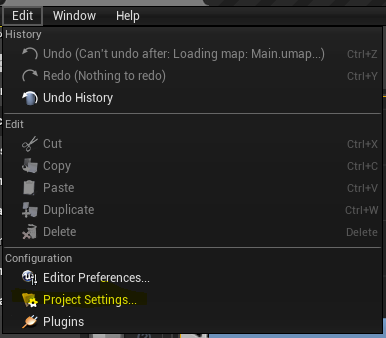
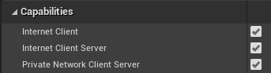
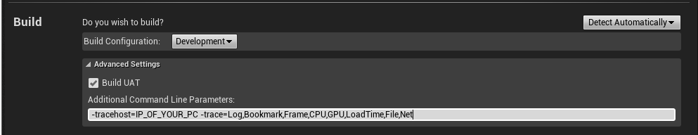
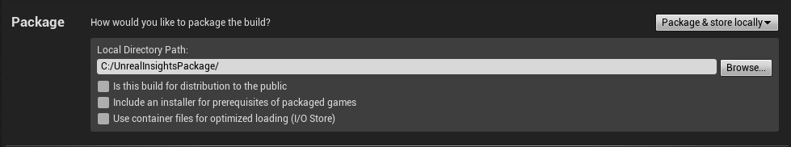
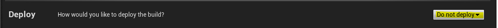

# Profiling with Unreal Insights

[Unreal Insights](https://docs.unrealengine.com/TestingAndOptimization/PerformanceAndProfiling/UnrealInsights/Overview/index.html) is a profiling system that collects, analyzes, and visualizes data from Unreal Engine. The profiling system can help you find optimization bottlenecks and areas where you apps performance could use a boost. Normally, you enable Unreal Insights right from the editor, but for HoloLens 2 you'll need to use the command line.

## Setup

Unreal lets you to create and configure a "Custom Profile" in the HoloLens launcher with the command line parameters that enable Unreal Insights.

1. Find the IP address of your computer using the **ipconfig** command on the command prompt. The IP address is the IPv4 address listed by ipconfig. Keep this in mind for later when you set Command Line Parameters.

> [!IMPORTANT]
> If you're behind a VPN, you may need to provide the IP address provided via the VPN instead.

2. Open **Project Settings** from the "Edit" toolbar in the main editor window.

3. Scroll down the left panel until you find the **Platforms** header and select **HoloLens**.

4. Confirm that the **Capabilities** section has "Internet Client", "Internet Client Server", and "Private Network Client Server" selected.

## Launch

1. Open **Project Launcher** from the UE4 panel under the **Launch** button:

2. Select the **+** button to create a custom profile under **Custom Launch Profiles**. Once created, you can always edit this profile later:

3. Select **edit profile** button on the HoloLens custom launch profile. In the **Build** section, check **Build UAT** and set **Additional Command Line Parameters**.
   - Try these for starters: **-tracehost=IP_OF_YOUR_PC -trace=Log,Bookmark,Frame,CPU,GPU,LoadTime,File,Net**
   - You can find a complete list of available launch parameters in the [Unreal Insights reference documentation](https://docs.unrealengine.com/TestingAndOptimization/PerformanceAndProfiling/UnrealInsights/Reference/index.html).

> [!NOTE]
> "IP_OF_YOUR_PC" is the IP address we found in step 1. This is the IP address of the computer running Unreal Insights, NOT the IP address of the HoloLens.

> [!IMPORTANT]
> Traces can get large very quickly. Enable only those channels you need to keep trace size low.

4. Select **Cook** to **By the Book** to enable copying to device. Make sure your maps are selected in **Cooked Maps**.

5. Set **How would you like to package the build** to **Package & store locally**. Note the file path you choose, as you will need this later.

6. Set **How would you like to deploy the build?** to **Do not deploy**.

8. Select **Back** to return to the root of the **Project Launcher** dialog
9. Back in the editor, Click **Launch** on your custom launch profile

10. Watch as your project is built, and then deploy the appxbundle (in the package path from step 5) to your HoloLens through the device portal

11. Launch Unreal Insights. The Unreal Insights executable is stored in the binaries engine folder, usually as follows: "C:\Program Files\Epic Games\UE_4.26\Engine\Binaries\Win64\UnrealInsights.exe"

12. Launch the app on your HoloLens.

## Profiling

Back in Unreal Insights, select the **Live** connection to your device to start profiling

The custom profile is shared between projects. From here on out, you can use the custom profile you created instead of having to do this every time. You only need to recreate the connection to the device every time you start Unreal with steps 3 to 6 in the [setup section](#setup).

## See also

- [Unreal Insights documentation](https://docs.unrealengine.com/TestingAndOptimization/PerformanceAndProfiling/UnrealInsights/index.html)
