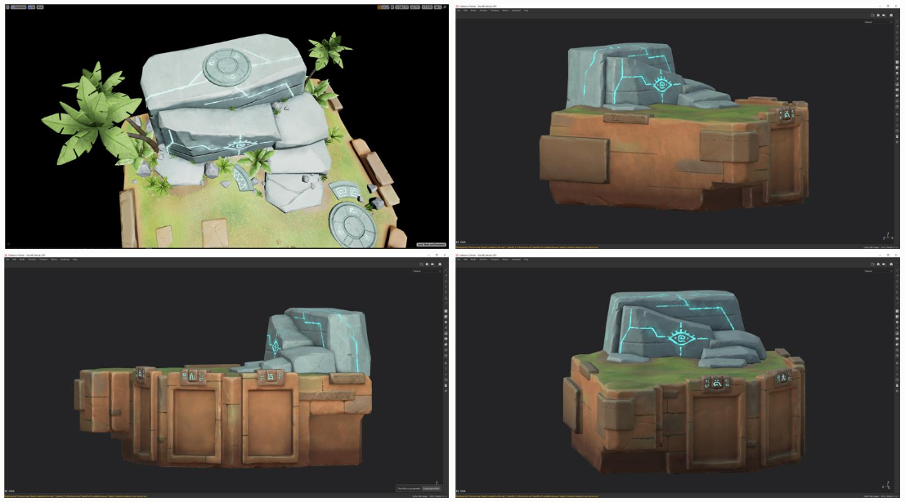

# The making of Kippy's Escape

Kippy the robot wakes up to find itself stranded on an island. It’s up to you to put on your problem-solving hat to help it find a path back to its rocket ship! Strap on your HoloLens 2 and [download the app](https://www.microsoft.com/p/kippys-escape/9nbd7gl86vkd) from the Microsoft Store or clone the [repository](https://github.com/microsoft/MixedReality-Unreal-KippysEscape) from GitHub and get Kippy home safe!  

> [!IMPORTANT]
> Make sure you're using **Unreal Engine 4.25 or later** if you're building Kippy's Escape from the GitHub repository.

Kippy’s Escape is an open-source [HoloLens 2](/hololens/hololens2-hardware) sample app built with Unreal Engine 4 and [Mixed Reality UX Tools for Unreal](https://github.com/microsoft/MixedReality-UXTools-Unreal). In this post, we’ll walk you through our process from first principles and visual design to implementing and optimizing the experience. You can find more information on developing Mixed Reality applications with MRTK UX Tools in the [Unreal development overview](unreal-development-overview.md).

## Download app from Microsoft Store in HoloLens 2
If you have HoloLens 2 device, you can directly download and install the app in your device.

## First principles 

In setting out to create Kippy’s Escape, our goal was to create an experience that would highlight [Unreal Engine’s HoloLens 2 support](https://docs.unrealengine.com/develping-for-hololens-in-unreal-engine/), the HoloLens 2’s capabilities, and the Mixed Reality Toolkit. We wanted to inspire developers to imagine what they could create with Unreal and HoloLens 2.  

We came up with three guiding principles for the experience: that it needed to be fun, interactive, and have a low barrier to entry. We wanted the experience to be intuitive enough that even a first-time mixed reality user won’t need a tutorial to go through it.  

## Designing the game 

The HoloLens 2 has access to design features found nowhere else in gaming today. Objects can be directly pushed or manipulated using your hands or targeted with eye tracking. These key features are behind some of the fun moments we built out in Kippy’s Escape.  

Using the unique HoloLens 2 features as guidance for our game design, we scoped out a few small environment scenarios. Islands made sense because they can be adjusted for different player heights, and provided some entertaining bridge ideas. We landed on the theme of ancient civilization meets sci-fi tech, with the idea that someone had built machinery over ruins harnessing a strange energy provided by each island. The islands were each given their own look and feel, a detail that helped create visual interest. A good balance between modeling and texturing would keep draw calls low for rendering performance, so a stylized look was designed with that in mind. 

*Some early sketches for what the experience might look like*

*Renderings of the second island*

To keep within our short production schedule, we agreed that a floating character could capture intent and emotion without rigorous animation cycles. And so Kippy was born! It emotes a few different expressions through its eyes and through minimalistic vocal sound effects to help guide the player throughout the experience. 

*Kippy showing different expressions via its eyes*

*If the user takes too long to solve a puzzle, Kippy will give the user a hint*

Beyond the character and environment design, we made a concerted effort to make the game feel fun. Eye tracking allowed us to fire off material and sound attributes, which highlighted key pieces of the game. Spatial audio helped make the levels feel at home in the player’s surroundings. Being able to grab objects, push buttons, and manipulate sliders drives innovative player engagements. It was important to make sure these connection points felt natural. 

*The end of the bridge cable glows when the user’s hand approaches it*

## Building the game mechanics 

Kippy’s Escape relies heavily on Mixed Reality UX Tools components to make the game interactive - namely hand interaction actors, bounds controls, manipulators, sliders, and buttons.   

The [hand interaction actor](https://microsoft.github.io/MixedReality-UXTools-Unreal/Docs/HandInteraction.html) enables both direct and far manipulation of holograms. At the start of Kippy’s Escape, the user is given the opportunity to set the location of the game. Hand beams extending from the user’s palm make it easy to manipulate large holograms that are far away, as seen in the gif below.  

The placeholder scene itself can be dragged and rotated using UX Tools’ [bounds control](https://microsoft.github.io/MixedReality-UXTools-Unreal/Docs/BoundsControl.html) component.  

On the second island, the user must pick up gems and place them in their matching slots. The gems have [manipulators](https://microsoft.github.io/MixedReality-UXTools-Unreal/Docs/Manipulator.html) attached to them that allow the user to pick them up and place them down. 

A [pressable button](https://microsoft.github.io/MixedReality-UXTools-Unreal/Docs/PressableButton.html) is the key to bringing up bombs for use on the third island.  

A [slider](https://microsoft.github.io/MixedReality-UXTools-Unreal/Docs/PinchSlider.html) component appears on the fourth island, triggering the final bridge to be raised.  

 

## Optimizing for HoloLens 2 

With any experience built to run on a mobile device, keeping an eye on performance is critical. Unreal 4.25 includes a major update to support for mobile multi-view, which significantly reduces rendering overhead and boosts frame-rate. We recommend checking out our other [recommended performance settings](performance-recommendations-for-unreal.md) for HoloLens 2 development with Unreal when you're optimizing.  

Physics objects still remain costly for performance, so a couple clever workarounds were used. For instance, the third “bridge” requires blowing up some debris blocking the stairway. Instead of having a force impact the stones as physics objects, the bomb detonation triggers a swap, switching the static stones for an exploding particle effect. 

 

We also cut down our draw calls from over 400 to  ~260 by: 
* Reducing mesh complexity
* Combining meshes
* Removing some of our initial dynamic lighting elements

While there’s likely more we could have done, we felt that was a good balance between performance and visual quality.  

## Try it out! 

Boot up your HoloLens 2 and [download](https://www.microsoft.com/p/kippys-escape/9nbd7gl86vkd) the app from the Microsoft Store, or clone the [repository](https://github.com/microsoft/MixedReality-Unreal-KippysEscape) from GitHub and build the app yourself!  

## About the team

<table>
<tr>
<td></td>
<td><b>Jack Caron</b> <i>Lead Game Designer</i> Jack currently works on Mixed Reality experiences for Microsoft, including HoloLens 2 projects and AltspaceVR, and was previously a designer on the HoloLens platform team.</td>
</tr>
</table>

<table>
<tr>
<td width="60"></td>
<td><b>Summer Wu</b> <i>Producer</i> Summer works on the mixed reality developer platform and heads the team’s Unreal Engine related efforts.</td>
</tr>
</table>

Special thanks to our friends at [Framestore](https://www.framestore.com/) for helping us bring Kippy’s Escape to life. From character development, to asset design, to game programming, their collaboration on this project was pivotal.
