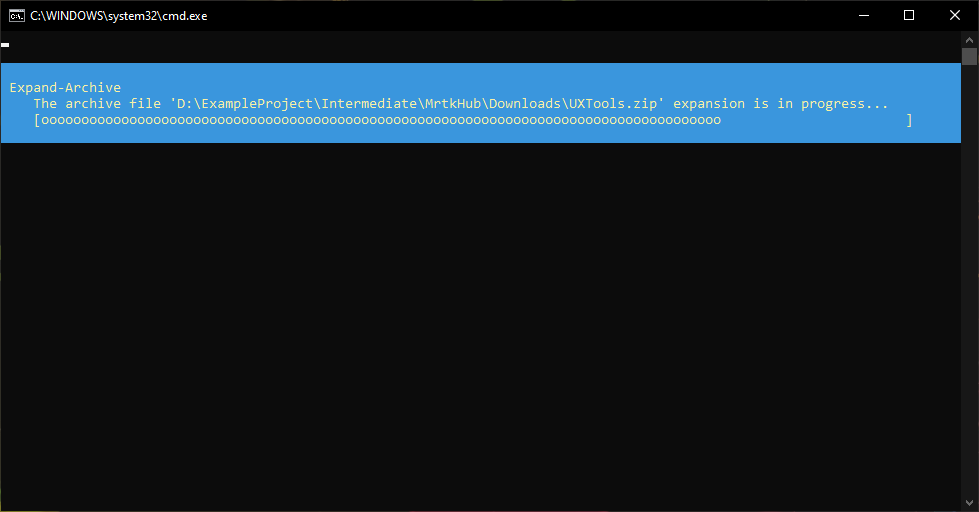

# Introduction to the Mixed Reality Toolkit Hub for Unreal

The Mixed Reality Toolkit Hub is an entry point to the Mixed Reality Toolkit for Unreal. It is a new way for developers to discover, update, and add Microsoft Mixed Reality plugins into their Unreal projects. You can view plugins, see their dependencies and install them into your project all without leaving the Unreal Editor.
- Discover new Microsoft Mixed Reality plugins and install them and their dependencies into your Unreal project.
- Keep your Microsoft Mixed Reality plugins up to date.
- Remove Microsoft Mixed Reality plugins from your project if you no longer need them.

## System Requirements

- [Unreal Engine 4.26](https://www.unrealengine.com/en-US/download)
- [Windows 10](https://www.microsoft.com/software-download/windows10ISO)

> [!NOTE]
> The Mixed Reality Toolkit Hub currently only supports Windows 10.

## Getting Started

### Installing the MRTK Hub plugin

The MRTK Hub is available on the Unreal Engine Marketplace. Download the plugin from Marketplace, open your project and enable the plugin from the _Mixed Reality_ section of the _Plugins_ menu. Restart the editor when prompted.

Once the plugin is enabled for your project, you can access the hub from the toolbar button.

### Installing mixed reality plugins

To install a plugin using the hub, select the plugin you want to add to your project and press the _Install_ button. Verify there are no conflicts in the _Issues_ box and press _Confirm_ to download the plugin. Once the plugin is downloaded, you will be prompted to restart the editor. Unfortunately we can't auto-restart the editor for you as sometimes the new editor instace will start before the installation is complete.

After closing the editor you will see a command prompt appear with a progress bar for unpacking the downloaded plugin. One command prompt will appear for each plugin being installed. Once unpacking is completed, you can re-open the editor and continue on your [mixed reality development journey](https://docs.microsoft.com/en-us/windows/mixed-reality/develop/unreal/unreal-quickstart).

> [!IMPORTANT]
> Once the plugin is installed, it must be checked into source control like any other project level plugin.

### Updating mixed reality plugins

To update a plugin using the hub, select the plugin you want to update from the list and press the _Install_ button. Verify that there are no conflicts in the _Issues_ box and press _Confirm_ to download the new version. You will be prompted to restart the editor to complete the update. Plugin updates are done on editor startup so there is no need to wait for any unpacking to complete before you re-open the editor.

### Removing mixed reality plugins

To remove a plugin using the hub, select the plugin you want to remove and select the version you have installed from the dropdown. Press the _Remove_ button, validate that there are no conflicts in the _Issues_ box and press _Confirm_ to remove the plugin. You will be prompted to restart the editor to complete the removal.

## Reviewing changes and detecting incompatibilities

You can view the exact changes that will be made to your project in the bottom section of the hub's window. From here you can see the plugins that will be added or removed from your project alongside any potential incompatibilities that might cause issues when the changes have been made.

> [!NOTE]
> The _Issues_ list will surface incompatibilities in Unreal engine version and plugin dependency versions but it doesn't automatically fix or suggest fixes to issues.

