# Upgrading projects in Unreal

When updating to a new version of Unreal, deprecated functions show up as warnings when compiling blueprints or packaging the project.  Functions are deprecated when a new function has been added that should be used instead.

## 5.0 changes

In 5.0, the Windows Mixed Reality (WMR) plugin that ships with Unreal Engine is deprecated in favor of the OpenXR plugin (available on [Unreal Marketplace](https://www.unrealengine.com/marketplace/en-US/product/ef8930ca860148c498b46887da196239) or [GitHub](https://github.com/microsoft/Microsoft-OpenXR-Unreal)). The WMR plugin will be removed in future engine releases, so developers should move to OpenXR.

### OpenXR vs Microsoft OpenXR
The OpenXR plugin that ships with the engine can be used to create an application, but any MSFT-specific OpenXR features (including Holographic App Remoting) will only exist in the Microsoft OpenXR plugin, so it does need to be downloaded to create a full-featured experience.

### Updates

The Microsoft OpenXR plugin is shipped out-of-band to the Unreal engine, so that plugin should be monitored for new features. Updates will be available as they're developed. This is a shift from the WMR plugin, where each engine release had all new features baked in.

### HoloLensAR

The HoloLens AR plugin has been removed and should no longer be included as a plugin dependency in Unreal Engine 5.0.

## 5.0 warnings

Updated Unreal Engine 5.0 projects may see new compiler errors for FVectors and Shaders due to UE5's [Large World Coordinates](https://docs.unrealengine.com/5.0/en-US/large-world-coordinates-in-unreal-engine-5/) which increased precision from float to double.

## 4.26 changes

The significant change is that **Start in VR** from **Edit > Project Settings > Project > Description > Settings** is mandatory for starting Windows Mixed Reality plugin. Without that parameter, you will not see your holograms on the device.

## 4.26 warnings
 
In 4.26, all AR and VR platforms have been refactored to add common interfaces and keep application code platform agnostic, so you may see more warnings than usual.  Updating to the new APIs is recommended so the project can be more easily ported to other platforms.

Warning messages will show which function has been deprecated and indicate what function to use instead.  All deprecated functions will continue to work for this release but may not work in future releases.  Deprecated functions will also no longer be listed when searching for functions in a blueprint.

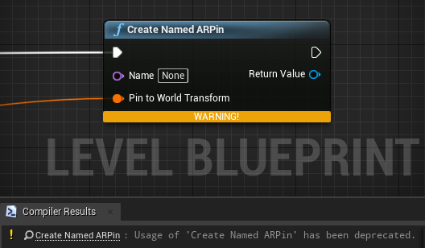

### 4.25 deprecations

| Deprecated function | New function |
| --- | --- |
| CreateNamedARPin | 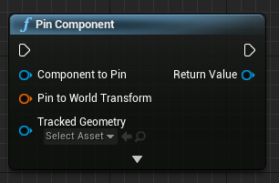 |
| LoadWMRAnchorStoreARPins | 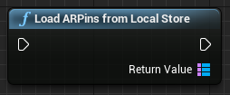 |
| LoadWMRAnchorSaveARPinToWMRAnchorStoreStoreARPins | 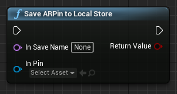 |
| RemoveARPinFromWMRAnchorStore | 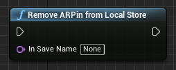 |
| SetEnabledMixedRealityCamera | 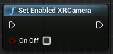 |
| ResizeMixedRealityCamera | 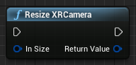 |
| StartCameraCapture | 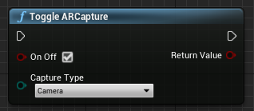 |
| StopCameraCapture | 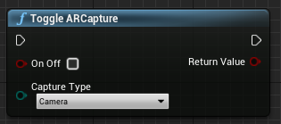 |
| StartQRCodeCapture | 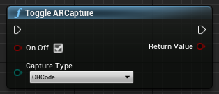 |
| StopQRCodeCapture | 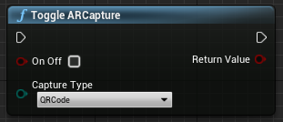 |
| Spatial mapping previously automatically started in 4.25, but now needs to be toggled in 4.26. | 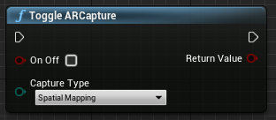 |
| ShowKeyboard | Removed in 4.26 since the keyboard automatically shows when a text widget is focused on. |
| HideKeyboard | Removed in 4.26 since the keyboard will automatically hide when a text widget is unfocused. |
| SupportsHandTracking | 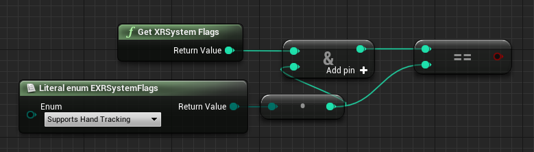 |
| IsDisplayOpaque | 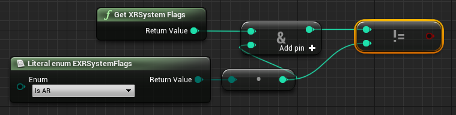 |
| GetHandJointTransform, GetPointerPoseInfo, GetControllerTrackingStatus | 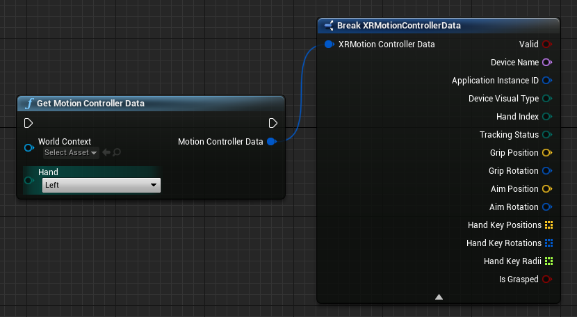 |
| GetVersionString | 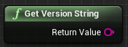 |
| IsTrackingAvailable | 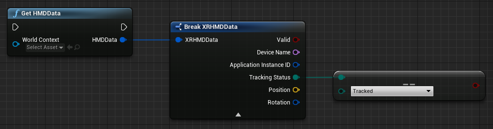 |
| IsButtonClicked, IsButtonDown, IsGrasped, IsSelectPressed | Use Unreal’s input action system. |
| SetFocusPointForFrame | Removed in 4.26.  Previously used for reprojection when remoting, which now supports depth reprojection. |
