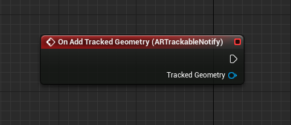

# QR codes in Unreal

If you're new to working with QR codes, you may want to review our [QR code tracking overview](../advanced-concepts/qr-code-tracking-overview.md).

The HoloLens 2 can see QR codes in world space using the webcam, which renders them as holograms at each code's real-world position. HoloLens 2 can also render holograms in the same location on multiple devices to create a shared experience. Make sure you're following the best practices for adding QR codes to your applications:

- Quiet zones
- Lighting and backdrop
- Size, distance, and angular position

Pay special attention to the [environment considerations](/hololens/hololens-environment-considerations) when QR codes are being placed in your app. You can find more information on each of these topics and instructions on how to download the required NuGet package in our [QR code tracking overview](../advanced-concepts/qr-code-tracking-overview.md) document.

> [!CAUTION]
> QR codes are the only type of images that can be tracked by HoloLens out of the box - Unreal's **UARTrackedImage** module isn't supported on HoloLens. If you need to track custom images, you can access the device's [webcam](unreal-hololens-camera.md) and process images using a third party image recognition library. 

## Enabling QR detection

Since the HoloLens 2 needs to use the webcam to see QR codes, you'll need to enable it in the project settings:
- Open **Edit > Project Settings**, scroll to the **Platforms** section, and select **HoloLens**.
    + Expand the **Capabilities** section and check **Webcam**.  
- You'll also need to opt into QR code tracking by [adding an ARSessionConfig asset](/windows/mixed-reality/unreal-uxt-ch3#adding-the-session-asset).

[!INCLUDE]

## Setting up a tracked QR code

QR codes are surfaced through Unreal’s AR tracked geometry system as a tracked image. To get this working, you'll need to:
1. Create an Actor Blueprint and add an **ARTrackableNotify** component:

2. Select **ARTrackableNotify** and expand the **Events** section in the **Details** panel:

3. Click **+** next to **On Add Tracked Geometry** to add the node to the Event Graph.
    - You can find the full list of events in the [UARTrackableNotify](https://docs.unrealengine.com/en-US/API/Runtime/AugmentedReality/UARTrackableNotifyComponent/index.html) component API.

## Using a tracked QR code

The Event Graph in the following image shows the **OnUpdateTrackedImage** event being used to render a point in the center of a QR code and print out its data.

[!INCLUDE]

Here's what's going on:
1. First, the tracked image is cast to an **ARTrackedQRCode** to check that the current updated image is a QR code.  
2. The encoded data is retrieved from the **QRCode** variable. You can get the top-left of the QR code from the location of **GetLocalToWorldTransform** and the dimensions with **GetEstimateSize**.

You can also [get the coordinate system for a QR code](/windows/mixed-reality/qr-code-tracking#getting-the-coordinate-system-for-a-qr-code) in code.

## Finding the unique ID

Every QR code has a unique guid ID, which you can find by:
- Dragging and dropping the **As ARTracked QRCode**  pin and searching for **Get Unique ID**.

## Next Development Checkpoint

If you're following the [Unreal development checkpoint journey](./unreal-development-overview.md?tabs=ue426%2cmrtk%2casa%2cD365#3-advanced-features) we've laid out, you can proceed to the next topic:

> [!div class="nextstepaction"]
> [WinRT](unreal-winRT.md)

Or jump directly to deploying your app on a device or emulator:

> [!div class="nextstepaction"]
> [Deploying to device](unreal-deploying.md)

You can always go back to the [Unreal development checkpoints](unreal-development-overview.md#3-advanced-features) at any time.

## See also
* [QR code tracking overview](../advanced-concepts/qr-code-tracking-overview.md)
* [Spatial mapping](../../design/spatial-mapping.md)
* [Holograms](../../discover/hologram.md)
* [Coordinate systems](../../design/coordinate-systems.md)
