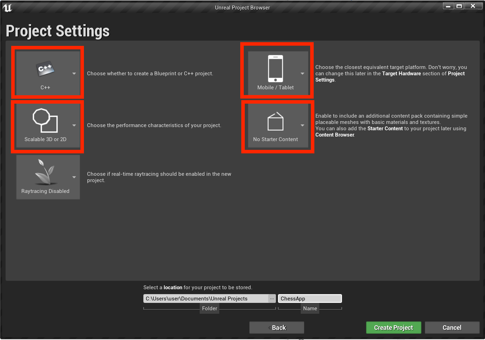
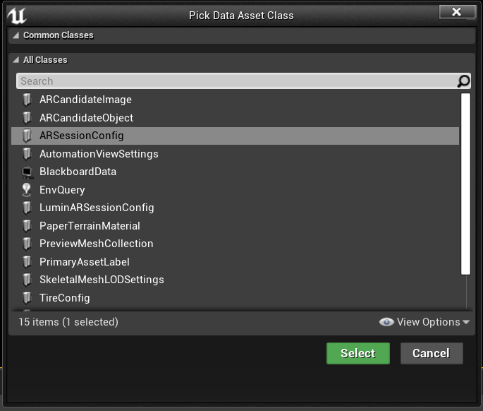
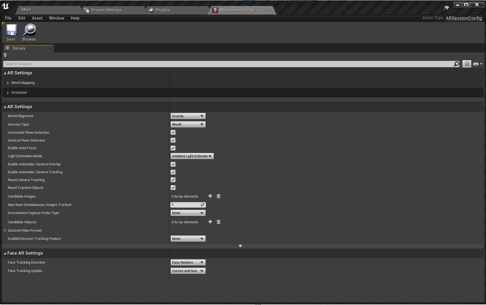
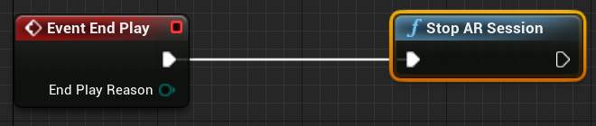
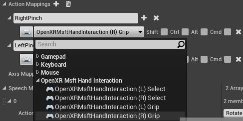
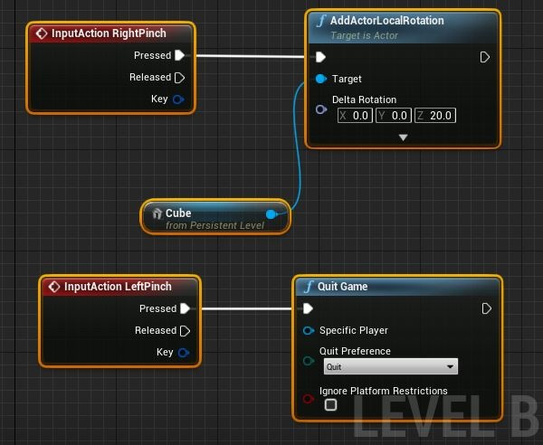
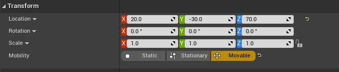

# Creating your first HoloLens Unreal application

This guide will walk you through getting your first Mixed Reality app running on the HoloLens in Unreal Engine. In the tradition of "Hello World", you'll create a simple app that displays a cube on the screen. To make it more useful, you'll also create your first gesture to rotate the cube and quit the application. 

## Objectives

* Start a HoloLens Project
* Enable the correct plugins
* Create an ARSessionConfig Data Asset
* Set up gesture inputs
* Build a basic level
* Implement a pinch gesture

## Creating a new project

The first thing you need is a project to work with. If you're a first-time Unreal developer, you'll need to [download supporting files](tutorials/unreal-uxt-ch6.md#packaging-and-deploying-the-app-via-device-portal) from the Epic Launcher.

1. Launch Unreal Engine
2. In the **New Project Categories**, select **Games** and click **Next**:

3. Select the **Blank** template and click **Next**:

4. In the **Project Settings**, set **C++, Scalable 3D or 2D, Mobile/Tablet**, and **No Starter Content**, then choose a save location and click **Create Project**

> [!NOTE] 
> You're using a C++ rather than a Blueprint project in order to be ready to use the OpenXR plugin later. This QuickStart uses the default OpenXR plugin that comes with Unreal Engine. However, downloading and using the official Microsoft OpenXR plugin is recommended. That requires the project to be a C++ project.

Your new project should open up automatically in the Unreal editor, which means you're ready for the next section.

## Enabling required plugins

You'll need to enable two plugins before you can start adding objects to the scene.

1. Open **Edit > Plugins** and select **Augmented Reality** from the built-in options list.
* Scroll down to **HoloLens** and check **Enabled**

2. Type **OpenXR** in the search box at the top right and enable the **OpenXR** and **OpenXRMsftHandInteraction** plugins:

3. Restart your editor

> [!NOTE]
> This tutorial uses OpenXR, but the two plugins you've installed above don't currently provide the full feature set for HoloLens development. The HandInteraction plugin will suffice for the "Pinch" gesture you'll use later, but if you want to go beyond the basics you'll need to [download the OpenXR plugin](https://github.com/microsoft/Microsoft-OpenXR-Unreal).

With the plugins enabled, you can focus on filling it with content.

## Creating a level

Your next task is to create a player setup with a starting point and a cube for reference and scale.

1. Select **File > New Level** and choose **Empty Level**. The default scene in the viewport should now be empty
2. From the **Modes** tab, select **Basic** and drag **PlayerStart** into the scene
* In the **Details** tab, set **Location** to **X = 0, Y = 0,** and **Z = 0** to place the user at the center of the scene when the app starts

3. From the **Basic** tab, drag a **Cube** into the scene
* Set the cube's **Location** to **X = 50, Y = 0**, and **Z = 0** to position the cube 50 cm away from the player at start
* Change  the cube's **Scale** to **X = 0.2, Y = 0.2**, and **Z = 0.2** 

You can't see the cube unless you add a light to your scene, which is your last task before testing the scene.

4. In the **Modes** panel, switch to the **Lights** tab and drag a **Directional Light** into the scene
* Position the light above **PlayerStart** so you can see it

5. Go to **File > Save Current**, name your level **Main**, and select **Save**

With the scene set, press **Play** in the toolbar to see your cube in action! When you're finished admiring your work, press Esc to stop the application.

Now that the scene is set up, lets get it ready for some basic interactions in AR. First, you need to create an AR Session and can add blueprints to enable hand interaction.

## Adding a session asset

AR sessions in Unreal don't happen by themselves. To use a session, you need an ARSessionConfig data asset to work with, which is your next task:

1. In the **Content Browser**, select **Add New > Miscellaneous > Data Asset** and make sure you're at the root Content folder level
2. Select **ARSessionConfig**, click **Select**, and name the asset **ARSessionConfig**:

2. Double-click **ARSessionConfig** to open it, **Save** with all default settings, and return to the Main window:

With that done, your next step is to make sure the AR session starts and stops when the level loads and ends. Luckily, Unreal has a special blueprint called a **Level Blueprint** that acts as a level-wide global event graph. Connecting the ARSessionConfig asset in the Level Blueprint guarantees the AR session will fire right when the game starts playing.

3. From the editor toolbar, select **Blueprints > Open Level Blueprint**:

4. Drag the execution node (left-facing arrow icon) off **Event BeginPlay** and release
* Search for the **Start AR Session node** and hit enter
* Click the **Select Asset** dropdown under **Session Config** and choose the **ARSessionConfig** asset

5. Right-click anywhere in the EventGraph and create a new **Event EndPlay** node. 
* Drag the execution pin and release, then search for a **Stop AR Session** node and hit enter 
* Hit **Compile**, then **Save** and return to the Main window

> [!IMPORTANT]
> If the AR session is still running when the level ends, certain features may stop working if you restart your app while streaming to a headset.

## Setting up inputs

1. Select **Edit > Project Settings** and go to the **Engine > Input**
2. Select the **+** icon next to **Action Mappings** and create **RightPinch** and **LeftPinch** actions:

3. Map the **RightPinch** and **LeftPinch** actions the to the respective **OpenXR Msft Hand Interaction** actions:

## Setting up gestures

Now that we have setup the inputs, we can get to the exciting part: Adding gestures! Lets rotate the cube on the right pinch and quit the application on left pinch.

1. Open the **Level Blueprint** and add an **InputAction RightPinch** and **InputAction LeftPinch**
* Connect the right pinch event to an **AddActorLocalRotation** with your **Cube** as the target and **Delta Rotation** set to **X = 0, Y = 0**, and **Z = 20**. The cube will now rotate by 20 degrees every time you pinch
* Connect the left pinch event to **Quit Game**

2. In the cube's **Transform** settings, set **Mobility** to **Movable** so it can move dynamically:

At this point, you're ready to deploy and test the application!
