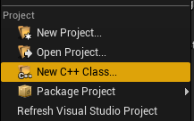
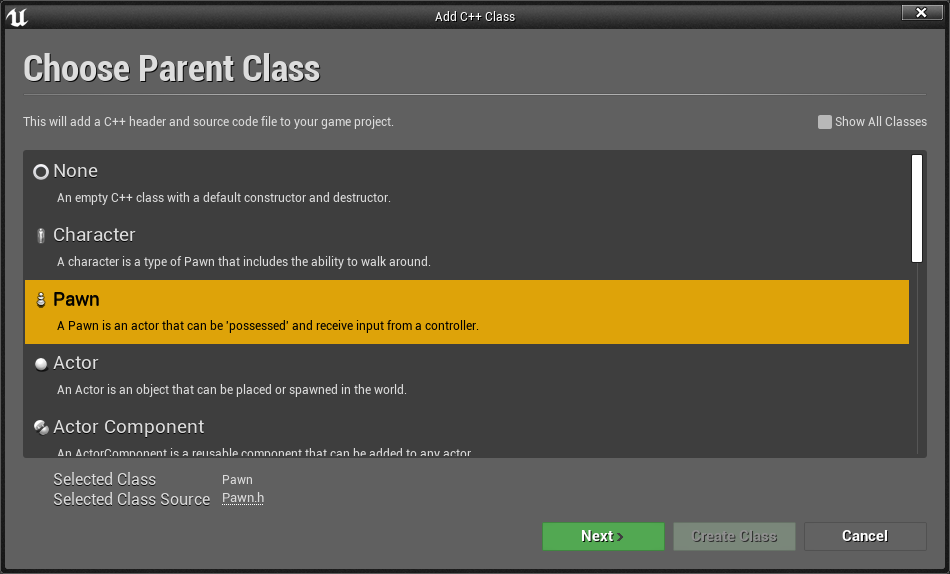

# HP Reverb G2 Controllers in Unreal 

Need introduction...

## Getting started

Unreal Engine 4.26 and either OpenXR or SteamVR is required to access the HP Motion Controller plugin you'll need to work with the HP Reverb G2 controllers.

[!INCLUDE[](includes/tabs-g2-controllers-in-unreal.md)]

### Porting From Existing OpenXR Game 

If no controller bindings exist in the game for the HP Mixed Reality Controller, the OpenXR runtime will attempt to remap the existing bindings to the active controller.  In this case, the game has Oculus Touch bindings and no HP Mixed Reality Controller bindings.


The events will still fire, but if the game needs to make use of controller specific bindings, like the right menu button, the HP Mixed Reality interaction profile must be used.  Multiple controller bindings can be specified per action to better support different devices.
   


## Adding Input Action Mappings 

Define a new action and map to one of the key presses in the HP Mixed Reality Controller section.


The HP Reverb G2 controller also has an analog grip, which can be used in the axis mappings with the “Squeeze Axis” binding.  There is a separate Squeeze binding, which should be used for action mappings when the grip button is fully pressed. 


## Adding Input Events to Game

Right click on a Blueprint and search for the new action names from the input system to add events for these actions.  Here the Blueprint is responding to the events with a print string outputting the current button and axis state.


### Input in C++

The same action and axis mappings in the game’s input project settings can be used from C++.

1. Create a new C++ Class with File/New C++ Class...



2. Create a pawn



3. In the project’s Visual Studio solution, find the new Pawn class and configure it for input.
* First, in the constructor, set AutoPossessPlayer to the first player to route input to the pawn.

```cpp
AMyPawn::AMyPawn()
{
    PrimaryActorTick.bCanEverTick = true;

    AutoPossessPlayer = EAutoReceiveInput::Player0;
}
```

* Then in SetupPlayerInputComponent, bind actions and axis events to the action names from the project’s input settings.

```cpp
void AMyPawn::SetupPlayerInputComponent(UInputComponent* PlayerInputComponent)
{
    Super::SetupPlayerInputComponent(PlayerInputComponent);

    PlayerInputComponent->BindAction("X_Button", IE_Pressed, this, &AMyPawn::XPressed);
    PlayerInputComponent->BindAction("L_GripAxis", this, &AMyPawn::LeftGripAxis);
}
```

* Add the callback functions to the class:

```cpp
void AMyPawn::XPressed()
{
    UE_LOG(LogTemp, Log, TEXT("X Pressed"));
}

void AMyPawn::LeftGripAxis(float AxisValue)
{
    if(AxisValue != 0.0f) 
    {
        UE_LOG(LogTemp, Log, TEXT("Left Grip Axis Valule: %f"), AxisValue);
    }
}
```

* Update the Pawn’s header with the callback function definitions:

```cpp
private:
    void XPressed();
    void LeftGripAxis(float AxisValue);
```

4. Compile from Visual Studio to launch the editor with the new pawn. Drag and drop the pawn from the content browser into the game and the pawn will now execute the callbacks when input is pressed.

## See also
* [SteamVR Input](https://docs.unrealengine.com/Platforms/VR/SteamVR/HowTo/SteamVRInput/index.html)
* [Using SteamVR with Windows Mixed Reality](https://docs.microsoft.com/windows/mixed-reality/enthusiast-guide/using-steamvr-with-windows-mixed-reality)
* [Unreal Player Camera](https://docs.unrealengine.com/Programming/Tutorials/PlayerCamera/3/index.html)