# Setting up a Mixed Reality scene in Unreal

## Setting up AR Config

Your first step is to make sure the correct plugins are enabled. 

1. Under **Edit > Plugins**, enable the **HoloLens** and **Windows Mixed Reality** plugins:

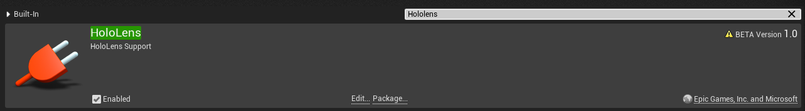

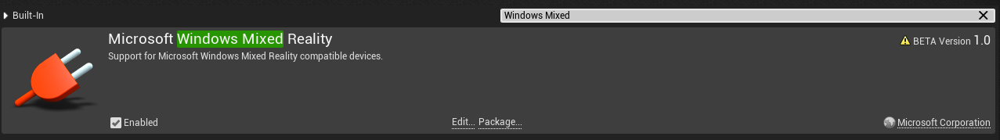

2. Next, under **Edit > Project Settings**, click on **Description** in the left menu window and check the **Start in VR** box:

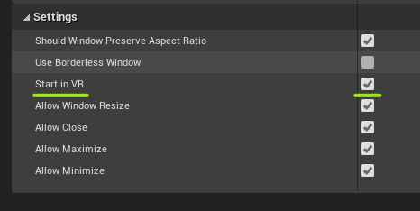

> [!IMPORTANT]
> Skipping this step will result in a blank app slate.

## Creating the main level

1. In the **Content Browser**, right-click and create a **Level**. This will be the default level for the project:

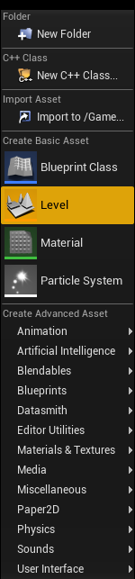

2. Double-click on the newly created level in the Content Browser to load it.

3. In the Content Browser, right-click to create a Data Asset and name it **ARSessionConfig**:

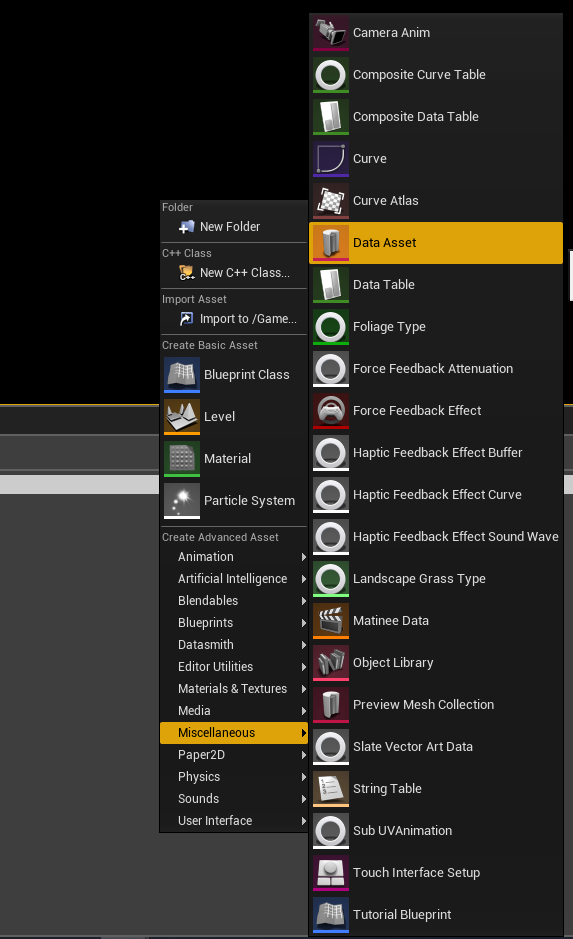

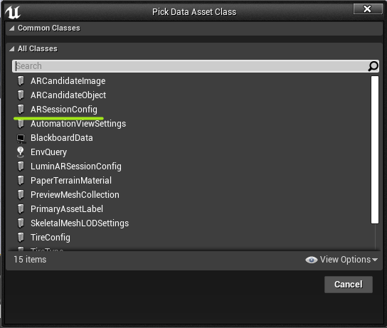

4. Double-Click to edit, and check the **Generate Mesh Data** and **Generate Collision for Mesh Data** boxes. This generates collision for the SR mesh.

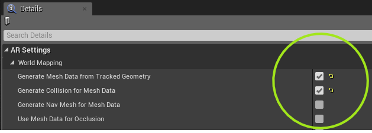

5. Next, open the Level Blueprint from the Blueprints dropdown above the scene view: 

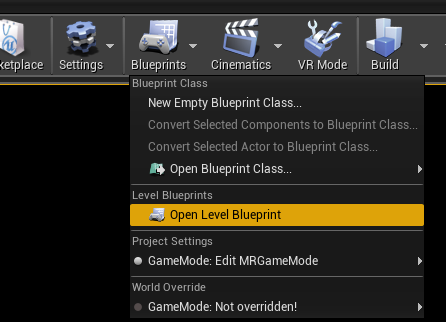

6. Right-click in the graph to create an **Start AR Session** node.

* Click on the the text window under **Session Config** and search for the ARSessionConfig data node created in the previous step:

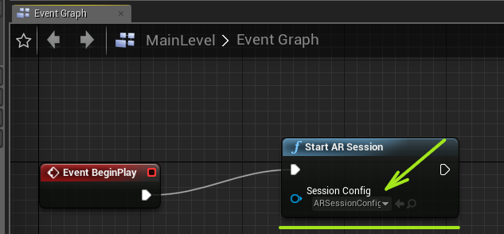

## Setting up motion controllers

1. In the Content Browser, right-click to create a Blueprint Class type **Actor** and name it **BP_MotionController**: 

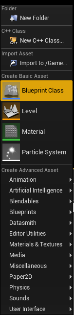

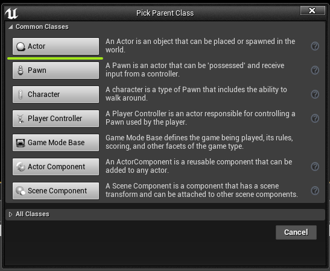

2. Double-click to edit and create a new variable of type **EController Hand** (follow green arrows below):

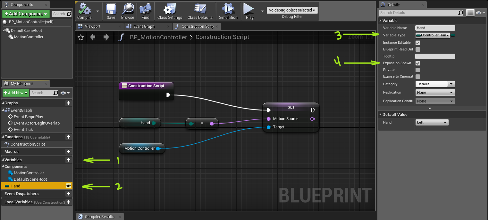

3. Add a **MotionController** component from the **+ Add Component** dropdown and construction setup:

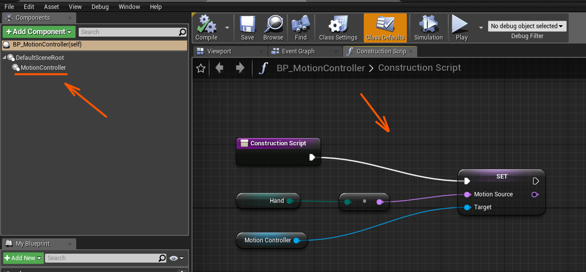

4. Right-lick in the grid to bring up the **Actions** menu and searching for **Motion Source**, which might require the **Context Sensitive** box to be un-checked:

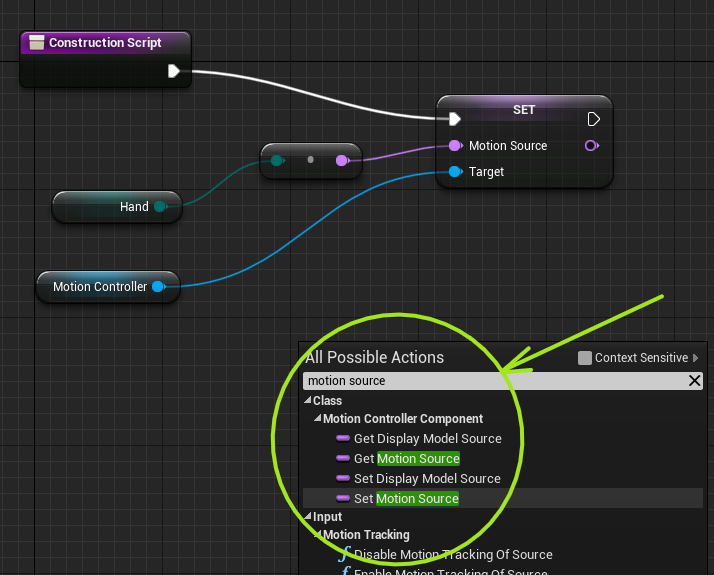

> [!NOTE]
> Construction Scripts come with Blueprints by default. They differ from the Event Graph in that they only run 'On Begin Play', which is for asset setup, not for running during the game.

5. The blue **Motion Controller** and green **Hand** nodes are created by drag & dropping them from their respective columns. The **Hand** enum will give an option to 'Get' or 'Set' - choose 'Get'.

## Adding a player pawn

1. Open the Content Browser and create **Blueprint Class** type **Pawn**:

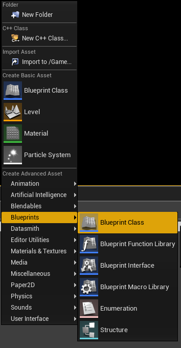

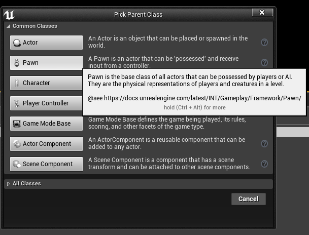

2. Double-click to edit and add a **Scene Component**, rename it **Origin**, and a **Camera Component** parented to it:

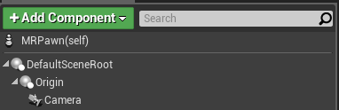

3. Open the Event Graph, set up to the SpawnActor **BP_MotionController** nodes and **AttachtoComponent** to the **Origin** node.

* Start by creating a **Spawn Actor from Class** node. 
* In its **Class** param, search and select the **MotionController** Blueprint created in the previous steps. 
* Pull from the **Return Value** pin and search or create an **Attach to Component** node, which should be the first in the list. 
* Duplicate those nodes and set up as shown in the screenshot below:

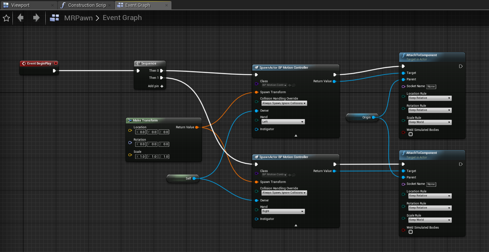

> [!NOTE]
> * The "Self" node can be created by right-clicking, holding and dragging from the "Owner" parameter and searching for "Self" in the menu pop-up. There will be an option to choose the "Self" variable.
>
> * The "Owner" input of the SpawnActor node is available when the drop-down arrow on the bottom of the node is clicked.
> 
> * The "Origin" getter can be created by click/dragging the Origin scene component into the graph from the component list.

4. Set one to Left and one to Right:

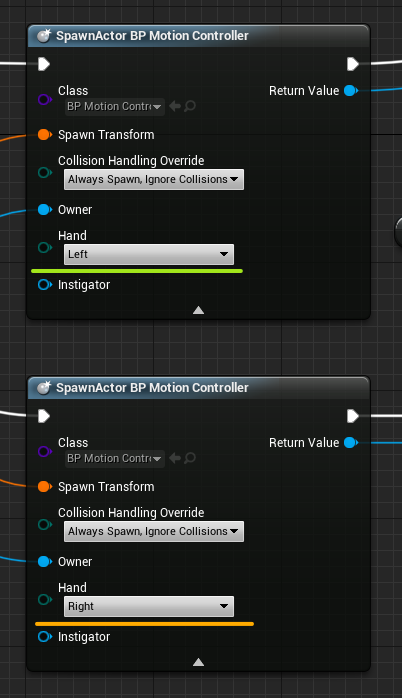

## Using Game Mode

1. Create another **Blueprint Class**, this time of type **Game Mode Base**:

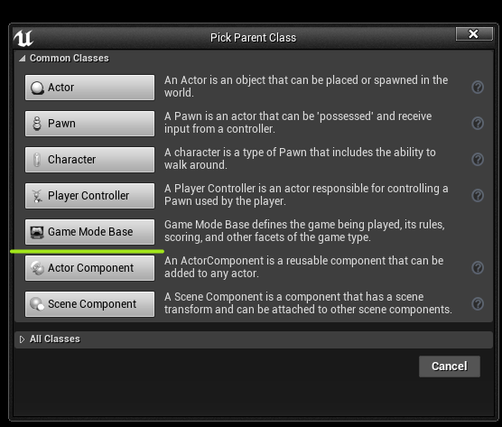

2. Double-click and point the **Default Pawn Class** parameter to the player pawn created above:

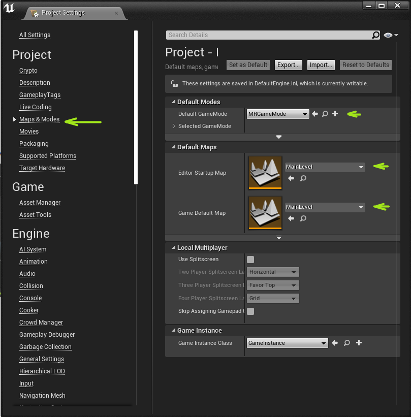

3. Open **Edit > Project Settings** and point the **Default GameMode** to the one you just created.
* Set the **StartUp** and **Default Maps** to the main level created earlier:

> [!IMPORTANT]
> This is important when building the app, but also sets the level to startup when the project is opened as opposed to the default UE4 temp level.

## Accessing hand joints

1. Create a **Blueprint Class** type **Actor** to get set up with hand positions and drop two **Hand Joint Transform** nodes in:

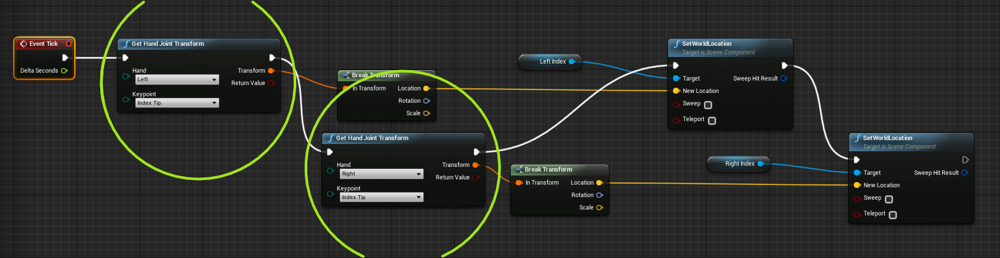

> [!NOTE]
> This is where the hand data can drive whatever the prototype or game needs. In this case, it is being used to have two spheres (named LeftIndex and RightIndex and added as components in the Blueprint) follow their respective index tips.

