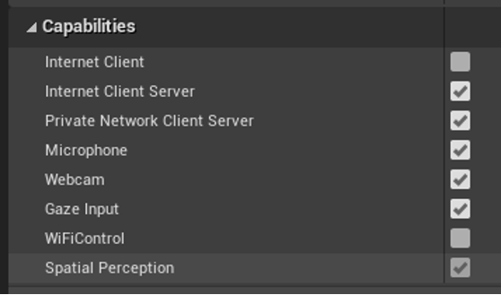
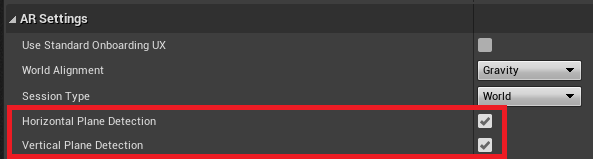
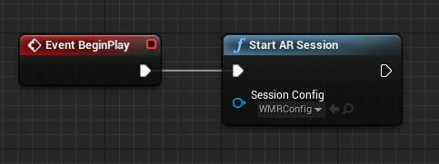
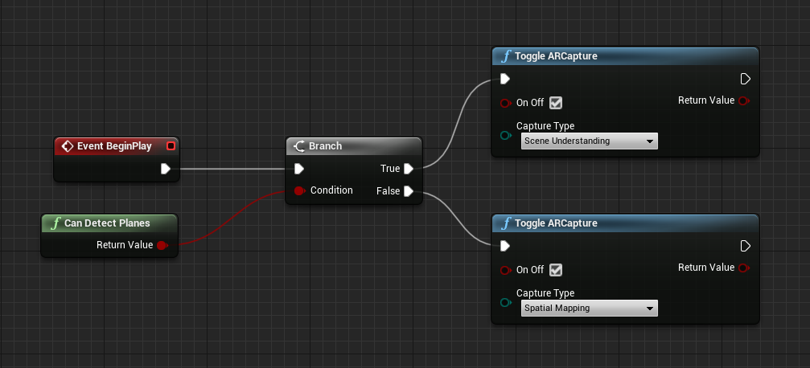
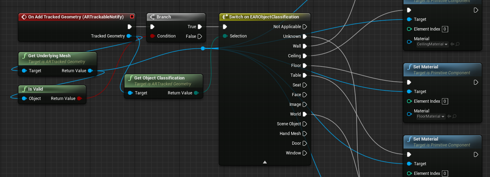
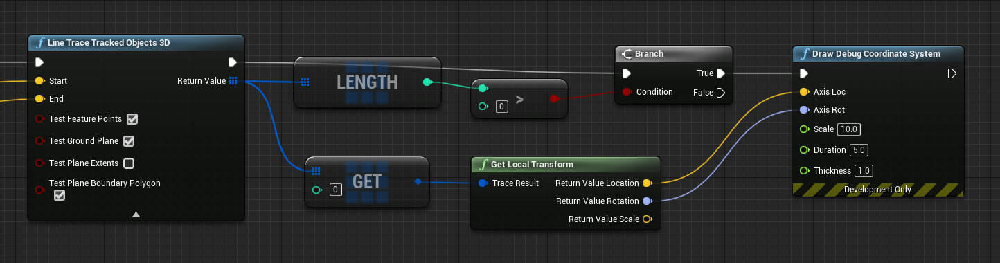

# Scene Understanding in Unreal
Scene understanding provides the MRMesh with planes that are classified with their interpreted usage, like walls, floors, ceilings, and tables.  Use cases are similar to spatial mapping, but the meshes have this additional metadata and will be surfaced as planes rather than a rough mesh.

You can find more information in the [Scene Understanding](../../design/scene-understanding.md) document.

> [!NOTE]
> Starting with Holographic Remoting version [2.8.0](../native/holographic-remoting-version-history.md#v2.8.0) Scene Understanding is fully supported.

## Prerequisites
> [!IMPORTANT] 
> Scene Understanding requires OpenXR and Unreal 4.27.1 or newer.

The Microsoft OpenXR plugin must be used, available from the [Unreal Marketplace](https://www.unrealengine.com/marketplace/en-US/product/ef8930ca860148c498b46887da196239) or [GitHub](https://github.com/microsoft/Microsoft-OpenXR-Unreal/releases).

Alternatively, start with the [OpenXR sample application](https://github.com/microsoft/Microsoft-OpenXR-Unreal) which demonstrates how to use Scene Understanding.


## Setup
To enable scene understanding on HoloLens:
1. Open **Edit > Project Settings** and scroll down to the **Platforms** section.    
1. Select **HoloLens** and then select **Spatial Perception**.



To opt into scene understanding and use the **MRMesh** in a HoloLens game:
1. Open the **ARSessionConfig** and expand the **ARSettings > World Mapping** section. 
2. Check **Generate Mesh Data from Tracked Geometry**, which tells the HoloLens plugin to start asynchronously getting scene understanding data and surface it to Unreal through the **MRMesh**. 
3. Optionally check **Render Mesh Data in Wireframe** to show a white wireframe outline of every triangle in the **MRMesh**. 


4. In the second **ARSettings** dropdown, find the **Horizontal Plane Detection** and **Vertical Plane Detection** checkboxes.  These can be selectively disabled if your experience only requires horizontal or vertical planes.  By default, both horizontal and vertical planes will be used.




## Optional ini Settings
You can modify the following parameters to update the spatial mapping runtime behavior:

- Open **Edit > Project Settings**, then scroll down to the **Platforms** section, and then select **HoloLens > Spatial Mapping**: 


- **Spatial Meshing Volume Size** is the diameter of a sphere around the player to render and update scene understanding data.
- If the application runtime environment is expected to be large, this value may need to be large to match the real-world space. The value can be smaller if the application only needs to place holograms on surfaces immediately around the user. As the user walks around the world, the spatial mapping volume will move with them.
    
When using scene understanding, large scanning volumes can hurt performance since many more meshes are being generated than spatial mapping.  To keep draw calls lower, an additional ini setting can be used to restrict the volume height:

- In the game's [Config/DefaultGame.ini](https://github.com/microsoft/Microsoft-OpenXR-Unreal/blob/076a5defe01e08360f382b2498d17708c00b85bf/MsftOpenXRGame/Config/DefaultGame.ini#L13) file, add a section [/Script/HoloLensSettings.SceneUnderstanding] with optional settings:

```
[/Script/HoloLensSettings.SceneUnderstanding]
SceneUnderstandingVolumeHeight=4
ShouldDoSceneUnderstandingMeshDetection=true
```
- **SceneUnderstandingVolumeHeight** will restrict the scene understanding scan volume to a rectangular prism with this height and sides of length **Spatial Meshing Volume Size**.

- **ShouldDoSceneUnderstandingMeshDetection** will add meshes to each of the identified planes.  Meshes will overlap some surfaces, such as tables, more accurately than planes, but will incur additional draw and compute calls.  By default, only planes will be detected.


## Working with the MRMesh
First you need to start the ARSession:



Then you need to start scene understanding:



In this example, we check the **CanDetectPlanes** function to check if we should toggle scene understanding or spatial mapping.  This will allow the code to work in both remoting and on a HoloLens device.  Otherwise, toggling scene understanding when remoting will not return any planes.

To get access to the **MRMesh** at runtime:
1. Add an **ARTrackableNotify** component to a Blueprint actor. 


1. Select the **ARTrackableNotify** component and expand the **Events** section in the **Details** panel. 
1. Select the **+** button on the events you want to monitor. 


You can find the full list of events in the [UARTrackableNotify](https://docs.unrealengine.com/4.27/API/Runtime/AugmentedReality/UARTrackableNotifyComponent/index.html) component API.

In this example, as MRMeshes are identified, their object classification is queried and a different material is set based on what type of surface it is.



To perform collision tests against scene understanding meshes, LineTraceTrackedObjects3D can be used:



Disable **Test Plane Extents** to perform hit tests against only scene understanding meshes, otherwise both meshes and planes will be used.  Planes don't always cover real-world geometry, so they could cause a false collision if used.  For example, open doorways will be covered by the plane from the wall around it.  

The tracked geometry and object classification can be queried from the trace result, so you can perform different functions based on whether you hit a wall or a table, for example.

In this example, a debug coordinate system is drawn at the collision point on the closest scene understanding mesh that was hit.

## See Also
* [Scene Understanding](../../design/scene-understanding.md)
* [Spatial Mapping in Unreal](./unreal-spatial-mapping.md)

