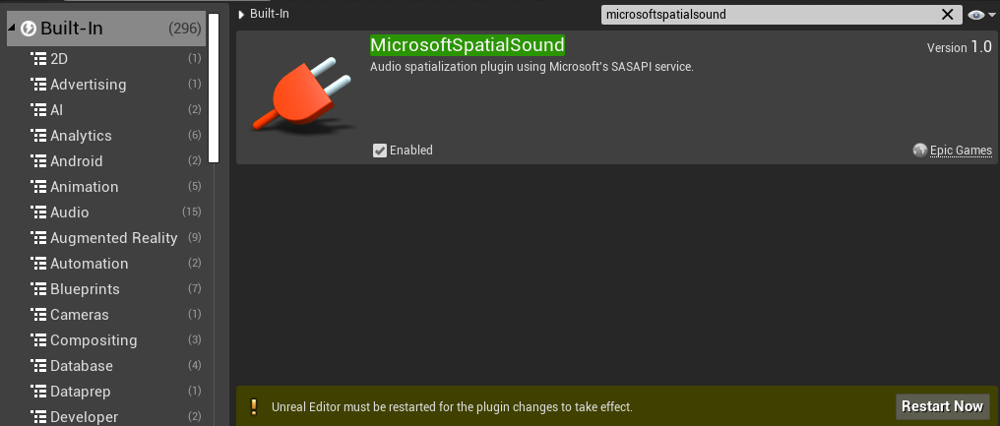
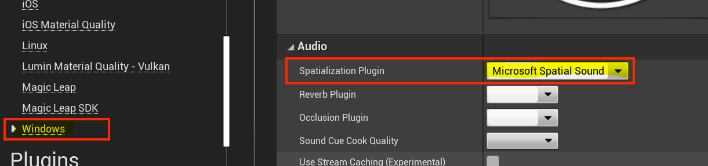
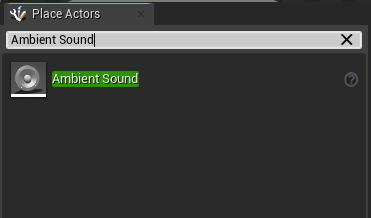
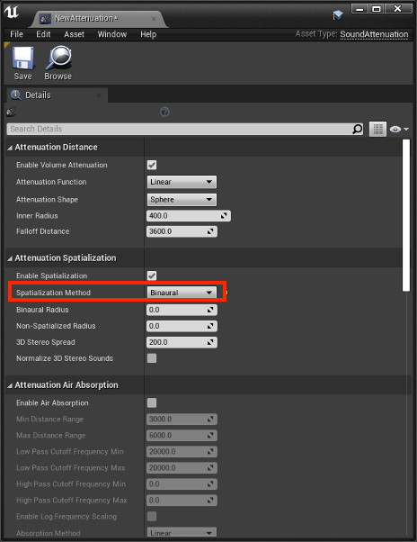
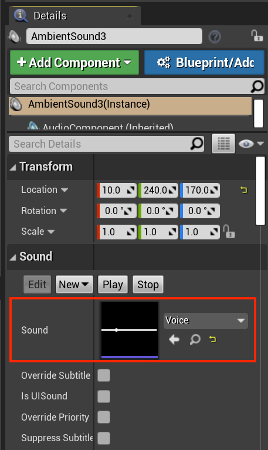
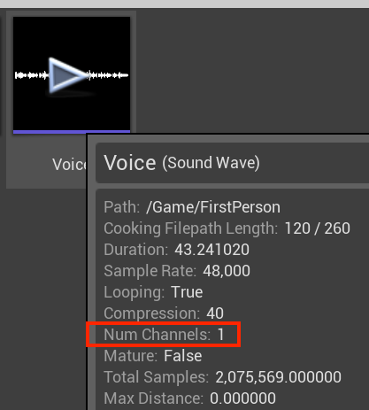

# Spatial Audio in Unreal

Unlike vision, humans hear in 360-degree surround sound. Spatial sound emulates how human hearing works, providing the cues needed to identify sound locations in world-space. When you add spatial sound in your mixed reality applications, you're enhancing the level of immersion your user's experience.  

High-quality spatial sound processing is complex, so the HoloLens 2 comes with dedicated hardware for processing those sound objects.  Before you can access this hardware processing support, you'll need to install the **MicrosoftSpatialSound** plugin in your Unreal project. This article will walk you through the installation and configuration of the plugin and point you towards more in-depth resources.

## Installing the Microsoft Spatial Sound plugin

The first step to adding spatial sound to your project is installing the Microsoft Spatial Sound plugin, which you can find by:

1. Clicking **Edit > Plugins** and searching for **MicrosoftSpatialSound** in the search box.
2. Selecting the **Enabled** checkbox in the **MicrosoftSpatialSound** plugin.
3. Restarting the Unreal Editor by selecting **Restart Now** from the plugins page.

> [!NOTE]
> If you haven't already, you'll need to install the **Microsoft Windows Mixed Reality** and **HoloLens** plugins by following the instructions in the **[Initializing your project](tutorials/unreal-uxt-ch2.md)** section of our Unreal tutorial series.

Once the editor restarts, your project is all set!

## Setting the spatialization plugin for HoloLens 2 platform

Configuring the spatialization plugin is done on a per-platform basis.  You can enable the Microsoft Spatial Sound plugin for the HoloLens 2 by:
1. Selecting **Edit > Project Settings**, scrolling to **Platforms, and clicking **HoloLens**.
2. Expanding the **Audio** properties and setting the **Spatialization Plugin** field to **Microsoft Spatial Sound**.

If you're going to be previewing your application in the Unreal editor on a desktop PC, you'll need to repeat the above steps for the **Windows** platform:

## Enabling spatial audio on your workstation

Spatial audio is disabled by default on desktop versions of Windows. You can enable it by:
* Right-clicking on the **volume** icon in the task bar.
    + Choose **Spatial sound -> Windows Sonic for Headphones** to get the best representation of what you'll hear on HoloLens 2.

> [!NOTE]
>This setting is only required if you plan to test your project in the Unreal editor.

## Creating Attenuation objects

After you've installed and configured the necessary plugins:
1. Search for an **Ambient Sound** actor in the **Place Actors** window and drag it into the **Scene** window.

2. Make the **Ambient Sound** actor a child of a visual element in your scene.
    * An Ambient Sound actor doesn't have any visual representation by default, so you'll only hear a sound from its position in the scene. Attaching it to a visual element let's you see and move the actor like any other asset.

3.  Right-click on the **Content Browser** and selecting **Create Advanced Asset -> Sounds -> Sound Attenuation**:

4. Right-click on the **Sound Attenuation** asset in the **Content Browser** window and select the **Edit** option to bring up the properties window.
    * Switch the **Spatialization Method** to **Binaural**.

5. Select the **Ambient Sound** actor and scroll down to the **Attenuation** section in the **Details** panel.
    * Set the **Attenuation Settings** property to the **Sound Attenuation** asset you created.

6. Set the **Sound Asset** you want to attach to the Ambient Sound actor:
    * Update the **Sound** property of the Ambient Sound actor to specify the SoundAsset file to use.

> [!NOTE]
> The SoundAsset file needs to be mono to be spatialized with the Microsoft Spatial Sound plug-in. You can find the sound file properties by hovering over the asset in the Content Browser window as shown in the screenshot below.

When the sound asset is configured, the ambient sound can be spatialized using the dedicated hardware offload support on HoloLens 2.

## Configuring objects for spatialization

Working with spatial audio means you're in charge of managing how sound behaves in a virtual environment. Your main focus is creating sound objects that appear louder when the user is close, and quieter when the user is far away. This is referred to as sound attenuation, making sounds appear as if they're positioned in a fixed spot.

All attenuation objects come with modifiable settings for:
* Distance
* Spatialization
* Air Absorption
* Listener Focus
* Reverb Send
* Occlusion

[Sound attenuation in Unreal](https://docs.unrealengine.com/Engine/Audio/DistanceModelAttenuation/index.html) has details and implementation specifics on each of these topics.

## Next Development Checkpoint

If you're following the Unreal development journey we've laid out, you're in the midst of exploring the MRTK core building blocks. From here, you can continue to the next building block:

> [!div class="nextstepaction"]
> [Voice input](unreal-voice-input.md)

Or jump to Mixed Reality platform capabilities and APIs:

> [!div class="nextstepaction"]
> [HoloLens camera](unreal-hololens-camera.md)

You can always go back to the [Unreal development checkpoints](unreal-development-overview.md#2-core-building-blocks) at any time.

## See also
* [Spatial Sound](/windows/mixed-reality/spatial-sound)
* [Spatial Sound Design](/windows/mixed-reality/spatial-sound-design)
* [MR Spatial 220: Spatial sound](/windows/mixed-reality/holograms-220)