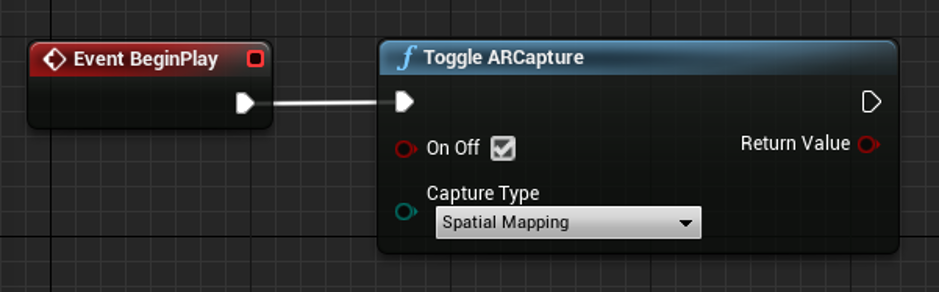

# Spatial Mapping in Unreal

Spatial mapping lets you place objects on physical surfaces in the real-world. When the world around the HoloLens is mapped, holograms seem more real to the user. Spatial mapping also anchors objects in the user's world by taking advantage of depth cues, helping convince them that these holograms are actually in their space. Holograms floating in space or moving with the user won't feel as real, so you always want to place items for comfort whenever possible.

You can find more information on spatial mapping quality, placement, occlusion, rendering, and more, in the [Spatial mapping](../../design/spatial-mapping.md) document.

## Enabling Spatial Mapping

To enable spatial mapping on HoloLens:
- Open **Edit > Project Settings** and scroll down to the **Platforms** section.    
    + Select **HoloLens** and check **Spatial Perception**.


To opt into spatial mapping and debug the **MRMesh** in a HoloLens game:
1. Open the **ARSessionConfig** and expand the **ARSettings > World Mapping** section. 

2. Check **Generate Mesh Data from Tracked Geometry**, which tells the HoloLens plugin to start asynchronously getting spatial mapping data and surface it to Unreal through the **MRMesh**. 
3. Check **Render Mesh Data in Wireframe** to show a white wireframe outline of every triangle in the **MRMesh**. 


## Spatial Mapping at runtime
You can modify the following parameters to update the spatial mapping runtime behavior:

- Open **Edit > Project Settings**, scroll down to the **Platforms** section, and select **HoloLens > Spatial Mapping**: 


- **Max Triangles Per Cubic Meter** updates the density of the triangles in the spatial mapping mesh.  
- **Spatial Meshing Volume Size** is the size of the cube around the player to render and update spatial mapping data.  
    + If the expected application runtime environment is expected to be large, this value may need to be large to match the real-world space. The value can be smaller if the application only needs to place holograms on surfaces immediately around the user. As the user walks around the world, the spatial mapping volume will move with them. 

## Working with MRMesh

First, you need to start Spatial Mapping:



Once spatial mapping has been captured for the space, we recommend toggling off spatial mapping.  The spatial mapping may be completed either after a certain amount of time, or when raycasts in each direction return collisions against the MRMesh.

To get access to the **MRMesh** at runtime:
1. Add an **ARTrackableNotify** Component to a Blueprint actor. 


2. Select the **ARTrackableNotify** component and expand the **Events** section in the **Details** panel. 
    - Select the **+** button on the events you want to monitor. 


In this case, the **On Add Tracked Geometry** event is being monitored, which looks for valid world meshes matching to spatial mapping data. You can find the full list of events in the [UARTrackableNotify](https://docs.unrealengine.com/API/Runtime/AugmentedReality/UARTrackableNotifyComponent/) component API. 

You can change the mesh’s material in the Blueprint Event Graph or in C++. The screenshot below shows the Blueprint route: 


## Spatial Mapping in C++

In your game's build.cs file, add **AugmentedReality** and **MRMesh** to the PublicDependencyModuleNames list:

```cpp
PublicDependencyModuleNames.AddRange(
    new string[] {
        "Core",
        "CoreUObject",
        "Engine",
        "InputCore",    
        "EyeTracker",
        "AugmentedReality",
        "MRMesh"
});
```

To access the MRMesh, subscribe to the **OnTrackableAdded** delegates:

```cpp
#include "ARBlueprintLibrary.h"
#include "MRMeshComponent.h"

void AARTrackableMonitor::BeginPlay()
{
    Super::BeginPlay();

    // Subscribe to Tracked Geometry delegates
    UARBlueprintLibrary::AddOnTrackableAddedDelegate_Handle(
        FOnTrackableAddedDelegate::CreateUObject(this, &AARTrackableMonitor::OnTrackableAdded)
    );
}

void AARTrackableMonitor::OnTrackableAdded(UARTrackedGeometry* Added)
{
    // When tracked geometry is received, check that it's from spatial mapping
    if(Added->GetObjectClassification() == EARObjectClassification::World)
    {
        UMRMeshComponent* MRMesh = Added->GetUnderlyingMesh();
    }
}
```

> [!NOTE]
> There are similar delegates for updated and removed events, **AddOnTrackableUpdatedDelegate_Handle** and **AddOnTrackableRemovedDelegate_Handle** respectively.
>
> You can find the full list of events in the [UARTrackedGeometry](https://docs.unrealengine.com/API/Runtime/AugmentedReality/UARTrackedGeometry/) API.

## See also
* [Spatial mapping](../../design/spatial-mapping.md)
