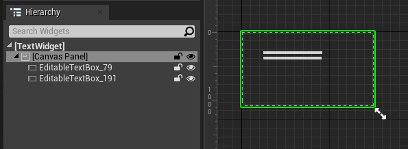
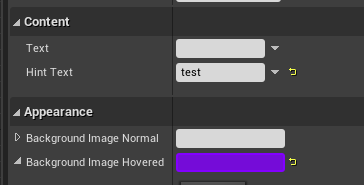
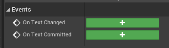
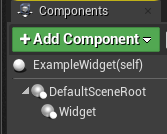
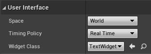
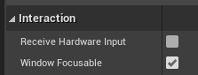
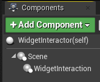
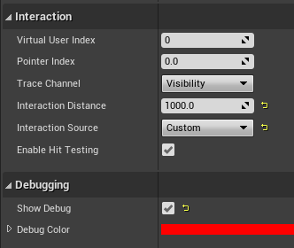
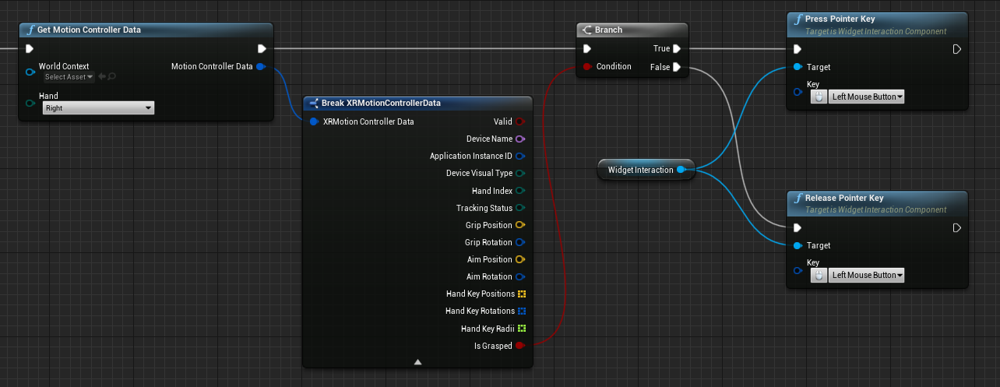

# UMG and keyboard in Unreal

Unreal Motion Graphics (UMG) is Unreal Engine’s built-in UI system, used to create interfaces such as menus and text boxes. User interfaces built with UMG consist of widgets. We'll guide you through creating a new widget, adding it to world space, and enabling interaction using the system keyboard as an example. You can learn more about UMG in the official Unreal Engine [documentation](https://docs.unrealengine.com/en-US/Engine/UMG/index.html). 

## Create a new widget

- Create a Widget Blueprint to lay out the game’s UI:

- Open the new blueprint and add components from the Palette to the canvas.  In this case, we've added two Text Box components from the “Input” section:

- Select a widget in the Hierarchy or Designer window and modify parameters in the details panel.  In this case, we’ve added some default “Hint Text” and a tint color that appears when you hover over the text box.  A text box will pop up a virtual keyboard on HoloLens when it's interacted with:

- Events can also be subscribed to in the details panel:

## Add a Widget to World Space

- Create a new Actor, add a Widget component, and add the actor to the scene:

- In the details panel for the Widget, set the **Widget Class** to the Widget Blueprint created earlier:

- For a text Widget, ensure **Receive Hardware Input** is unchecked so we only update its text from the virtual keyboard:

## Widget Interaction

UMG Widgets typically receive input from a mouse.  On HoloLens or VR, we need to simulate a mouse with a Widget Interaction component to get the same events.

- Create a new Actor, add a **Widget Interaction** component, and add the actor to your scene:

- In the details panel for the Widget Interaction component:
    - Set the interaction distance to the distance value you want
    - Set the **Interaction Source** to **custom**
    - For development, set **Show Debug** to **true**:

The default for Interaction Source is “World”, which should send raycasts based on the world position of the Widget Interaction component. In AR and VR, that's not the case.  Enabling “Show Debug” and adding a hover tint to widgets is important to check the widget interaction component is doing what you expect.  The workaround is to use a custom source and set the raycast in the event graph from the hand ray.  

Here we're calling this from Event Tick:

Then add virtual mouse pointer events to the widget interaction component reacting to HoloLens input.  In this case, send a Left Mouse press event when the hand is grasped, and a Left Mouse release event when not grasped:

Now, when you deploy the app to the HoloLens 2, you’ll see a hand ray extending from your right hand. If you direct it at one of the editable text boxes and air tap, the system keyboard will appear in front of you and allow you to enter text. 
 
> [!NOTE]
> The HoloLens system keyboard requires Unreal Engine 4.26 or later. Additionally, the keyboard will not appear when your app is being streamed from the Unreal editor to the headset, only when the app is running on device.

## See Also:
* [Unreal's UMG documentation](https://docs.unrealengine.com/Engine/UMG/index.html)
* [Unreal's UMG tutorials](https://docs.unrealengine.com/Programming/Tutorials/UMG/index.html)
