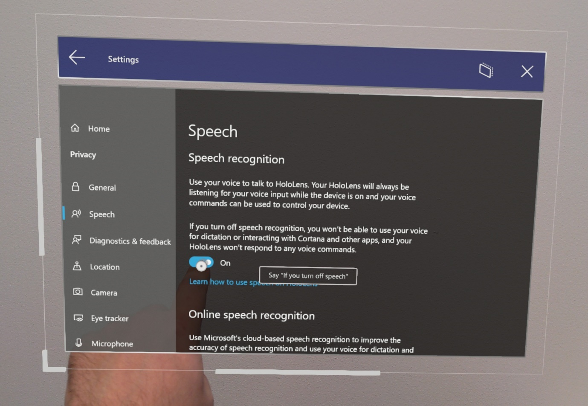
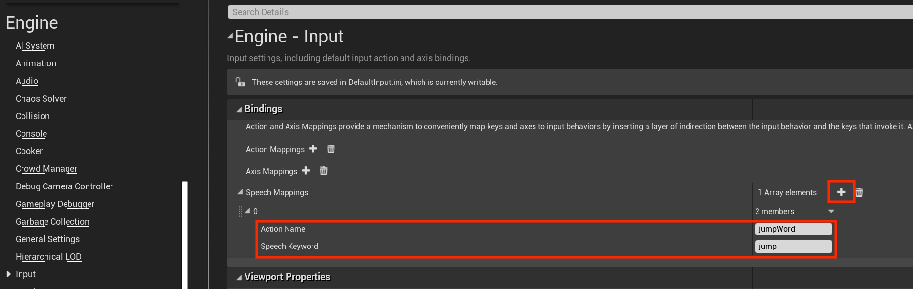

# Voice Input in Unreal

Voice input in Unreal allows you to interact with a hologram without having to use hand gestures and is only supported HoloLens 2. Voice input on HoloLens 2 is powered by the same engine that supports speech in all other Universal Windows Apps, but Unreal uses a more limited engine to process voice input. This limits voice input features in Unreal to predefined speech mappings, which are covered in the following sections. 

## Enabling Speech Recognition

If you use Windows Mixed Reality Plugin, Voice input doesn’t require any special Windows Mixed Reality APIs; it's built on the existing Unreal Engine 4 [Input](https://docs.unrealengine.com/Gameplay/Input/index.html) mapping API. If you use OpenXR, you should additionally install [Microsoft OpenXR plugin](https://github.com/microsoft/Microsoft-OpenXR-Unreal). 

To enable speech recognition on HoloLens:
1. Select **Project Settings > Platform > HoloLens > Capabilities** and enable **Microphone**. 
2. Enabled speech recognition in **Settings > Privacy > Speech** and select **English**.

> [!NOTE]
> Speech recognition always functions in the Windows display language configured in the **Settings** app. It’s recommended that you also enable **Online speech recognition** for the best service quality.

3. A dialog will show up when the application first starts to ask if you want to enable the microphone. Selecting **Yes** starts voice input in the app.

## Adding Speech Mappings

Connecting speech to action is an important step when using voice input. These mappings monitor the app for speech keywords that a user might say, then fire off a linked action. You can find Speech Mappings by:
1. Selecting **Edit > Project Settings**, scrolling to the **Engine** section, and clicking **Input**.

To add a new Speech Mapping for a jump command:
1. Select the **+** icon next to **Array elements** and fill out the following values:
    * **jumpWord** for **Action Name**
    * **jump** for **Speech Keyword**

> [!NOTE]
> Any English word(s) or short sentence(s) can be used as a keyword. 

Speech Mappings can be used as Input components like Action or Axis Mappings or as blueprint nodes in the Event Graph. For example, you could link the jump command to print out two different logs depending on when the word is spoken:

1. Double-click a blueprint to open it in the **Event Graph**.
2. **Right-click** and search for the **Action Name** of your speech mapping (in this case **jumpWord**), then hit **Enter** to add an **Input Action** node to the graph.
3. Drag and drop the **Pressed** pin to **Print String** node as shown in the image below. You can leave the **Released** pin empty, it won't execute anything for speech mappings.
 

4. Play the app, say the word **jump**, and watch the console print out the logs!

That's all the setup you'll need to start adding voice input to your HoloLens apps in Unreal. You can find more information on speech and interactivity at the links below, and be sure to think about the experience you're creating for your users.

## Next Development Checkpoint

If you're following the Unreal development journey we've laid out, you're next task is exploring the Mixed Reality platform capabilities and APIs: 

> [!div class="nextstepaction"]
> [HoloLens camera](unreal-hololens-camera.md)

You can always go back to the [Unreal development checkpoints](unreal-development-overview.md#2-core-building-blocks) at any time.

## See also
* [Voice Input](../../design/voice-input.md)
* [Gaze and commit](../../design/gaze-and-commit.md)
* [Instinctual interactions](../../design/interaction-fundamentals.md)

