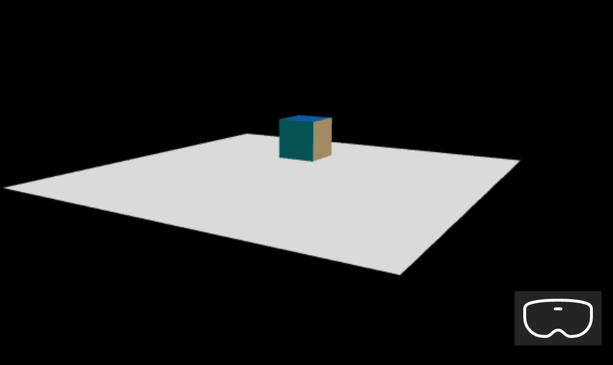
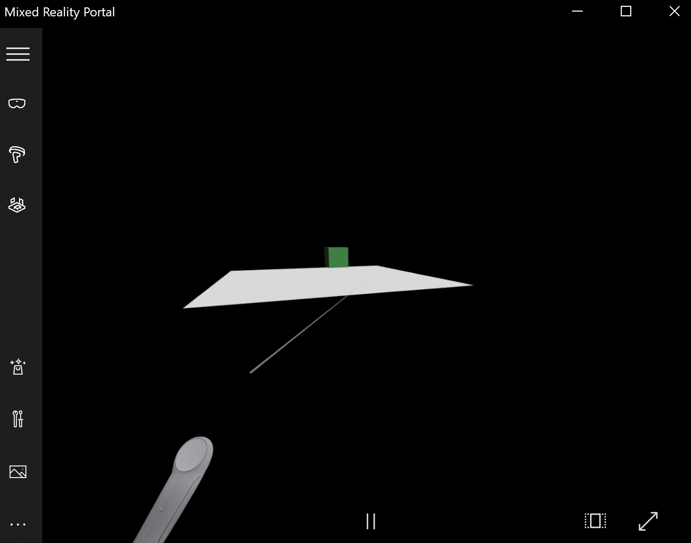

# Tutorial: Interact with 3D object

Learn how to create 3D objects and interactions for a Mixed Reality experience using babylon.js. In this section, you'll start with something simple, like painting the faces of a cube when you select the object.

This tutorial covers the following topics:

> [!div class="checklist"]
> * How to add interactions
> * Enable WebXR immersive mode
> * Run the app on Windows Mixed Reality Simulator

## Before you begin

In previous tutorial step a basic web page with a scene was created. Have the hosting web page open for editing.

```html
<html>
<head>
    <script src="https://cdn.babylonjs.com/babylon.js"></script>
    <style>
        body,#renderCanvas { width: 100%; height: 100%;}
    </style>
</head>
<body>
    <canvas id="renderCanvas"></canvas>
    <script>
        var canvas = document.getElementById("renderCanvas");
        var engine = new BABYLON.Engine(canvas, true);
        
        var createScene = function() {
            const scene = new BABYLON.Scene(engine);
            scene.clearColor = new BABYLON.Color3.Black;
            
            var alpha =  -3*Math.PI/4;
            var beta = Math.PI;
            var radius = 5;
            
            const camera = new BABYLON.ArcRotateCamera("Camera", 0, 0, 0);
            camera.setPosition(new BABYLON.Vector3(alpha, beta, radius));
            camera.attachControl(canvas, true);
            
            const light = new BABYLON.HemisphericLight("light", new BABYLON.Vector3(1, 1, 0));
            
            const box = BABYLON.MeshBuilder.CreateBox("box", {wrap: true});
            box.position.x = 0.5;
            box.position.y = 1;
            
            return scene;
        };
        
        var sceneToRender = createScene();
        engine.runRenderLoop(function(){
            sceneToRender.render();
        });
    </script>
</body>
</html>
```

## Add interaction

1. First, let's update our code that creates the cube, so that the cube is painted with a random color. To do that, we will add [material](https://doc.babylonjs.com/divingDeeper/materials/using/materials_introduction) to our cube. Material allows us to specify color and textures and can be used to cover other objects. How a material appears depends on the light or lights used in the scene and how it is set to react. For example, the diffuseColor spreads the color all over the mesh to which it is attached. Add the following code:

    ```javascript
    var boxMaterial = new BABYLON.StandardMaterial("material", scene);
    boxMaterial.diffuseColor = BABYLON.Color3.Random();
    box.material = boxMaterial;
    ```

1. Now that the cube is painted with a random color, let's add an interaction to:

    * Change the face color when the cube is clicked
    * Move the cube after the color is changed

    To add interactions we should be using [actions](https://doc.babylonjs.com/divingDeeper/events/actions). An action is launched in response to the event trigger. For example, when the user clicks on the cube. All we need to do is instantiate BABYLON.ActionManager and register an action for certain trigger. The [BABYLON.ExecuteCodeAction](https://doc.babylonjs.com/typedoc/classes/babylon.executecodeaction) will run our JavaScript function when someone clicks on the cube:

    ```javascript
    box.actionManager = new BABYLON.ActionManager(scene);
    box.actionManager.registerAction(new BABYLON.ExecuteCodeAction(
        BABYLON.ActionManager.OnPickTrigger, 
        function (evt) {
            var sourceBox = evt.meshUnderPointer;
            
            //move the box upright
            sourceBox.position.x += 0.1;
            sourceBox.position.y += 0.1;

            //update the color
            boxMaterial.diffuseColor = BABYLON.Color3.Random();
        }));
    ```

1. The final code of the web page will look as follows:

    ```html
    <html>
    <head>
        <script src="https://cdn.babylonjs.com/babylon.js"></script>
        <style>
            body,#renderCanvas { width: 100%; height: 100%;}
        </style>
    </head>
    <body>
        <canvas id="renderCanvas"></canvas>
        <script>
            var canvas = document.getElementById("renderCanvas");
            var engine = new BABYLON.Engine(canvas, true);
            
            var createScene = function() {
                const scene = new BABYLON.Scene(engine);
                scene.clearColor = new BABYLON.Color3.Black;
                
                var alpha =  -3*Math.PI/4;
                var beta = Math.PI;
                var radius = 5;
                
                const camera = new BABYLON.ArcRotateCamera("Camera", 0, 0, 0);
                camera.setPosition(new BABYLON.Vector3(alpha, beta, radius));
                camera.attachControl(canvas, true);
                
                const light = new BABYLON.HemisphericLight("light", new BABYLON.Vector3(1, 1, 0));
                
                const box = BABYLON.MeshBuilder.CreateBox("box", {});
                box.position.x = 0.5;
                box.position.y = 1;

                var boxMaterial = new BABYLON.StandardMaterial("material", scene);
                boxMaterial.diffuseColor = BABYLON.Color3.Random();
                box.material = boxMaterial;
 
                box.actionManager = new BABYLON.ActionManager(scene);
                box.actionManager.registerAction(
                    new BABYLON.ExecuteCodeAction(BABYLON.ActionManager.OnPickTrigger, 
                    function (evt) {
                        var sourceBox = evt.meshUnderPointer;
                        sourceBox.position.x += 0.1;
                        sourceBox.position.y += 0.1;

                        boxMaterial.diffuseColor = BABYLON.Color3.Random();
                    }));

                return scene;
            };
            
            var sceneToRender = createScene();
            engine.runRenderLoop(function(){
                sceneToRender.render();
            });
        </script>
    </body>
    </html>
    ```

## Enable WebXR immersive experience

Now that our cube is changing colors, we're ready to try the immersive experience.

1. In this step we're going to introduce a [ground](https://doc.babylonjs.com/divingDeeper/mesh/creation/set/ground). The cube will be hanging in the air and we will see a floor at the bottom. Add the ground as follows:

    ```javascript
    var ground = BABYLON.MeshBuilder.CreateGround("ground", {width: 4, height: 4});
    ```

    This creates a simple 4x4-meter floor.

1. In order to add WebXR support, we need to call *createDefaultXRExperienceAsync*, which has a *Promise* result. Add this code to the createScene function:

    ```javascript
    var xrPromise = scene.createDefaultXRExperienceAsync({
        floorMeshes: [ground]
    });
    xrPromise.then((xrExperience) => {
        console.log("Done, WebXR is enabled.");
    });
    ```

1. The final code of the web page will look as follows:

    ```html
    <html>
    <head>
        <script src="https://cdn.babylonjs.com/babylon.js"></script>
        <style>
            body,#renderCanvas { width: 100%; height: 100%;}
        </style>
    </head>
    <body>
        <canvas id="renderCanvas"></canvas>
        <script>
            var canvas = document.getElementById("renderCanvas");
            var engine = new BABYLON.Engine(canvas, true);
            
            var createScene = function() {
                const scene = new BABYLON.Scene(engine);
                scene.clearColor = new BABYLON.Color3.Black;
                
                var alpha =  -3*Math.PI/4;
                var beta = Math.PI;
                var radius = 5;
                
                const camera = new BABYLON.ArcRotateCamera("Camera", 0, 0, 0);
                camera.setPosition(new BABYLON.Vector3(alpha, beta, radius));
                camera.attachControl(canvas, true);
                
                const light = new BABYLON.HemisphericLight("light", new BABYLON.Vector3(1, 1, 0));
                
                const box = BABYLON.MeshBuilder.CreateBox("box", {});
                box.position.x = 0.5;
                box.position.y = 1;

                var boxMaterial = new BABYLON.StandardMaterial("material", scene);
                boxMaterial.diffuseColor = BABYLON.Color3.Random();
                box.material = boxMaterial;
 
                box.actionManager = new BABYLON.ActionManager(scene);
                box.actionManager.registerAction(
                    new BABYLON.ExecuteCodeAction(BABYLON.ActionManager.OnPickTrigger, 
                    function (evt) {
                        var sourceBox = evt.meshUnderPointer;
                        sourceBox.position.x += 0.1;
                        sourceBox.position.y += 0.1;

                        boxMaterial.diffuseColor = BABYLON.Color3.Random();
                    }));
                    
                var ground = BABYLON.MeshBuilder.CreateGround("ground", {width: 4, height: 4});
                
                var xrPromise = scene.createDefaultXRExperienceAsync({
                    floorMeshes: [ground]
                });
                
                xrPromise.then((xrExperience) => {
                    console.log("Done, WebXR is enabled.");
                });

                return scene;
            };
            
            var sceneToRender = createScene();
            engine.runRenderLoop(function(){
                sceneToRender.render();
            });
        </script>
    </body>
    </html>
    ```

1. The above code generates the following output in the browser window:


## Run on Mixed Reality Portal emulator

1. Select the Immersive-VR button on the bottom right corner:


1. This action will launch the Mixed Reality Portal window as shown below:


1. Use the W,A,S, and D keys on your keyboard to walk forward, back left and right accordingly. Use simulated hand to target the cube and press the Enter key on your keyboard to perform the click action. The cube will change its color and move to a new position.

<!-- TBD: HoloLens2 emulator does not work, investigate possible workaround -->

## Takeaways

The following are the most important takeaways from this tutorial:
* Babylon.js makes it easy to create immersive experiences using JavaScript
* To create virtual scenes you don't need to write low-level code or learn a new technology
* You can build Mixed Reality applications with WebXR-supported browser without need to buy a headset

## Next steps

Congratulations! You've completed our series of babylon.js tutorials and learned how to:
> [!div class="checklist"]
> * Set up a development environment
> * Create a new web page to display results
> * The babylon.js API to create and interact with basic 3D elements
> * Run and test the application in a Windows Mixed Reality Simulator

For more information on Mixed Reality javascript development see [JavaScript development overview](/javascript-development-overview.md).
