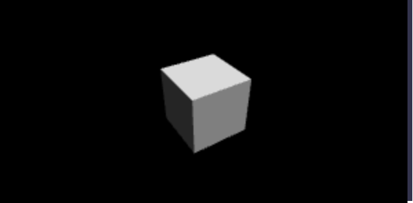

# Tutorial: Prepare a scene

Learn how to prepare a scene, and add some basic 3D elements to it.

In this tutorial, learn how to:

> [!div class="checklist"]
> * Create a scene
> * Add a camera
> * Add light
> * Add basic 3D elements

## Before you begin

In previous tutorial step a basic web hosting page was created. Have the hosting web page open for editing.

```html
<html>
    <head>
        <title>Babylon.js sample code</title>
        <script src="https://preview.babylonjs.com/babylon.js"></script>
    </head>
<body>
    <canvas id="renderCanvas"></canvas>
</body>
</html>
```

## Create a scene

A scene is where all the contents will be displayed. There might be multiple scenes, the scenes can overlay and it is possible to switch between scenes. Read more about [babylon.js Scene](https://doc.babylonjs.com/divingDeeper/scene).

1. Add the script tag after the canvas html element and add the following code to create a scene filled in black color:

    ```html
    <script type="text/javascript">
        var engine = null; // will be added later

        const createScene = function() {
            const scene = new BABYLON.Scene(engine);
            scene.clearColor = new BABYLON.Color3.Black;
            return scene;
        }
        var scene = createScene();
    </script>
    ```

1. Note that the *engine* variable is set to null. We have to create an instance of babylon.js web rendering engine that renders a scene and hooks events on the canvas. To create an instance of the engine, add the following code before the function *createScene*:

    ```javascript
    var canvas = document.getElementById("renderCanvas");
    var engine = new BABYLON.Engine(canvas, true);
    ```

1. The scene is not rendered by default. Remember, there might be multiple scenes and you control which scene is displayed. To render the scene repeatedly on every frame, execute the following code:

    ```javascript
    engine.runRenderLoop(function () {
        scene.render();
    });
    ```

## Add basic 3D element

1. Let's add our first 3D shape. In the 3D virtual world shapes are built from *meshes*, lots of triangular facets joined together, each facet made from three vertices. You can either use a predefined mesh or create your own custom mesh. Here we will be using a predefined box mesh, i.e. a cube. To create the box use [BABYLON.MeshBuilder.CreateBox](https://doc.babylonjs.com/divingDeeper/mesh/creation/set/box). The parameters are name, and options (options are different according to the type of mesh). Append the following code to the function *createScene*:

    ```javascript
    const box = BABYLON.MeshBuilder.CreateBox("box", {wrap: true});
    box.position.x = 1;
    box.position.y = 1;
    ```

1. Check the output in the browser. The browser window shows a blank page with javascript error in development console
'Uncaught Error: No camera defined'. Now we have to add a camera to the scene.

## Add a camera

1. To allow user input, a camera must be attached to the canvas. Let's add the camera of type [BABYLON.ArcRotateCamera](https://doc.babylonjs.com/divingDeeper/cameras/camera_introduction#arc-rotate-camera) that allows us to look around, i.e. can be rotated around object that we've just added to the scene. The parameters required to create an instance of the camera are name, alpha (rotation along the longitudinal axis), beta (rotation along the latitudinal axis), radius (distance from the target), and target. Add the following code to the *createScene* function:

    ```javascript
    var alpha =  -Math.PI / 2;
    var beta = Math.PI / 3;
    var radius = 10;
    var target = new BABYLON.Vector3(-0.5, 0, -0.5);
    const camera = new BABYLON.ArcRotateCamera("Camera", alpha, beta, radius, target);
    camera.attachControl(canvas, true);
    ```

1. If you check the output in the browser, you will see a black canvas. We are missing the light.

## Add light

1. There are four types of lights that can be used with a range of lighting properties: Point, Directional, Spot and Hemispheric Light. Let's add the ambient light [HemisphericLight](https://doc.babylonjs.com/typedoc/classes/babylon.hemisphericlight), as follows:

    ```javascript
    const light = new BABYLON.HemisphericLight("light", new BABYLON.Vector3(1, 1, 0));
    ```

1. The final code of the web page will look as follows:

    ```html
    <html>
    <head>
        <script src="https://preview.babylonjs.com/babylon.js"></script>
    </head>
    <body>
        <canvas id="renderCanvas"></canvas>
        <script>
            var canvas = document.getElementById("renderCanvas");
            var engine = new BABYLON.Engine(canvas, true);
            
            var createScene = function() {
                const scene = new BABYLON.Scene(engine);
                scene.clearColor = new BABYLON.Color3.Black;

                var longitude =  -Math.PI/2;
                var latitude = Math.PI/3;
                var radius = 10;
                var position = new BABYLON.Vector3(-0.5, 0, -0.5);
                const camera = new BABYLON.ArcRotateCamera("Camera", longitude, latitude, radius, position);
                camera.attachControl(canvas, true);
                
                const light = new BABYLON.HemisphericLight("light", new BABYLON.Vector3(1, 1, 0));
                
                const box = BABYLON.MeshBuilder.CreateBox("box", {wrap: true});
                box.position.x = 0.5;
                box.position.y = 1;
                
                return scene;
            };
            
            var scene = createScene();
            engine.runRenderLoop(function(){
                scene.render();
            });
        </script>
    </body>
    </html>
    ```

1. Check the output in the browser. You should see the cube and using the mouse you can rotate the camera around the cube and see the different faces of the cube:



## Next steps

> [!div class="nextstepaction"]
> [Next Tutorial: 3. Interact with 3D object](interact-03.md)
