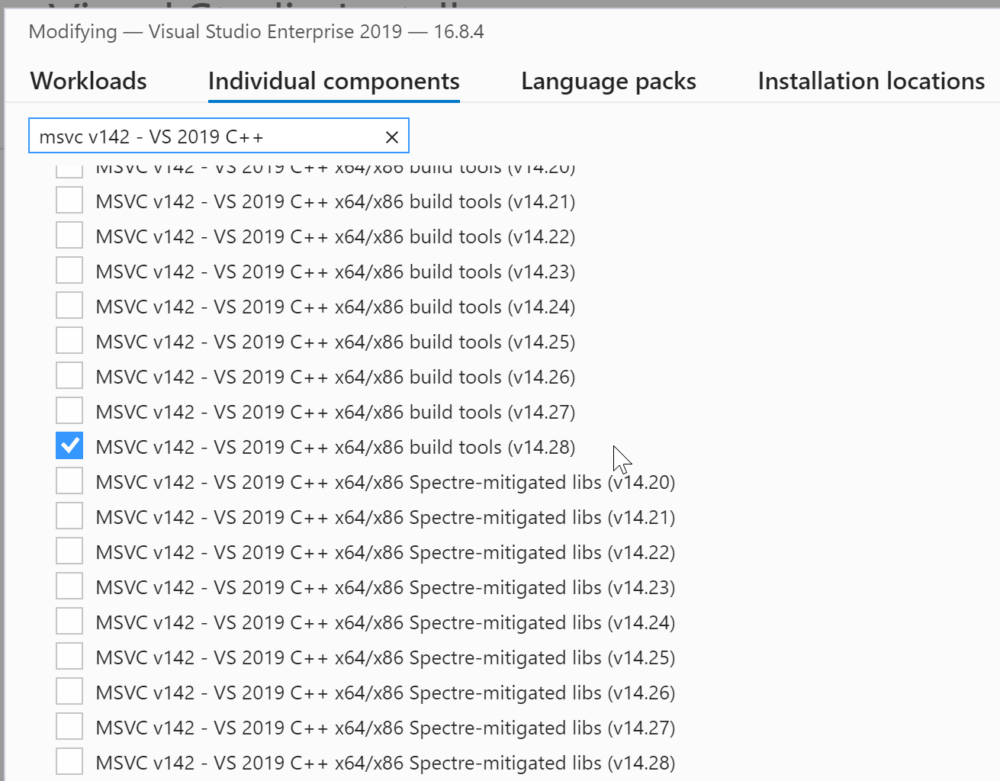

# Tutorials

In this tutorial you will learn how to setup the environment for BabylonNative and deploy your project to HoloLens.

## Requirements

* A Windows 10 operating system
* [Visual Studio 2019](https://visualstudio.microsoft.com/downloads/) with C++ development tools
* [Git](https://git-scm.com/)
* [CMake](https://cmake.org/)
* HoloLens 2 device or emulator

> [!CAUTION]
> Make sure that you have installed MSVC v142 - VS2019 C++. In VisualStudio, go to menu Tools -> Get Tools and Features and ensure that the feature is checked as shown below

