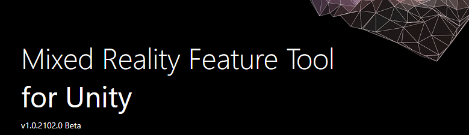

# Welcome to the Mixed Reality Feature Tool

> [!IMPORTANT]
> The Mixed Reality Feature Tool is only available in Unity at the moment. If you're developing in Unreal, refer to the [tools installation](install-the-tools.md) documentation.

The Mixed Reality Feature Tool is a new way for developers to discover and add Mixed Reality feature packages into Unity projects. You can search packages by name or category, see their dependencies, and even view proposed changes to your projects manifest file before importing. Once you've validated the packages you want, the Mixed Reality Feature tool will download them into the project of your choice.

## System requirements

Before you can run the Mixed Reality Feature Tool, you'll need:

* [.NET 5.0 runtime](https://dotnet.microsoft.com/download/dotnet/5.0) 
* [Windows 10](https://www.microsoft.com/software-download/windows10ISO) 

> [!NOTE]
> The Mixed Reality Feature Tool currently only runs on Windows, but MacOS support is coming soon!

Once you have your environment set up:

* Download the latest version of the Mixed Reality Feature Tool from the [GitHub releases page](https://aka.ms/MRFeatureTool)
* When the download completes, unzip the file and save it to your desktop
    * We recommend creating a shortcut to the executable file for faster access

## 1. Getting started

Launch the Mixed Reality Feature Tool from the executable file, which displays the start page on first launch:

From the start page, you can:

* [Configure](configuring-feature-tool.md) tool settings using the **gear icon** button 
* Use the **question mark** button to launch the default web browser and display our documentation
* Select **Start** to begin discovering feature packages

## 2. Discovering and acquiring feature packages

The feature package catalog is retrieved as soon as you press Start. Features are grouped by category to make things easier to find. For example, the **Mixed Reality Toolkit** category has several features for you to choose from:

Once you've made your choices, select **Get features** to fetch all the required packages from the catalog. For more information, please see [discovering and acquiring features](discovering-features.md).

## 3. Importing feature packages

Following acquisition, the complete set of packages is presented, along with a list of required dependencies. If you need to change any feature or package selections, this is the time:

We highly recommend using the **Validate** button to ensure the Unity project can successfully import the selected features. After validation, you'll see a pop-up dialog with a success message or a list of identified issues.

You also need to set the location of the target Unity project before you import. Use the **ellipsis** button to the left of the project path field to browse. When you're done navigating your file system, open the folder containing your target Unity project.

> [!NOTE]
> The dialog that's displayed when browsing for the Unity project folder contains '_' as the file name. There must be a value for the file name to enable the folder to be selected.

Select **Import** to continue.

> [!NOTE]
> After clicking the `Import` button, if any issues remain a simple message will be displayed. The recommendation is to click No and to use the `Validate` button to view and resolve the issues.

For more information, please see [importing features](importing-features.md).

## 4. Reviewing and approving project changes

The final step is reviewing and approving the proposed changes to the manifest and project files:

* The proposed changes to the manifest are displayed on the left 
* The files to be added to the project are listed to the right
* The **Compare** button allows for side by side viewing of the current manifest and the proposed changes

For more information, see [reviewing and approving project modifications](reviewing-changes.md).

## 5. Project updated

When the proposed changes are approved, your target Unity project is updated to reference the selected Mixed Reality features:

The Unity project's **Packages** folder now has a **MixedReality** subfolder with the feature package file(s) and the manifest will contain the appropriate reference(s).

Return to Unity, wait for the new selected features to load, and start building!

## See also

- [Configuring the feature tool](configuring-feature-tool.md)
- [Discovery and acquisition](discovering-features.md)
- [Viewing feature package details](viewing-package-details.md)
- [Importing selected packages](importing-features.md)
- [Reviewing and approving project modifications](reviewing-changes.md)
