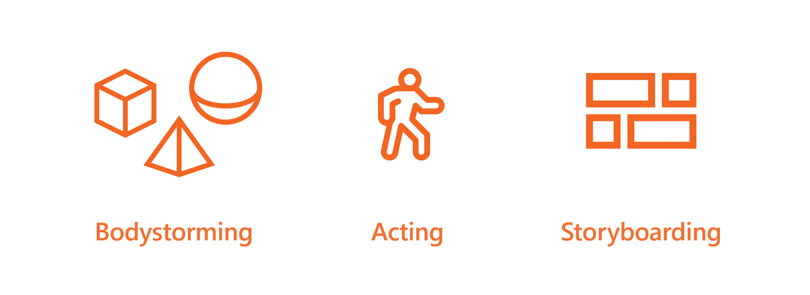
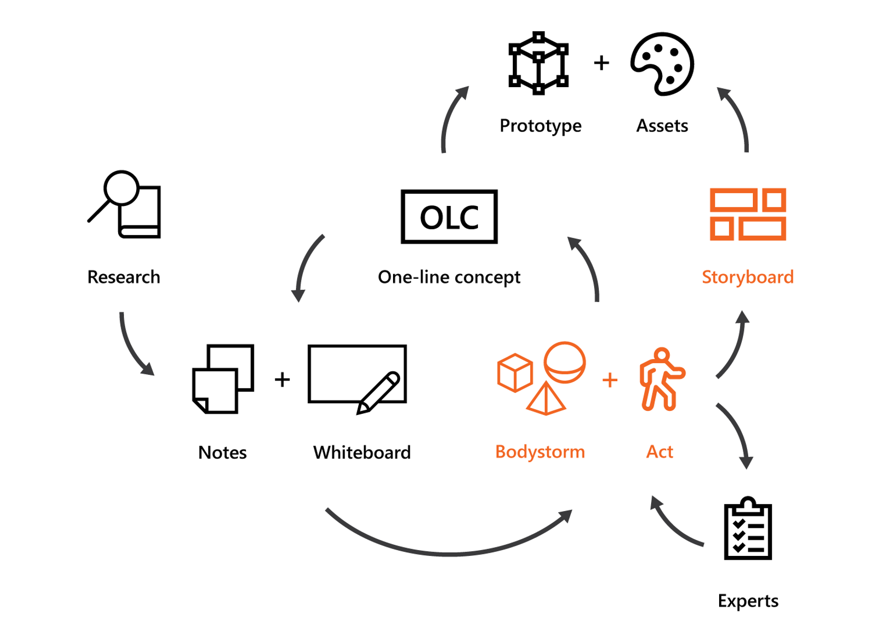
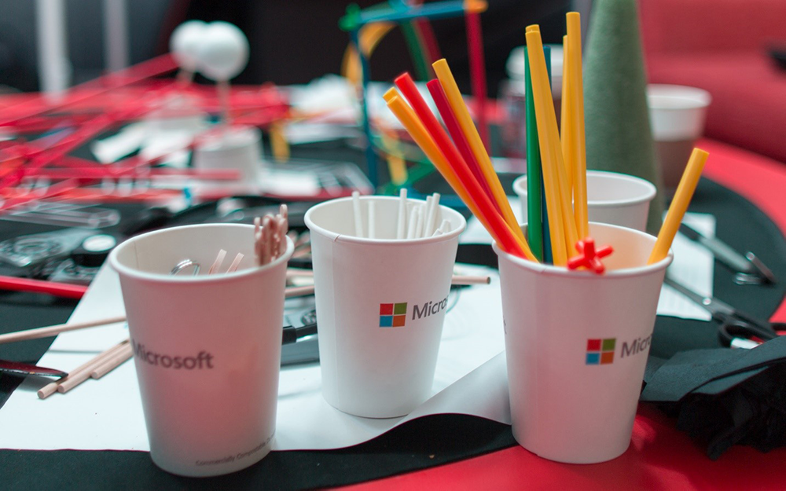

# Thinking differently for Mixed Reality

When Microsoft launched the HoloLens (1st gen) to eager developers in 2016, the team had already partnered with studios inside and out of Microsoft to build the device’s launch experiences. These teams learned by doing, finding both opportunities and challenges in the new field of mixed reality design.

We turned their methods and insights into a curriculum that we teach new developers in our Mixed Reality Academy. The curriculum includes week-long design workshops we offer to our enterprise partners).

Below is a snapshot of everything we've learned to help our enterprise partners prepare their teams for mixed reality development. While many of these methods originally target HoloLens development, imagining and communicating in 3D are critical to the full spectrum of mixed reality experiences.

## Thinking spatially during the design process

Any design process or design framework is meant to iterate thinking: To approach a problem broadly, to share ideas with others effectively, to evaluate those ideas and reach a solution. Today, we have well-established design and development methods for building experiences on desktops, phones, and tablets. Teams have clear expectations of what is necessary to iterate an idea and turn it into a product for users.

Teams are often composed of a mix of development, design, research, and management. All roles should participate in the design process. The barrier to entry for contributing an idea for a mobile app is as simple as drawing a rectangle for the device’s screen. Meanwhile, sketching UI elements with boxes and lines is enough to establish technical requirements or define potential user behavior.

With mixed reality, the traditional 2D design process begins to break down. Sketching in 3D is difficult for most people, and using 2D tools like pen and paper or whiteboards, can often limit ideas to those dimensions. Meanwhile, 3D tools, built for gaming or engineering, require a high degree of skill to quickly flesh out ideas. The lack of lightweight tools is compounded by the technical uncertainty inherent with new devices, where foundational interaction methods are still being established. These challenges can potentially limit the design contributions to team members with 3D development backgrounds — drastically reducing the team’s ability to iteration.

 
*Teams from the Mixed Reality Partner Program in our workshop*

When we work with external partners, we hear stories of teams waiting for the developer to finish the prototype before they can continue their design process. The rest of the team is then potentially blocked from making meaningful progress on the product. Developers end up with all the responsibility for solving both the technical implementation and user experience as they attempt to put a rough idea into code.

## Techniques for expanding the design process

Our teams at Microsoft have a set of techniques to more effectively include their team and quickly iterate through complex design problems. While not a formal process, these techniques are intended to supplement rather than replace your workflow. These methods allow team members without specialized 3D skills to offer ideas before diving into the prototyping phase. Different roles and disciplines can be part of the design process, not just 3D designers, and developers. Uncovering opportunities and identifying possible challenges might occur later in development.

 

## Generating ideas with bodystorming

Getting your team to think about events occurring in the real world, beyond the traditional world of 2D devices, is key to developing innovative mixed reality experiences. At Microsoft, we've found the best results by encouraging interaction with physical props in a real-world space. Using simple, cheap crafting materials we build physical props to represent digital objects, user interfaces, and animations in a proposed experience. This technique is called bodystorming and has been a staple of product ideation within industrial design for decades.

*Simple, cheap art supplies used in bodystorming*

Simple, physical props level the playing field for participants, allowing individuals with different skillsets and backgrounds to contribute ideas and uncover opportunities inherent to mixed reality experiences instead of being locked into 2D thinking. While technical prototyping or high-fidelity storyboarding requires a skilled 3D developer or artist, a few Styrofoam balls and cardboard can be enough to showcase how an interface might unfold in physical space. These techniques apply to both mixed reality development with HoloLens and the immersive headsets. For example, a set of plastic connectors might roughly illustrate the size of holograms that appear in a HoloLens experience or as props to act out interactable elements or motion designs in a virtual world.

Bodystorming is a technique used to quickly generate ideas and evaluate ideas that are too nebulous to prototype. At Microsoft, bodystorming is most commonly used to quickly vet an idea. It can also help host a more in-depth session if you involve outside stakeholders who aren't familiar with mixed reality development or need to distill broad scenarios. Remember that the purpose of bodystorming is to ideate quickly and efficiently by encouraging participants to think spatially. Detailed artwork or precise measurements aren't important at this stage. Physical props need only meet the minimum requirements to explore or communicate an idea. Ideas presented through bodystorming are not expected to be fully vetted, but the process can help narrow down possibilities to test later during the in-device prototyping phase. As such, bodystorming doesn't replace technical prototyping, but rather offsets the burden of solving both technical and design challenges during the prototyping phase.

## Acting and expert feedback

Following the bodystorming process of ideating with physical objects in the real world, the next step is to walk through an experience with these objects. We call this phase of the process acting and it often involves staging how a user would move through the experience or a specific interaction.

 
*Teams acting out a scenario during a workshop*

Acting with physical props allows participants to experience the user's perspective, while allowing outside observers to see how events play out. This presents an ideal time to include a wider audience of team members or stakeholders who can provide specific ‘expert’ feedback. For example, if you're exploring a mixed reality experience designed for hospitals, acting out your thinking to a medical professional can provide invaluable feedback. Another example is when you might have a specific challenge you're trying to understand, like spatial audio or budgeting for asset quality vs. performance. In these cases, acting gives experts a quick, rough concept of how the experience might unfold, without the need for a device-based prototype.

This sort of acting isn't formalized, with no need to bring in professional talent, but in situations where we want to share the thinking with others who aren't present, we'll video record a ‘scene’ of interaction or include a storyboard artist to observe and sketch key moments. Acting can also be a lightweight activity, often happening in-situ during the bodystorming phase. Deciding which method to use depends on the audience and the fidelity needed to prompt the appropriate type of feedback. It ultimately comes down to whatever will most effectively capture your team’s thinking.

## Capturing ideas with storyboards

The best method for conveying the ideas and concepts of your proposed experience depends on your intended audience, and the type of feedback your next iteration requires. When presenting new ideas to team members, low fidelity re-enactments of bodystorming can be enough to bring someone up to speed. When introducing your experience concepts to new stakeholders or potential users, the best method is often storyboarding. Storyboarding is a technique common to the entertainment industry, found behind the scenes in movies and video game development. The technique helps convey both the overall flow of an experience (at low fidelities) and the aesthetic look and feel (at high fidelities). As with prototyping, understanding the fidelity needs of your storyboard is key to gathering the right feedback and avoiding counter-productive discussions.

 
*Example of a low-fidelity storyboard*

Low-fidelity storyboards are the right fidelity for quick discussions, especially when conveying high-level ideas. These can be as simple as stick-figure drawings and primitive shapes to denote virtual elements in a scene or the proximity of interactive components (both physical and virtual). While these are useful given the relative ease and low skill barrier to execute, remember the lesson from bodystorming: Not everyone can see 2D depictions of an experience and understand the 3D implications.

 
*Example of a high-fidelity storyboard*

High-fidelity storyboards are a powerful tool when bringing in new stakeholders or combining insights from a bodystorming session with the proposed aesthetic direction of your experience. Storyboards can build off mood boards to illustrate the final appearance of a virtual experience, and capture key moments that may be pivotal to the final product. Keep in mind that high-fidelity storyboards often require an artist, especially one embedded within the team, who can capture difficult-to-describe ideas. At Microsoft, we have added storyboard artists, often with backgrounds in game development, to our mixed reality teams who attend meetings prepared to quickly capture sketches that will later be expanded into higher fidelity mockups. These individuals work closely with technical artists, helping to convey the artistic direction of assets used in the final experience.

## Design process

Our process today starts with whiteboarding and sticky notes and expands into physical bodystorming and acting. We then translate that thinking into storyboards and something we call a 'One-Line Concept' (the high-level sentence that describes what we're making) before moving on to prototyping and asset creation. Our design work is often physical before we get into the development phase.

 
*Overall design process*

The design process is messy and every team is different. However, methods like bodystorming, acting, and storyboarding can help alleviate difficulties in iteration.

 
*In reality, its continuous iterative phases*

## Expanding your team's skills

Altering your process to better accommodate mixed reality experiences depends on more closely connecting technical and design roles. Working with partners at Microsoft, we've seen several teams successfully transition into 3D development, and we find the biggest advantage comes from team members stepping out of their comfort zone and developing skills that give them more involvement throughout the development process (not just limiting their skills to design or development).

Feedback and iteration are key to any successful design, and with mixed reality experiences, this sort of feedback often skews to more technical concepts, especially given the relative nascency of mixed reality’s technology and tools. Building your design team’s skills in technical areas, including skills with tools like Unity or Unreal, helps those individuals better understand the approach of developers and provide more effective feedback during prototyping. Similarly, developers who understand the fundamental UX concepts of mixed reality experiences (and potential design pitfalls) can help them offer implementation insights during the early phases of planning.

We usually get questions from partners working in mixed reality about how best to grow their team and skillsets with 3D tools. This is a difficult question to answer given the state of the industry, as teams are faced with building tomorrow’s experiences with yesterday’s tools. Many teams are gathering individuals with backgrounds in gaming and entertainment, where 3D development has been a staple for decades. Teams are also encouraging their existing teams to pick up tools like Unity and 3D modeling software. While these are both essential needs for meeting the baseline of mixed reality experiences today, there will likely be a great number of specialized tools and skills to help build tomorrow’s ground-breaking applications.

The field of mixed reality design is always changing, with more focus on data and cloud services in holographic experiences. This next generation of experiences will take advantage of advanced natural language processing and real-time computer vision, and more inherently social scenarios within immersive experiences. For example, experiences in virtual reality allow designers to build imaginative environments and spaces, requiring a skill set more akin to architecture or psychology rather than traditional interface design. Or you can consider experiences in the real world with HoloLens, where the use cases often involve highly specialized fields such as medicine, engineering, or manufacturing, where specific environments and real-time data are essential elements of the experience. Working across roles, using both design and specialized knowledge, and having a willingness to learn new tools are invaluable skill for teams working in mixed reality.

## Helping your team explore mixed reality quickly and effectively

In the early days of HoloLens, these techniques came out of necessity as the device’s early prototype hardware proved to be a less than ideal format for quickly iterating through design ideas. Interaction methods, including fundamental UI in the operating system were explored with bodystorming, while acting helped our usability team understand fundamental user behaviors for scenarios in the workplace. In the end, the team established a strong baseline for the HoloLens core UX, communicating concepts across team roles and allowing OS development to move quickly in parallel with hardware development.

 

Whether it's bodystorming, acting, reviewing with experts, or storyboarding, these techniques are intended to save you time and effort. While we're still very much in the early days of HoloLens and virtual reality development, expanding your design process for mixed reality will help your team spend their energy exploring new and challenging design problems rather than overcoming difficulties communicating ideas.

### Sample list of workshop supplies

Simple art supplies provide team members with the necessary tools to explain ideas without any advanced artistic skills. Here's a sample of what our team commonly uses during bodystorming:

* Styrofoam discs
* Styrofoam cubes
* Styrofoam cones
* Styrofoam spheres
* Cardboard boxes
* Wooden dowels
* Lollipop sticks
* Cardstock
* Paper cups
* Duct tape
* Masking tape
* Scissors
* Paperclips
* Filing clamps
* Post-Its
* Twine
* Pencils
* Sharpies

## Next Discovery Checkpoint

Congratulations, you've completed the core of the Mixed Reality discovery journey! You can either [see how industry partners are using Mixed Reality](get-started-with-mr.md#see-how-industry-partners-are-using-mixed-reality), [explore the HoloLens](get-started-with-mr.md#explore-hololens-and-mixed-reality-services), or start your design or development journeys:

> [!div class="nextstepaction"]
> [Start your design journey](../design/design.md)

> [!div class="nextstepaction"]
> [Start your development journey](../develop/development.md)