# Mixed Reality Community

At Microsoft, we believe having access to strong communities is essential for developers, platforms, and ecosystems to grow. Use the information below to take part in communities and meet some of the team members who are here to help you.

## Online Communities

|Community Name  |Link  |Description  |
|---------|---------|---------|
|**HoloDevelopers Slack**|[Join Here](https://aka.ms/holodevelopers)|The HoloDevelopers Slack was initially created as a place for developers exploring HoloLens to get to know one another, form friendships, build trust, and get help from each other.  It has grown into a thriving community that covers the spectrum of mixed reality across many platforms, devices, and companies.|
|**Stack Overflow**|[MR Questions](https://stackoverflow.com/questions/tagged/windows-mixed-reality)||
|**Reddit WMR Headsets**|[WMR subreddit](https://www.reddit.com/r/WindowsMR/)|         |
|**Reddit HoloLens**|[HoloLens subreddit](https://www.reddit.com/r/HoloLens/)|         |

 

## Local Communities
If you run a community that you would like included on this page, send an [email here](mailto:jemccull@microsoft.com) with the details

|Community Name|Country|City|Link|
|---------|---------|---------|---------|
|**_Augmented Reality Melbourne_**|Australia|Melbourne|[Link](https://www.meetup.com/armelbourne/)|
|**_Chicago AWE Nite_**|USA|Chicago|[Link](https://www.meetup.com/AWENiteChicago/)|
|**_HoloMagicians_**|Japan|Tokyo|[Link](https://hololens.connpass.com/)|
|**_Mixed Reality User Group - Netherlands_**|Netherlands|Rijswijk|[Link](https://www.mixug.com)|
|**_VR Philippines_**|Philippines|N/A|[Link](https://www.facebook.com/vrphilippines/)|
|**_XRLA_**|USA|Los Angeles|[Link](https://www.meetup.com/XRLA_Meetup/)|

 

## Microsoft MR Developer Ecosystem Team

|||||
|---------|---------|---------|---------|
| **Daniel Escudero** *MR Academy Lead Designer*|Interactive designer, prototyper, and coder, specialized in Mixed Reality, with over 15 years of interaction design experience. Currently designing and prototyping new Mixed Reality interactions, while creating workshops and hackathons with San Francisco Bay Area partners and the MR, VR, and AR communities. Mentor and speaker for Mixed Reality Design at multiple MR, VR, and AR events and lectures.|San Francisco, CA|[Email](mailto:daescu@microsoft.com)|
|<!--  --> **Daniel Gonzalez** *Program Manager II*| |Redmond, WA|[Email](mailto:dgonza@microsoft.com)|
|<!--  --> **Jane Fang** *Principal Program Manager Lead*| |San Francisco, CA|[Email](mailto:jafang@microsoft.com)|
| **Jesse McCulloch** *Program Manager II*|Jesse is a Program Manager on the Mixed Reality Developer Ecosystem team at Microsoft. He's often found hanging out in developer Slack groups, on Twitter trying to keep up with everything going on in this rapidly growing space, or in a big metal tube flying through the air on his way to engage with developers in the real world.|Redmond, Wa|[Email](mailto:jemccull@microsoft.com)|
|<!--  --> **Jo Ryall** *Head of Marketing, SF Academy*| |San Francisco, CA|[Email](mailto:joryal@microsoft.com)|
|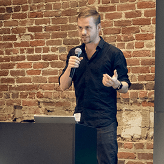 **Nick Klingensmith** *MR Academy Lead Engineer*|Nick is an experienced game developer specializing in tool development, graphics programming, MR, and Unity! With over 100 published games, he's worked on small arcade games, mobile high fidelity GPU pushing titles, all the way to massive networked social games. The tools he's published on the Unity Asset Store are also used in thousands of games, on just about every modern platform imaginable. Nick has collected most of the official Unity certifications, and also helped write them. Nick currently works for Microsoft as the lead engineer on the Mixed Reality Academy team in San Francisco.|San Francisco, CA|[Email](mailto:niklinge@microsoft.com)|

 

## Microsoft MR Design Team, Developer Experience

|||||
|---------|---------|---------|---------|
|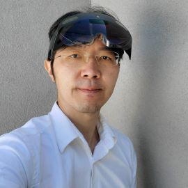 **Yoon Park** *Principal UX Designer*|Yoon is a designer, creative technologist, and author from Seoul, Korea. As a Principal UX Designer at Microsoft’s Mixed Reality design team, he's leading the design effort for the open-source Mixed Reality Toolkit(MRTK) project, Mixed Reality Design Labs(MRDL), and documentation. He shares his personal MR project design stories on [Medium](https://medium.com/@dongyoonpark/designing-type-in-space-for-hololens-2-4d926355d5b3). | Redmond, WA|[Twitter](https://twitter.com/cre8ivepark) [Medium](https://medium.com/@dongyoonpark) [LinkedIn](https://www.linkedin.com/in/cre8ivepark/) [Email](mailto:dongyoon.park@microsoft.com)|
|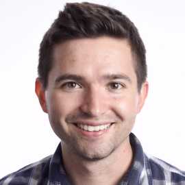 **Cameron Micka** *Senior Software Engineer*|Cameron Micka is a software engineer who takes pride in empowering developers to achieve their artistic and creative ambitions. Cameron joined Microsoft in 2016 after developing video games for nearly a decade at LucasArts Entertainment, Fun Bits Interactive, and his own startup. At Microsoft, Cameron’s role is to build tools for Mixed Reality developers and consult with partners and customers. | Redmond, WA|[Twitter](https://twitter.com/tcmicka) [Email](mailto:cameron.micka@microsoft.com)|

 

## Azure Cloud Advocate Spatial Computing Team

The charter of Azure Cloud Advocates is to help every technologist on the planet succeed. This applies to students, enterprise employees, and startups. They engage in outreach to developers and others in the software ecosystem, all designed to further technical education and skill with the Microsoft Cloud + AI platform.

The members listed here are the Cloud Advocates that work on the Spatial Computing team within the Cloud Advocate organization. They work extremely close with the Mixed Reality Developer Ecosystem team, and it's often hard to tell where one team stops, and the other one starts.

||||
|---------|---------|---------|
|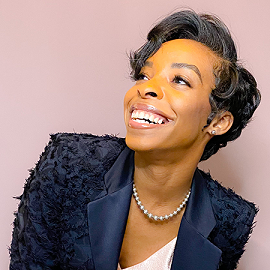 **April Speight** *Cloud Advocate*|I've been in the tech industry for 7 years after a career in luxury fashion as a menswear stylist and visual merchandiser. I love working with bots and voice enabled devices. However, I'm currently creating new realities within the world of spatial computing! I like meeting new coders and people on their journey to transition into the tech industry. I provide advice and code tutorials on both my [website](https://www.vogueandcode.com/code) and [YouTube channel](https://www.youtube.com/c/vogueandcode). In my spare time, you can either find me crafting or scratching' on turntables!|[Twitter](https://twitter.com/vogueandcode)|
|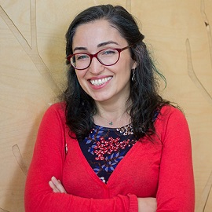 **Ayşegül Yönet** *Sr. Cloud Advocate*|Ayşegül is a Senior Azure Cloud Developer Advocate at Microsoft and focuses on Spatial Computing, Mixed Reality, Cognitive Services, and Data Visualization. She's a co-chair of [W3C Immersive Web Working Group](https://www.w3.org/immersive-web/) and [Community Group](https://www.w3.org/community/immersive-web/) and a Google Developer Expert for Web Technologies. She co-hosts of [San Francisco WebXR Meetup](https://www.meetup.com/Web-VR/) and enjoys teaching at different non-profit organizations aiming to increase diversity in the software industry. She's the co-founder of **Code4Good**, an organization with the vision of helping people to contribute to open source. Previously she led Women Who Code meetups, Girl Develop It and Black Girls Code workshops and was a CTO at [AnnieCannons](https://www.anniecannons.com/), a bootcamp dedicated to teaching tech skills to human trafficking survivors. Lately she enjoys creating tutorials for [YouTube AysSomething Channel](https://www.youtube.com/channel/UCeo_soIgcgBSd3SVRbs_MPQ?view_as=subscriber) and [YouTube WebXR Channel](https://www.youtube.com/channel/UCNzjXKJVyqYVyPY8rGKwFtQ?view_as=subscriber).|[Twitter](https://twitter.com/AysSomething)|
| **Em Lazer-Walker** *Cloud Advocate*|Em (she/her or they/them) is a Cloud Advocate for Microsoft based in Toronto. She’s an artist/engineer who makes interactive art, experimental games, and open-source software tools to empower creativity. Most of her work focuses on using nontraditional interfaces to reframe everyday objects and spaces as playful experiences and to inspire people to become self-motivated learners. She’s built projects as far-flung as a site-specific generative poetry walk, a game played on 19th century telegraph hardware, and a commercial board game that uses Amazon Alexa. In the past, she’s worked at companies like Pivotal Labs and Etsy, on games and apps such as Words With Friends and Timehop, and as a researcher in the MIT Media Lab's Playful Systems research group. She’s passionate about fostering diverse and inclusive communities, and organizes game events such as the [Roguelike Celebration](https://roguelike.club/) and the annual [alt.ctrl.PARTY](https://alt.ctrl.party/).  As a game designer and installation artist, her work has been featured in places such as the Smithsonian American Art Museum and the Venice Architectural Biennale, and has been showcased at games events and spaces such as IndieCade (2016 finalist), alt.ctrl.GDC, Bit Bash, Come Out and Play, Babycastles, Different Games, and New York Toy Fair (2019 Game of the Year nominee).|[Twitter](https://twitter.com/lazerwalker)|
| **Madoka Chiyoda** *Cloud Advocate*|I joined Microsoft in 2016 after being a mobile app developer using Xamarin for years. I love both programming and drawing manga, so I'm doing both. Check my manga work [here](https://chomado.com/).|[Twitter](https://twitter.com/chomado)|
|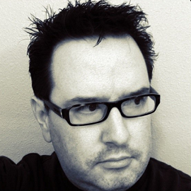 **Thomas Lewis** *Cloud Advocate Lead*|Cloud Advocate in Microsoft's Developer Relations. Spatial Computing + Academic advocacy. Favorites: MR/AR/VR/XR, Web, Design & otters. Pronouns: he/him.|[Twitter](https://twitter.com/tommylee)|

 

## Microsoft Mixed Reality MVPs

Microsoft Most Valuable Professionals, or MVPs, are technology experts who passionately share their knowledge with the community. They're always on the "bleeding edge" and have an unstoppable urge to get their hands on new, exciting technologies. They have deep knowledge of Microsoft products and services, and can bring together diverse platforms, products, and solutions, to solve real world problems. MVPs make up a global community of over 4,000 technical experts and community leaders across 90 countries/regions, driven by their passion, community spirit, and quest for knowledge. Above all, MVPs are always willing to help others - that's what sets them apart.

||||
|---------|---------|---------|
| **Aleksandr Kudishov** *Russia*|MVP focused on Game Development & Windows Development, VR/AR/MR. Game Producer, Tech Evangelist, Holographic Developer, MSP Lead of Game-Development.|[Email](mailto:draconifore@gmail.com)|
|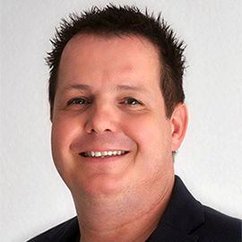 **Alexander Meijers** *The Netherlands, Rijswijk*|A professional who inspires, motivates, and educates businesses on how to use emerging technologies using Virtual, Augmented, and Mixed Reality in their journey to digital innovation. He has a strong background on SharePoint, Office 365, and Microsoft Azure and is working with machine learning, artificial intelligence, and cognitive services. Primarily focused on manufacturing, construction, industry, logistics, and maritime/offshore, his goal is helping businesses to achieve more on creating, improving, smartening, and shortening of business processes by using services, apps, and devices like HoloLens and Kinect for Azure.|[Email](mailto:alexander@appzinside.com)|
|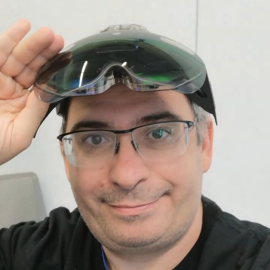 **András Velvart** *Budapest, Hungary*|András has been a Microsoft Most Valuable Professional (in Windows Development / Mixed Reality) for 12 years. He's a frequent speaker at technology events ([Sessionize profile](https://sessionize.com/velvart-andras/)). He's the author of the open-source MVPToolkit for Unity that allows Unity developers to create maintainable, testable AR/VR enterprise applications. András' passion is the future of Human-Computer Interaction, including mixed, augmented, and virtual reality, conversational interfaces, speech recognition. Created multiple Pluralsight courses, including on Apple's ARKit and Microsoft's UWP XAML technologies.|[Email](mailto:velvart.andras@response.hu)|
| **Bronwen Zande** *Brisbane, Australia*|Bronwen Zande is a Director of Soul Solutions, having spent more of her life as a developer than not. She's a long-term Microsoft Most Valuable Professional (MVP) having been awarded MVP status for Windows Development, Emerging Experiences, Kinect, Bing Maps, and Live Services.  Bronwen is an active community member involved in promoting IT as a career with her participation in judging Imagine Cup, Young ICT Explorers, and Technology Takes You Anywhere. Bronwen was a founding member of the Brisbane Girl Geek Dinners, organizer of Developer, Developer, Developer Brisbane (now DDD Brisbane), and a multi-year Australian activator for SheEO.  She is an avid traveler and when not behind the lens of a camera can often be found presenting at a local meetup or user group while on her travels.|[Email](mailto:bronwen@soulsolutions.com.au)|
| **Bruno Anjos** *Brazil*|Innovation Manager, work at management and architecture of Digital Pages innovation projects, with expertise for XR - Augmented Reality, Mixed and Virtual Reality platforms. Microsoft MVP in Mixed Reality 2020-2021 in Mixed Reality. I work as an expert in the development and planning of Mixed Reality solutions - focusing on Microsoft HoloLens. Experience with game and application development, and asset creation and multimedia content.|[Email](mailto:brunof.anjos@outlook.com)|
| **Clemente Giorio** *Torino, Italia*|"Hacker, geek, maker, researcher, innovator, trainer, developer... Has made science and technology his passion other than his job. Follows many communities and is often actively involved as a speaker and event organizer in particular with: Coding Gym, DotNetPodcast, FabLabNapoli, DotNetCampania and HoloLens Developers.  His signature dishes, far from the stove, are: Artificial Intelligence, Computer Vision, Internet of Things, Natural User Interface, and Mixed Reality.  Microsoft MVP and Intel Software Innovator, works as Senior Research & Development Engineer for Deltatre, where he develops software prototypes.|[Email](mailto:tinuxnet@hotmail.com)|
| **Eric Provencher** *Montreal, QC, Canada*|Eric is a Spatial Design Engineer working on Advanced XR Authoring Research at Unity Labs. Experienced in working on MRTK and cross-platform mixed reality application framework development from his time at CAE and a close Microsoft Mixed Reality partner. Eric maintains MRTK-Quest, a widely used open-source extension to MRTK. MRTK-Quest brings native support of the Oculus ecosystem, including controller and hand tracking support on Oculus Quest.|[Email](mailto:erproven@gmail.com)|
| **Fabrice Barbin** *France*|Entrepreneur, innovation, and technology enthusiast for years, Fabrice is CEO at [SYNERGIZ](http://www.synergiz.com), Microsoft Mixed Reality Partner, pioneer of HoloLens use cases in France. Actively promoting Microsoft technologies as speaker, rewarded MVP for 12 years, Fabrice is interested by a large set of products: HoloLens, Kinect4Azure, IoT, Surface Hub, Ink, Touch, IA, Machine Learning, Cognitive Services, Azure|[Email](mailto:fbarbin@synergiz.com)|
| **Francesco Clasadonte** *Milan, Italy*|Fanciful and creative, I engage in everything I'm passionate about. For three years I have been working as a researcher at Politecnico di Milano, focusing my research on interactive technologies for children with disabilities, gaining experiences in developing IOT systems, smart objects, robot interaction, lighting design, multisensory environment, and natural user interfaces both in national and international projects.  Currently, I'm working at [FifthIngenium](https://fifthingenium.com) as Senior Creative Developer, in the fields of IOT, web solutions, system integration, with focus on emerging and innovative technologies such as mixed reality and artificial intelligence.|[Email](mailto:klasaf@outlook.com)|
| **Gianni Rosa Gallina** *Italy*|Gianni is a Microsoft MVP since 2011, focusing on emerging technologies, AI, and Virtual/Augmented/Mixed Reality since 2013. Currently he's R&D Senior Software Engineer in Deltatre's Innovation Lab, designing, and prototyping next generation solutions for sport-related experiences and services, from VR/MR apps to end-to-end Azure architectures and video workflows, passing by Cognitive Services, AI and much more. Besides that, he's an active member of the local community "Torino Technologies Group" (TTG), organizer and trainer for Coding Gym Torino monthly meetups, Pluralsight online courses author, publish articles on his blog and he's speaker in national and international tech conferences and events.|[Email](mailto:giannishub@hotmail.com)|
| **Jessica Engstrom** *Stockholm, Sweden*|Microsoft MVP - Windows Platform Development, Public speaker, UX, Bots, and Mixed Reality. Coding After Work Podcast co-host. User group and conference organizer|[Email](mailto:jessica@catoholic.se)|
|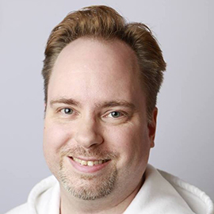 **Jimmy Engstrom** *Stockholm, Sweden*|Microsoft MVP - Windows Platform Development, speaker, Blazor, Mixed Reality, HoloLens, and Windows developer. Coding After Work Podcast co-host. User group and conference organizer|[Email](mailto:jimmy@engstromjimmy.se)|
|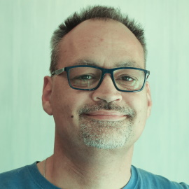 **Joost van Schaik** *Amersfoort, The Netherlands*|I'm not the one to paint big stories and wide vistas in the MR space – I call myself a developer++ and I make things happen. My primary claims to 'fame' are my blog and my apps – one of the first indie apps for both HoloLens 1 and 2 available from the Store are mine. Look for publisher "LocalJoost" and see for yourself. In the past three years I've been involved in quite some commercial projects too. I consider myself a community person – I love to share my knowledge, both on my blog and in person.|[Email](mailto:joostvanschaik@outlook.com)|
|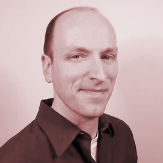 **Lance Larsen** *Madison, WI, USA*|Lance Larsen is a Microsoft MVP, a founder, and the Chief Visionary Officer (CVO) of [HOLOSOFT](https://www.HoloSoft.com) as well avid Community Speaker -and- president of [MADdotNET](https://www.MADdotNET.com), Madison Wisconsin's .NET developer community!  Additionally, he's one of the original organizers of That Conference - the Summer Camp for Geeks.  Most proud to have focused on "Growing-up Geek" talks to raise the next generation of kids on technology. Technology focused on "HoloLens / Mixed Reality", "VR / AR for industry", "Azure Spatial Anchors", "Azure Kinect", "Unity Development" and much more...|[Email](mailto:lance@lancelarsen.com)|
|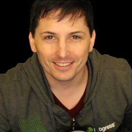 **Lance McCarthy** *Boston, MA, USA*|Lance McCarthy is an exceptional community leader with an acute expertise for all things .NET and C# (especially on the XAML stack) and HoloLens/Mixed Reality applications. Lance is helpful online, guiding and answering questions from Microsoft developers on Twitter as @lancewmccarthy and blogs at DVLUP.com. He organizes & hosts events in the Boston area such as user group nights, mini-code camps, and full hackathons.|[Email](mailto:lance@dvlup.com)|
|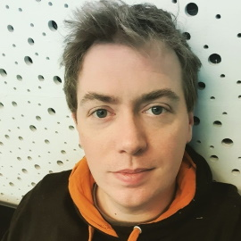 **Matteo Valoriani** *Milan, Italy*|Speaker at national and international conferences, travel and technology lover, Matteo is Microsoft MVPs since 2014 focusing on Natural User Interfaces, Kinect, Emerging Technologies, Volumetric Video, Augmented Intelligence, and Mixed Reality.  After working in Microsoft, a PhD on Computer Vision and unconventional paradigms for ambient interaction, Matteo founded and lead [FifthIngenium](https://www.fifthingenium.com), an Italian high-tech company, Microsoft Partner, specialized on HoloLens and Mixed Reality solutions for Training, Healthcare, and Industry 4.0. Every day Matteo helps its customers, medium and large companies, to understand and exploit the potential of Mixed Reality and AI. Matteo believes in the power of technology to improve people's lives and for this reason he promotes and develops technological projects with high social impact in the field of disability and children's education.|[Email](mailto:matteo.valoriani@fifthingenium.com)|
| **Philipp Bauknecht** *Pforzheim, Germany*|Hi, I'm Philipp Bauknecht from Germany, Founder & CEO of medialesson GmbH an early adopter of HoloLens and member of the Microsoft Mixed Reality Partner Program. I help my customer's design, architect, build and operate modern, beautiful, and useable Apps that run on any platform as a consultant, architect, and trainer together with my team of highly skilled designers and developers. Besides I teach Interface Design at the Pforzheim University and engage with the community as a speaker at conferences and user groups and organizer of code camps and hackathons. I was selected as one of the 100 creative talents by the European Union and the Committee of the Regions. I'm a Microsoft Most Valuable Professional (MVP) for Windows Development since 2013. In 2017, I was accepted into the Microsoft Regional Director Program.|[Email](mailto:bauknecht@medialesson.de)|
| **Rafał Legiędź** *Pabianice, Poland*|Rafał works as a software engineer for Avenga. Being in the industry since 2007 he develops his passion for the software at every possible moment. He believes that being pragmatic in our field is helpful and proves that by switching technologies he uses whenever there's a need or an opportunity to learn new concepts. Started with .NET back-end solutions, he quickly became a web guy and then he got his head around different kind of mobile technologies and VR/AR. Also a Microsoft MVP in Windows Development.   As his passion evolved, he became obsessed with knowledge sharing and community activities. That resulted in co-founding a conference and a series of other actions like giving talks or conducting workshops.|[Email](mailto:rafal.legiedz@gmail.com)|
|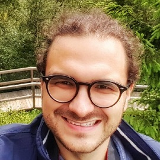 **René Schulte** *Dresden, Germany*|René Schulte is Director of Global Innovation at Valorem Reply working with teams across the globe on emerging technologies like the revolutionary 3D volumetric video telepresence solution HoloBeam and the AR Cloud enabling large, cross-platform user experiences with persistence. He is a creative thought leader with a passion for UX and deep technical knowledge from more than 10 years in VR/AR/MR/XR technology and 3D programming, developing for the Microsoft HoloLens since 2015, was featured on Forbes and is listed as VR/AR/MR dev influencer. He also coded AI deep learning neural networks before it was cool and is applying modern AI to empower humans. He is a frequent keynote and session speaker and panelist at conferences like //build, Unite, Vision VR/AR Summit, VRDC (GDC), AWE, ESA and more. Blogs about many topics. He also created popular open-source libraries like WriteableBitmapEx and the AR library SLARToolKit. He was honored several times for his dev community work with the Microsoft MVP award, recognized as Microsoft Regional Director and Global Advisory Board member for the VR/AR Association.   He lives in Dresden, Germany with his wife and their 5 children.|[Email](mailto:schulte.rene@outlook.com)|
| **Simon Darkside Jackson** *United Kingdom*|Long time game evangelist, from the early days of basic, pascal and C++.   Jumped on the XNA bandwagon in its infancy from the sailing ship MDX, from there I've expanded far and wide dealing with game and development frameworks from here to the beyond. Currently enjoying my first year as a published author and entrant in the ID program and seeking to get as many people on boarded as possible. Additionally I'm being dragged round the UK supporting the Unity porting programs (maybe MonoGame later) and getting lots of projects on to the windows platform.|[Email](mailto:gamedevspace@hotmail.co.uk)|
|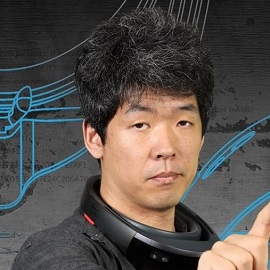 **Takahiro Miyaura** *Nara, Japan*|I'm working as a software engineer, and developer in IT industry. In particular, I've been doing research XR(VR/AR/MR etc.) technologies, and various technologies(AI, IoT, and so on) that can take advantage of XR.|[Email](mailto:cafe.kobe@gmail.com)|
|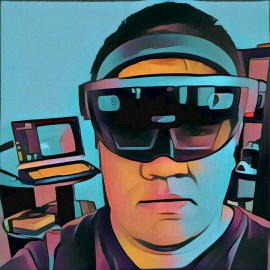 **Tamás Deme** *Budapest, Hungary*|Tamás is a mixed reality engineer working at the Atlanta based VIM, where he develops solutions for devices ranging from servers to a headset that shows you holograms. He's a five times Microsoft MVP in Windows Development, interested in open-source projects, teaching and mentoring. You can find him online at [https://tomzorz.me](https://tomzorz.me) or on twitter at [https://twitter.com/tomzorz_](https://twitter.com/tomzorz_).|[Email](mailto:mixedreality@tomzorz.me)|
| **Tatsuro Ueda** *Mie, Japan*|MR Educator of Physics in 5 countries including Afrika, President of Feel Physics|[Email](mailto:tatsuro.ueda@feel-physics.jp)|
|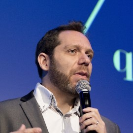 **Vincent Guigui** *Paris, France*|In charge of the Innovative Interactions division at [OCTO Technology](https://www.octo.com), I help our customers develop new interactions between human and digital world.  I am a lecturer on Innovation and Natural User Interfaces topics, talking about Immersive Experiences (VR/AR/MR), Conversational Interfaces (Bot), and potential future of the user interfaces...  Since 2013, I've been awarded by Microsoft as one of the european leading experts on Kinect, Natural User Interfaces, and HoloLens (Most Valuable Professional award).|[Email](mailto:vincent@guigui.fr)|

