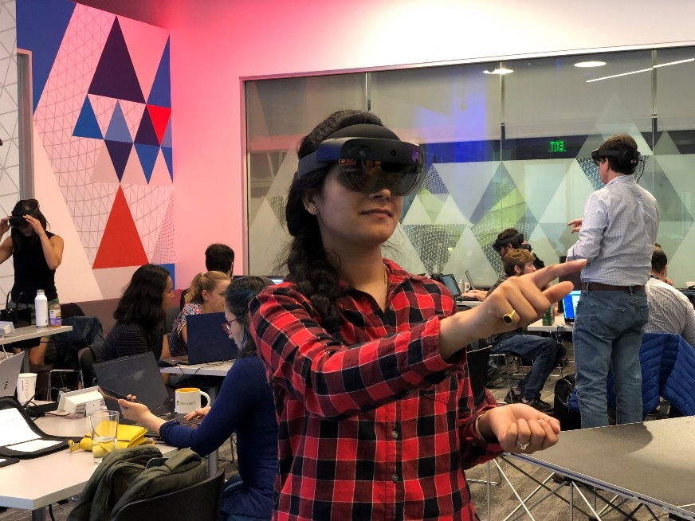
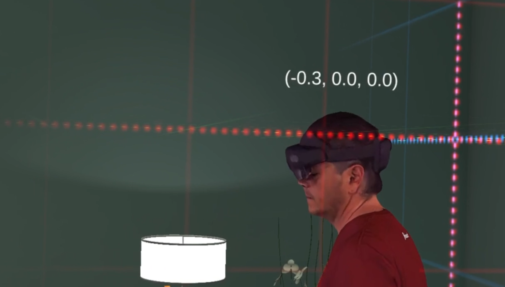
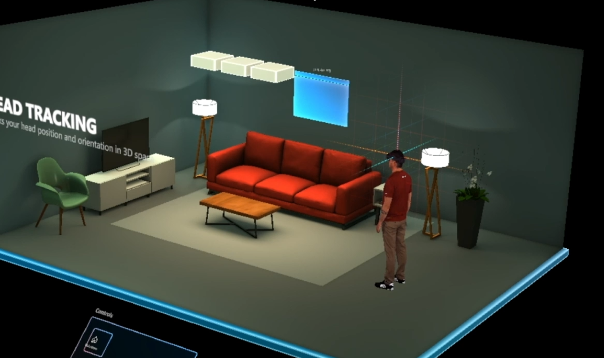
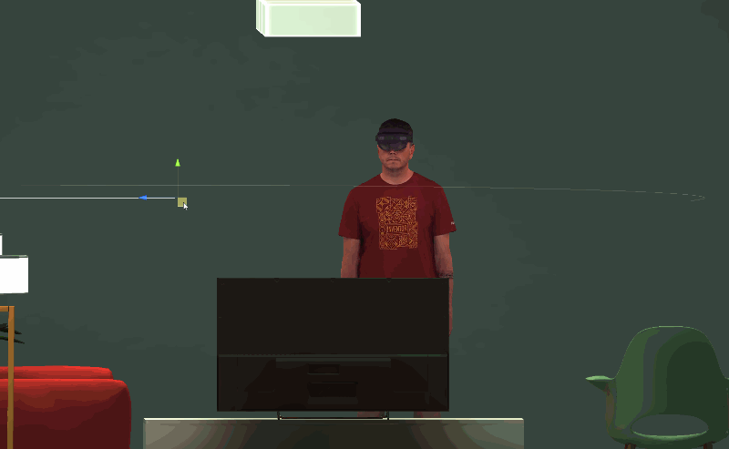
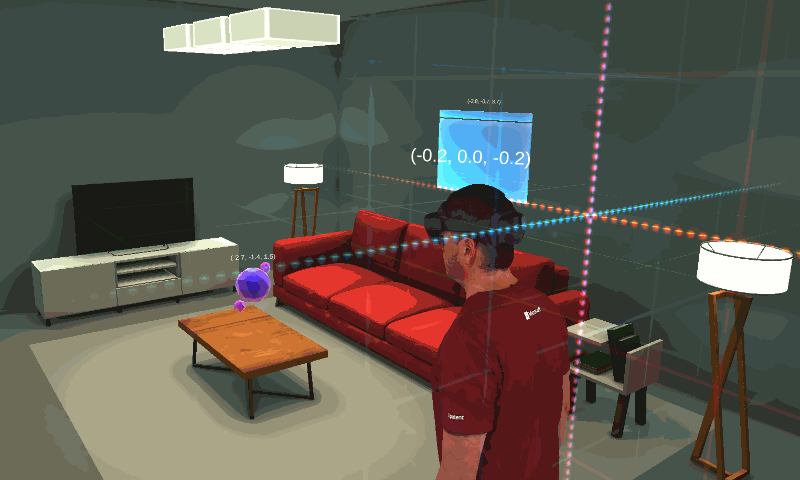
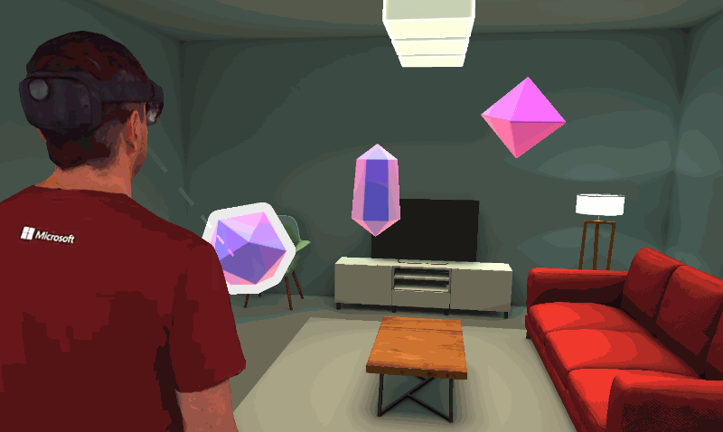
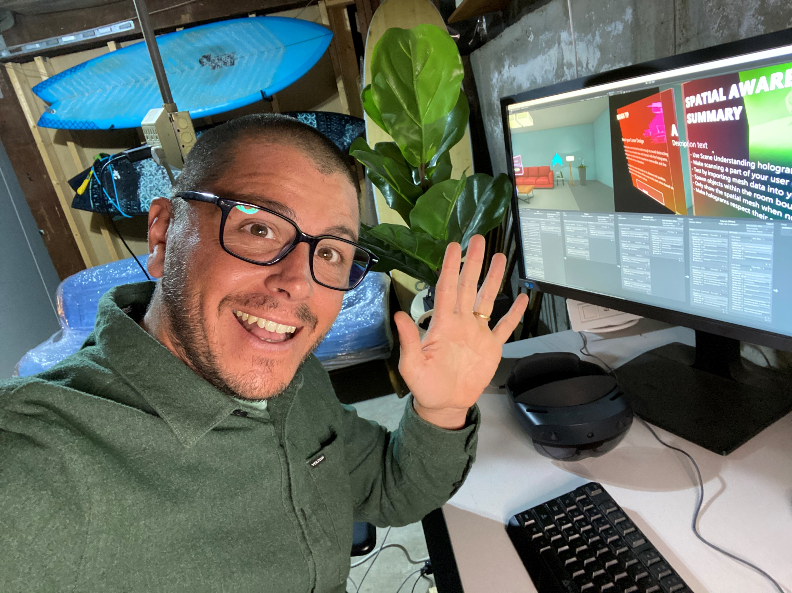

# The making of Designing Holograms

> [!NOTE]
> Please allow for a small loading window to account for all the cool GIFs and embedded videos on this page.

Learning how to design for mixed reality can be hard because the medium doesn't always translate well to 2D design processes. Here at Microsoft, we've created a free app for the HoloLens 2 to help you learn the fundamentals of mixed reality UX Design firsthand. The unique approach of the Designing Holograms app dives into mixed reality behaviors, tips, and recommendations to help you create engaging and amazing HoloLens apps of your own. Download the app for free from the Microsoft Store and learn from Microsoft’s Mixed Reality Design Team!​

> [!div class="nextstepaction"]
> [Download the Designing Holograms app](https://www.microsoft.com/p/designing-holograms/9nxwnjklrzwd)

 

*Designing Hologram’s demo room (also known as the doll house)​*

## Designing for mixed reality

Like many of you, I used to design mobile apps. Coming from a 2D design world, jumping into full on spatial computing, where everything is now in the world, was a significant shift. In mixed reality, apps aren't confined to a 2D screen anymore; in fact, they're almost free, placed in the real world and interacting with real objects.​

To me, connecting 3D experiences to conventional 2D design processes is the most challenging aspect of mixed reality development. In conversations with customers, I would hear things like “I know what features to include and how to get them up and running. It’s code, I can follow the docs and tutorials, but the user experience? So many features, different input options, different scenarios, and physical environments, it’s overwhelming".

*Image from the HoloLens 2 Design Workshop in San Francisco​*

## An opportunity to teach

It wasn’t obvious at first, but an excellent opportunity was presented to use mixed reality as a Medium to teach it.​

Designing Holograms is a visual experience that explains mixed reality design concepts and recommendations. It’s just you and a virtual teacher demonstrating mixed reality design concepts. Everything is from a third person perspective with the experience firmly in your own space.

 

> [!VIDEO https://docs.microsoft.com/en-us/shows/Docs-Mixed-Reality/Designing-Holograms-app-trailer/player]

*Designing Holograms trailer video​*

## Exploring the doll house

The doll house is the virtual environment we use throughout the app. The environment is an 80 x 60 x 40-cm miniature room that contains the basic elements that most rooms have in common, like walls, lamps, furniture, a table, and a TV. The doll house is the main protagonist of the app experience, so we needed to make sure it would work great in any environment. Think of it as a small demo room for visualizing all sorts of mixed reality concepts.

> [!VIDEO https://docs.microsoft.com/en-us/shows/Docs-Mixed-Reality/Dollhouse-adjustment-behavior-in-the-Designing-Holograms-app/player]
*Video of the Dollhouse adjustment behavior​*

### 1:1 vs 1:10 prototypes

Our initial assumption was that 1:1 demonstrations would be amazing, almost like looking at a real life teacher. The user would see everything that the teacher sees at a real life scale. However, we immediately realized that there would be a few problems:​

- Most developers will run their apps in offices, or rooms smaller than the demo room, so it wouldn’t fit.​
- Displays are additive, meaning the entire virtual environment will be overlaid over a user’s room. That can get confusing with two tables, maybe double couches, and walls that don’t align.​
- And worst of all a virtual environment heavily constrained by a field of view.​

When we tried out a mini 1:10 scale, the result was a fantastic birds-eye view of a realistic room. You could see everything that was going on from any angle all at the same time. What was most surprising is that most testers found it so much more immersive to see a small version, then they never toggled back to the 1:1 scale. So we decided to actually scrap the 1:1 version and avoid the extra work required to adapt UI and other aspects of the app.​

*Field of view with 1:1 scale​*

*Field of view with 1:10 scale​*

## Using Mixed Reality Capture

One of the most characteristic features of this app is the use of Mixed Reality Capture to teach and demonstrate mixed reality design concepts.​

Microsoft has a Mixed Reality Capture studio in San Francisco. Microsoft also licenses this technology to other studios, which include Avatar Dimension in Washington D.C., Metastage in Los Angeles, Dimension Studios in London, SK Telecom in Seoul, and Volucap in Berlin. You can find more information on our [Mixed Reality Capture Studios here](https://www.microsoft.com/mixed-reality/capture-studios).​

 

> [!VIDEO https://docs.microsoft.com/en-us/shows/Docs-Mixed-Reality/Raw-capture-footage-for-the-Designing-Holograms-app/player]
*Raw footage of Daniel Escudero from one of the 106 cameras in the Mixed Reality Capture Studio in San Francisco.​*

The capture process generates a keyframed mesh, normals, and texture, which can be delivered as OBJ/PNG files for further post-production, or ready for playback as an H.264 compressed MP4 file. These files can be imported into Unity, Unreal, Native, and WebXR projects. Files can run on Windows, iOS, Mac, Android, Magic Leap, and Playstation VR.​

 

> [!VIDEO https://docs.microsoft.com/en-us/shows/Docs-Mixed-Reality/Mixed-Reality-Capture-footage-for-the-Designing-Holograms-app/player]
*The Capture Player provided to analyze mp4s that contain video with audio and embedded meshes.​*

## Manipulating captures and virtual objects

Mixed Reality Captures produce virtual representations of people or animals, but at times you may need those characters to interact with other virtual objects. The following two examples show different ways we manipulated the scenes to achieve this effect.​

### Head Gaze Adjustment​

Headgaze adjustment lets you move a captured person’s head at runtime, meaning you could have a capture face towards a user. In our case, we used it to show the field of view and field of interest. What you see below is a moving gameobject acting as a target for the head gaze to look at. As we move the target from side to side, the head of the capture follows.​

We used this trick to make sure that the idle capture would always face towards holograms placed in different parts of the doll house.​ 

​*The Capture’s head being moved at runtime following a target gameobject in Unity.*

### Syncing Animated Objects​

The second one, was animating objects to sync with a capture’s movement. In different parts of the app, we imported sequential OBJs of a specific capture every five frames. The OBJs were then animated in the scene to make sure they would match the corresponding frame of the capture. It’s a tedious process of animating and keyframing, but the result is great. You can now see a Mixed Reality Capture interacting with non-captured objects.​

*Synced animation between a Mixed Reality Capture and UI panel​*

### UI creative process

When we started the UI design, we wanted to show some of the magic and possibility that holograms have to offer. Simply showing static 2D windows and text boxes doesn’t feel right in the 3D world. Many of the possibilities at hand just don't show up, so right from the beginning we decided to move away from that and make full use of holographic 3D space.​

At first, we started with adding some thickness to the panels, icons, and text information. Still, as a user, what I see is a text box. Text boxes with images, but we aren't there. We went further by making use of the Mixed Reality Toolkit (MRTK) shaders. The MRTK shaders became a powerful tool, and we made use of its stencil features to add negative depth to the panels. That means instead of adding elements in front of a text box, the icons now appear behind a transparent panel. What I see now as a user is something that I just can’t replicate anymore in the real world, and this is where holographic magic started to happen. Also as a user I don’t really like to read, I do a lot already in the physical world.​

Obviously icons work a lot better than simple text does, to provide an even more powerful guidance, I then started creating a set of animated objects and avatars, each of them telling a tiny story about what is being done in the respective scenario and how it’s being used.​

## Core concepts

**Head Tracking and Eye Tracking**

> [!VIDEO https://docs.microsoft.com/en-us/shows/Docs-Mixed-Reality/Microsofts-Designing-Holograms-Head-Tracking-and-Eye-Tracking-Chapter/player]

**Hand Tracking**

> [!VIDEO https://docs.microsoft.com/en-us/shows/Docs-Mixed-Reality/Microsofts-Designing-Holograms-Hand-Tracking-Chapter/player]

**Spatial Awareness**

> [!VIDEO https://docs.microsoft.com/en-us/shows/Docs-Mixed-Reality/Microsofts-Designing-Holograms-Spatial-Awareness-Chapter/player]

**Holographic frame**

**Coordinate systems**

**Eye tracking**

**Room scan visualization and spatial mapping**

**Scene understanding**

**Point and commit with hand rays**

## "Try it out" moments

Designing Holograms teaches mixed reality concepts, but it also allows you to try them in your room. After some of those explanations, we pause and take you out of the doll house and into an interactive moment. Here are some examples of those interactive moments:

*The hand tracking frame showing when hands are detected and when they enter the field of view.​*

*Interacting with colliding crystals through far interaction​*

*Exploring near interaction affordances​*

## About the team

<table style="border-collapse:collapse" padding-left="0px">
<tr>
<td style="border-style: none" width="60"></td>
<td style="border-style: none"><b>Daniel Escudero</b> <i>Lead Technical Designer</i> Dan is the Creative Director on Designing Holograms and currently works as Design Lead for the Microsoft’s Mixed Reality Academy in San Francisco, and was previously a Designer in one of Microsoft’s Mixed Reality Studios in London.</td>
</tr>
</table>

<table style="border-collapse:collapse" padding-left="0px">
<tr>
<td style="border-style: none" width="60"></td>
<td style="border-style: none"><b>Martin Wettig​</b> <i>Senior 3D Artist</i> Martin leads 3D Art and UI Design on Designing Holograms and was previously a Senior 3D Artist at one of Microsoft’s Mixed Reality Studios in Berlin.​</td>
</tr>
</table>

A huge thank you to the Mixed Reality Design Team for sharing so much knowledge, and to the amazing folks at [Object Theory](https://objecttheory.com/) for being essential teammates through every step of the project. Thank you all for you amazing talent, for your passion and exceptional eye for design.

> [!div class="nextstepaction"]
> [Download the Designing Holograms app](https://www.microsoft.com/p/designing-holograms/9nxwnjklrzwd)