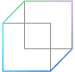

# Get started with Mixed Reality

The Mixed Reality ecosystem is an emerging landscape of physical and digital interactions, limited only by your imagination. Whether you're an experienced developer or a new convert, we recommend beginning your Mixed Reality journey with the resources we've laid out in the links below. There's a lot of new ground to cover, so let's get started! 

## Choose your track

If you already know which area of Mixed Reality you'd like to explore, feel free to jump right in to any of the tracks below. However, keep this page in your bookmarks so you can reference the basic conceptual content at a later time.

:::row:::
    :::column:::
        
        **[I'm new to mixed reality](#understand-the-basics)** 
        Understand the basics
    :::column-end:::
    :::column:::
        
        **[I'm a designer](../design/design.md)** 
        Start designing and prototyping
    :::column-end:::
    :::column:::
        
        **[I'm a developer](../develop/development.md)** 
        Learn the tools and architecture
    :::column-end:::
:::row-end:::

 

---

 

## Understand the basics

If you're new to mixed reality, it's important that you start from the bottom and work your way up through its core concepts, experiences, and capabilities. We've created a sequential journey of sorts to help you set a firm foundation for designing and developing your own ideas in Mixed Reality.

### 1. What is mixed reality?

|  Concept  |  Outcome  |
| --- | --- |
| [Mixed reality is a spectrum](../discover/mixed-reality.md) | Mixed reality blends the physical with the digital, the next evolution in human, computer, and environment interactions |
| [What is a hologram?](../discover/hologram.md) | HoloLens lets you create holograms, which are objects made of light and sound that appear in the world around you, just as if they were real objects. Holograms respond to your gaze, gestures and voice commands, and can interact with real-world surfaces around you |

### 2. What can you do with mixed reality?

|  Concept  |  Outcome  |
| --- | --- |
| [A new vision for work](https://dynamics.microsoft.com//mixed-reality/overview/) | Explore a range of products that can empower employees and optimize operations with Dynamics 365, including [Remote Assist](https://docs.microsoft.com/dynamics365/mixed-reality/remote-assist/ra-overview), [Layout](https://docs.microsoft.com/dynamics365/mixed-reality/layout/) and [Guides](https://docs.microsoft.com/dynamics365/mixed-reality/guides/) |
| [The pursuit of more personal computing](../out-of-scope/case-study-the-pursuit-of-more-personal-computing.md) | The solutions these products provide reveal what’s necessary to advance the future. With mixed reality, this is especially true: Meaningful insight comes from getting hands-on with real work — real devices, real customers, real problems |

### 3. What are the capabilities of HoloLens?

|  Concept  |  Outcome  |
| --- | --- |
| [Immersive, ergonomic, instinctual and untethered](https://www.microsoft.com//hololens/hardware) | HoloLens 2 offers the most comfortable and immersive mixed reality experience available, with industry-leading solutions that deliver value in minutes—all enhanced by the reliability, security, and scalability of cloud and AI services from Microsoft |

### 4. What are the core concepts of an experience?

|  Concept  |  Outcome  |
| --- | --- |
| [Keep the user comfortable - (Comfort)](../design/comfort.md) | To ensure maximum comfort on head-mounted displays, it’s important for designers and developers to create and present content in a way that mimics how these cues operate in the natural world |
| [How the user sees the world - (Holographic frame)](../design/holographic-frame.md) | Users see the world of mixed reality through a rectangular viewport, powered by their headset. On the HoloLens, this rectangular area is called the holographic frame and allows users to see digital content overlaid onto the real world around them |
| [Making holographic objects feel real - (Spatial mapping)](../design/spatial-mapping.md) | Spatial mapping makes it possible to place objects on real surfaces. This helps anchor objects in the user's world and takes advantage of real world depth cues |
| [Suggesting the scale of an object - (Scale)](../design/scale.md) | A key to displaying content that looks realistic in holographic form is to mimic the visual statistics of the real world as closely as possible. This means incorporating as many of the visual cues as we can that help us (in the real world) understand where objects are, how big they are, and what they’re made of |

## See how industry partners are using mixed reality

:::row:::
    :::column:::
       
    :::column-end:::
    :::column span="2":::
        ### [View complex construction projects with Bentley's digital construction software](https://binged.it/31AR3kP)
        Synchro is digital construction software that enables viewing complex construction projects in mixed reality. Their 4D digital construction platform combines traditional Gantt chart CPM scheduling with integrated 4D visualization capabilities in real time.
    :::column-end:::
:::row-end:::

---

:::row:::
    :::column:::
       
    :::column-end:::
    :::column span="2":::
        ### [PTC's Vuforia Studio authoring solution promotes workforce productivity and safety](https://binged.it/31ARrjh)
        Vuforia Studio's efficient mixed reality authoring solution promotes workforce productivity and safety by delivering information when and where workers need it most: in the real-world context of their daily work environment.
    :::column-end:::
:::row-end:::

---

:::row:::
    :::column:::
       
    :::column-end:::
    :::column span="2":::
        ### [Philips is piloting HoloLens in the domain of image-guided minimally invasive procedures](https://binged.it/31B1RiR)
        Philips is piloting HoloLens in the domain of image-guided minimally invasive procedures, during which physicians rely on live X-ray, ultrasound and other sources of information to "see" inside the patient and guide their actions.
    :::column-end:::
:::row-end:::

 

---

## What would you like to do next?

:::row:::
    :::column:::
        
        **[Try out mixed reality](https://www.microsoft.com//windows/windows-mixed-reality?icid=SSM_Search_Promo_XCat_WindowsMixedReality_CTA1#storelocator)** 
        Get a demo of Mixed Reality and HoloLens at your local Microsoft Store.
    :::column-end:::
    :::column:::
         
        **[Become a creator](../design/design.md)** 
        Learn the basic concepts you need to begin designing and prototyping.
    :::column-end:::
        :::column:::
         
        **[Start developing](../develop/development.md)** 
        Choose a development path based on your skill level, work style or platform interest.
    :::column-end:::
    :::column:::
         
        **[Come to an event](../whats-new/sf-academy-events.md)** 
        See the hardware and get a hands-on tutorial to make your first HoloLens 2 application.
    :::column-end:::
:::row-end:::

 

 

>[!IMPORTANT]
>All mixed reality development materials are provided on this site for your reference only. Your application, its usage, and its effect on end users is your sole responsibility as the application developer, including ensuring that your app does not cause discomfort, injury, or any other harm to the end user, and including appropriate warnings and disclaimers. You need to at all times take the appropriate steps in the development and publishing of your application to ensure that your application is safe, and that you meet all obligations in your [App Developer Agreement with Microsoft](https://docs.microsoft.com/legal/windows/agreements/app-developer-agreement).
