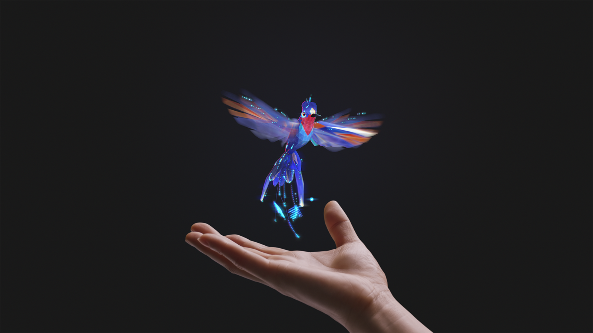
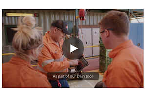
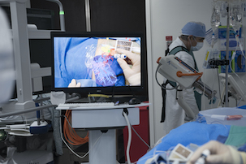
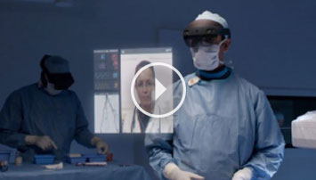
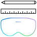

# Get started with Mixed Reality

The mixed reality ecosystem is an emerging landscape of physical and digital interactions, limited only by your imagination. Whether you're an experienced developer or a new convert, we recommend that you begin your mixed reality journey with the resources we've laid out below. There's a lot of new ground to cover, so let's get started! 

## Understand the basics

If you're new to mixed reality, it's important that you start from the bottom and work your way up through its core concepts, experiences, and capabilities. You have several options here: we have a focused module on Microsoft Learn that will get you up to speed in no time, or you can choose to explore the individual journeys we've set up below. Any of these paths will help you set a firm foundation for designing and developing your own ideas in mixed reality.

> [!div class="nextstepaction"]
> [Introduction to Mixed Reality module](/learn/modules/intro-to-mixed-reality)

### What is mixed reality?

Before you dive into application design or development, you need to understand what we mean by mixed reality. This section is designed to get you acquainted with the mixed reality spectrum, including environmental input, perceptual changes, design challenges, and devices. 

|  Concept  |  Outcome  |
| --- | --- |
| [Mixed reality is a spectrum](../discover/mixed-reality.md) | Mixed reality blends the physical with the digital to provide the next evolution in human, computer, and environment interactions |
| [What is a hologram?](../discover/hologram.md) | Our [HoloLens headset](/hololens) lets you view holograms, which are objects made of light and sound that appear in the world around you like real objects. Holograms respond to your gaze, gestures and voice commands, and can interact with real-world surfaces around you |
| [Mixed reality learning overview](mr-learning-overview.md#general-modules) | Try out our curated mixed reality module through Microsoft Learn |
| [Expand your design process](../discover/case-study-expanding-the-design-process-for-mixed-reality.md) | Expand your design mindset with spatial thinking, bodystorming, and acting when creating your immersive experiences  |

 

---

## See how industry partners are using mixed reality

:::row:::
    :::column:::
       
    :::column-end:::
    :::column span="2":::
        ### [Mercedes-Benz is transforming the service workforce with HoloLens 2 and Dynamics 365 Remote Assist](https://customers.microsoft.com/story/839709-mercedes-benz-automotive-holoLens-en-usa)
        Mercedes-Benz USA is using HoloLens 2 and Dynamics 365 Remote Assist to improve service technician efficiency, solve problems more quickly, and reduce the cost and environmental impact of service-related travel.
    :::column-end:::
:::row-end:::

---

:::row:::
    :::column:::
       
    :::column-end:::
    :::column span="2":::
        ### [BHP increases the pace of innovation with mixed reality and IoT, despite lockdown](https://customers.microsoft.com/story/850776-bhp-energy-dynamics-365-hololens)
        Despite COVID-19's impact and restrictions, BHP is delivering support and training to field workers from thousands of miles away with HoloLens 2 and Dynamics 365 Remote Assist.
    :::column-end:::
:::row-end:::

---

:::row:::
    :::column:::
       
    :::column-end:::
    :::column span="2":::
        ### [Healthcare startup cuts time to market by up to 70%, despite pandemic](https://customers.microsoft.com/story/848966-mediview-mcs-story)
        Healthcare startup Mediview has developed a remarkable product that uses 3D holograms projected either directly on top of the patient’s anatomy or hovering above it to help surgeons see the patient's internal anatomy and guide them through procedures.
    :::column-end:::
:::row-end:::

---

:::row:::
    :::column:::
       
    :::column-end:::
    :::column span="2":::
        ### [View complex construction projects with Bentley's digital construction software](https://binged.it/31AR3kP)
        Synchro is digital construction software that enables users to view complex construction projects in mixed reality. Their 4D digital construction platform combines traditional Gantt chart CPM scheduling with integrated 4D visualization capabilities in real time.
    :::column-end:::
:::row-end:::

---

:::row:::
    :::column:::
       
    :::column-end:::
    :::column span="2":::
        ### [PTC's Vuforia Studio authoring solution promotes workforce productivity and safety](https://binged.it/31ARrjh)
        Vuforia Studio's efficient mixed reality authoring solution promotes workforce productivity and safety by delivering information when and where workers need it most: in the real-world context of their daily work environment.
    :::column-end:::
:::row-end:::

---

:::row:::
    :::column:::
       
    :::column-end:::
    :::column span="2":::
        ### [Philips helps physicians "see" inside their patients](https://binged.it/31B1RiR)
        Philips is piloting HoloLens in the domain of image-guided invasive procedures, during which physicians rely on live X-ray, ultrasound, and other sources of information to "see" inside the patient and guide their actions.
    :::column-end:::
:::row-end:::

 

---

### Explore HoloLens and mixed reality services

If you're curious to see how the different mixed reality hardware and services work, check out the links below. These links will lead you to different parts of the Microsoft documentation. We recommend that you set bookmarks and return here to continue on your design and development journey.

|  Concept  |  Outcome  |
| --- | --- |
| [HoloLens hardware](https://www.microsoft.com//hololens/hardware) | HoloLens 2 offers the most comfortable and immersive mixed reality experience available, with industry-leading solutions that deliver value in minutes—all enhanced by the reliability, security, and scalability of cloud and AI services from Microsoft |
| [Dynamics 365](https://dynamics.microsoft.com/mixed-reality/overview/) | Explore a range of products that can empower employees and optimize operations with Dynamics 365, including [Remote Assist](/dynamics365/mixed-reality/remote-assist/ra-overview), [Layout](/dynamics365/mixed-reality/layout/), and [Guides](/dynamics365/mixed-reality/guides/). You gain meaningful insights from getting hands-on with real work, real devices, and real users |
| [Azure Cloud Services](../develop/mixed-reality-cloud-services.md) | Build compelling immersive experiences on different platforms with spatial awareness, spatial anchors, and complex 3D model rendering |
| [Microsoft Mesh](/mesh/overview) | Mesh lets people connect with presence, share across space, and collaborate with one another, from anywhere in the world, through Mesh-enabled mixed reality experiences. With Mesh, you can enhance virtual meetings, conduct virtual design sessions, help others remotely, and host virtual meet-ups |

## What would you like to do next?

:::row:::
    :::column:::
         
        **[Start designing](../design/design.md)** 
        Learn the basic concepts you need to begin designing and prototyping.
    :::column-end:::
    :::column:::
         
        **[Start developing](../develop/development.md)** 
        Choose a development path based on your skill level, work style, or platform interest.
    :::column-end:::
    :::column:::
         
        **[Come to an event](../whats-new/journey-to-mr-series.md)** 
        Get started with your Mixed Reality development journey.
    :::column-end:::
:::row-end:::

 

>[!IMPORTANT]
>All mixed reality development materials are provided on this site for your reference only. Your application, its usage, and its effect on end users is your sole responsibility as the application developer; this means you must ensure that your app doesn't cause discomfort, injury, or any other harm to the end user, and includes appropriate warnings and disclaimers. You must always take the appropriate steps in the development and publishing of your application to ensure that your application is safe, and that you meet all obligations in your [App Developer Agreement with Microsoft](/legal/windows/agreements/app-developer-agreement).
