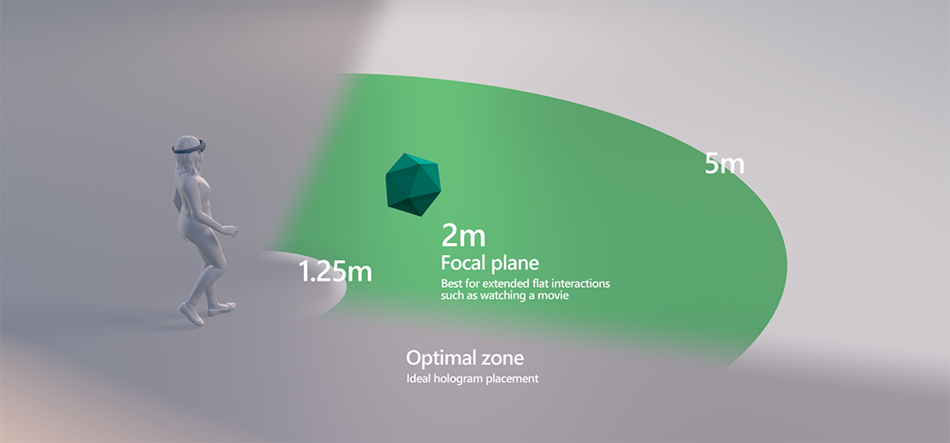

# What is a hologram?

HoloLens lets you view **holograms**, which are objects made of light and sound that appear in the world around you like real objects. Holograms can respond to your [gaze](../design/gaze-and-commit.md), [gestures](../design/gaze-and-commit.md#composite-gestures), and [voice commands](../design/voice-input.md). They can even interact with [real-world surfaces](../design/spatial-mapping.md) around you. Holograms are digital objects that are part of your world.

 

<iframe width="940" height="530" src="https://www.youtube.com/embed/MVXH5V8MVQo" frameborder="0" allow="accelerometer; autoplay; encrypted-media; gyroscope; picture-in-picture" allowfullscreen></iframe>

 

## Device support

<table>
    <colgroup>
    <col width="25%" />
    <col width="25%" />
    <col width="25%" />
    <col width="25%" />
    </colgroup>
    <tr>
        <td><strong>Feature</strong></td>
        <td><a href="/hololens/hololens1-hardware"><strong>HoloLens (1st gen)</strong></a></td>
        <td><a href="https://docs.microsoft.com/hololens/hololens2-hardware"><strong>HoloLens 2</strong></td>
        <td><a href="../discover/immersive-headset-hardware-details.md"><strong>Immersive headsets</strong></a></td>
    </tr>
     <tr>
        <td>Holograms</td>
        <td>✔️</td>
        <td>✔️</td>
        <td>❌</td>
    </tr>
</table>

 

---

## A hologram is made of light and sound

### Light

The holograms that HoloLens [renders](../develop/platform-capabilities-and-apis/rendering.md) appear in the holographic frame directly in front of users' eyes. Holograms add light to your world, which means that you see both the light from the display and the light from your surrounding world. HoloLens doesn't remove light from your eyes, so holograms can't be rendered with the color black. 

Holograms can have very different appearances and behaviors. Some are realistic and solid, and others are cartoonish and ethereal. You can use holograms to highlight features in your environment or use them as elements in your app's user interface.

### Sound

Holograms can also produce [sounds](../design/spatial-sound.md), which appear to come from a specific place in your environment. On HoloLens, sound comes from two speakers that are located directly above your ears. Same as the holographic displays, the speakers are additive, introducing new sounds without blocking the sounds from your environment.

## A hologram can be placed in the world or tag along with you

When you have a fixed location for a hologram, you can [place](../design/coordinate-systems.md) it precisely at that point in the world. As you walk around, the hologram appears stable based on the world around you. If you use a [spatial anchor](../design/coordinate-systems.md#spatial-anchors) to pin the object, the system can even remember where you left it when you come back later.

Some holograms follow the user instead. They position themselves based on the user. You can choose to bring a hologram with you, and then place it on the wall once you get to another room.

**Best practices**

* Some scenarios demand that holograms remain easily discoverable or visible throughout the experience. There are two high-level approaches to this kind of positioning. Let's call them **display-locked** and **body-locked**.
   * **Display-locked** content is locked to the display device. This type of content is tricky for several reasons, including an unnatural feeling of "clingyness" that makes many users frustrated and wanting to "shake it off." In general, designers have found it better to avoid display-locking content.
   * **Body-locked** content can be far more forgiving. Body-locking is when you tether a hologram to the user's body or gaze vector in 3D space. Many experiences have adopted a body-locking behavior where the hologram follows the user's gaze, which allows the user to rotate their body and move through space without losing the hologram. Incorporating a delay helps the hologram movements to feel more natural. For example, some core UI of the Windows Holographic OS uses a variation on body-locking that follows the user's gaze with a gentle, elastic-like delay while the user turns their head.
* Place the hologram at a comfortable viewing distance typically about 1-2 meters away from the head.
* Provide <mark> a drift amount for elements that must be continually in the holographic frame </mark> or consider moving your content to one side of the display when the user changes their point of view.

**Place holograms in the optimal zone - between 1.25 m and 5 m**

Two meters is the most optimal viewing distance. The experience will start to degrade as you get closer than 1 meter. At distances less than 1 meter, holograms that regularly move in depth are more likely to be problematic than stationary holograms. Consider gracefully clipping or fading out your content when it gets too close, so you don't jar the user into an unpleasant viewing experience.

 

---

## A hologram interacts with you and your world

Holograms aren't only about light and sound; they're also an active part of your world. Gaze at a hologram and gesture with your hand, and a hologram can start to follow you. Give a voice command, and the hologram can reply.

Holograms enable personal interactions that aren't possible elsewhere. Because the HoloLens knows where it is in the world, a holographic character can follow you with its eyes as you walk around the room.

A hologram can also interact with your surroundings. For example, you can place a holographic bouncing ball above a table. Then, with an [air tap](../design/gaze-and-commit.md#composite-gestures), watch the ball bounce, and make sound as it hits the table.

Holograms can also be occluded by real-world objects. For example, a holographic character might walk through a door and behind a wall, out of your sight.

**Tips for integrating holograms and the real world**

* Aligning to gravitational rules makes holograms easier to relate to and more believable. For example: Place a holographic dog on the ground & a vase on the table rather than have them floating in space.
* Many designers have found that they can integrate more believable holograms by creating a "negative shadow" on the surface that the hologram is sitting on. They do this by creating a soft glow on the ground around the hologram and then subtracting the "shadow" from the glow. The soft glow integrates with the light from the real world. The shadow is used to ground the hologram in the environment.

 

---

:::row:::
    :::column:::
        ## A hologram is what  you can dream up 
        As a holographic developer, you have the power to break your creativity out of 2D screens and into the world around you.  
        What will *you* build?
    :::column-end:::
        :::column:::
         
        
    :::column-end:::
:::row-end:::

 

---

## Next Discovery Checkpoint

You're on the [discovery journey](get-started-with-mr.md) we've laid out, and exploring the basics of Mixed Reality. From here, you can continue to the next foundational topic: 

> [!div class="nextstepaction"]
> [Expand your design process](case-study-expanding-the-design-process-for-mixed-reality.md)