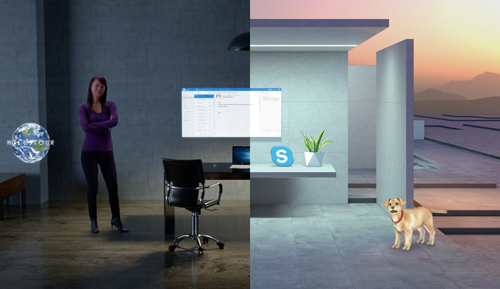

# Navigating the Windows Mixed Reality home

Just like the Windows PC experience starts with the desktop, Windows Mixed Reality starts with the home. The Windows Mixed Reality home uses our innate ability to understand and navigate 3D places. With HoloLens, your home is your physical space, but with immersive headsets, your home is a virtual place.

Your home is also where you’ll use the Start menu to open and place apps and content. You can fill your home with mixed reality content and multitask by using multiple apps at the same time. The things you place in your home stay there, even if you restart your device.

## Start Menu

The Start menu consists of:
* System information (network status, battery percentage, current time, and volume)
* Cortana (on immersive headsets, a Start tile; on HoloLens, at the top of Start)
* Pinned apps
* The All apps button (plus sign)
* Photo and video buttons for [mixed reality capture](/hololens/holographic-photos-and-videos)

Switch between the pinned apps and All apps views by selecting the plus or minus buttons. To open the Start menu on HoloLens, use the bloom gesture. On an immersive headset, press the Windows button on your controller.

## Launching apps

To launch an app, select it on Start. The Start menu will disappear, and the app will open in placement mode, as either a 2D window or a [3D model](../distribute/implementing-3d-app-launchers.md).

To run the app, you’ll need to then place it in your home:
1. Use your [gaze](../design/gaze-and-commit.md) or controller to position the app where you want it. It will automatically adjust (in size and position) to conform to the space where you place it.
2. Place the app using air-tap (HoloLens) or the Select button (immersive headsets). To cancel and bring back the Start menu, use the bloom gesture or the Windows button.

[2D apps](../develop/porting-apps/building-2d-apps.md), created for desktop, mobile, or Xbox can be modified to run as mixed reality immersive apps using the [HolographicSpace API](/uwp/api/Windows.Graphics.Holographic.HolographicSpace). An immersive app takes the user out of the home and into an immersive experience. Users can return home with the bloom gesture (HoloLens) or by pressing the Windows button on their controller (immersive headsets).

Apps can also be launched via an app-to-app API or via Cortana.

## Moving and adjusting apps

Select **Adjust** on the app bar to reveal controls that move, scale, and rotate mixed reality content. When you’re finished, select **Done**.

Different apps may have other options on the app bar. For example, Microsoft Edge has *Scroll*, *Drag*, and *Zoom* choices. 

The **Back** button navigates back to previously viewed screens in the app. It will stop when you reach the beginning of the experiences shown in the app, and won't navigate to other apps.

## Getting around your home

With **HoloLens**, you move through physical space to move around your home.

With **immersive headsets**, you can get up and walk around in your playspace to move within a similar area in the virtual world. To move across longer distances, use the thumbstick on your controller to virtually "walk," or you can use *teleportation* to immediately jump longer distances.

**To teleport:**
1. Bring up the teleportation reticle.
   * Using [motion controllers](../design/motion-controllers.md): press the thumbstick forward and hold it in that position.
   * Using an Xbox controller: press the left thumbstick forward and hold it in that position.
   * Using a mouse: hold down the right-click mouse button (and use the scroll wheel to rotate the direction you want to face when you teleport).
2. Place the reticle where you want to teleport.
   * Using [motion controllers](../design/motion-controllers.md): tilt the controller (on which you're holding the thumbstick forward) to move the reticle.
   * Using an Xbox controller: use your [gaze](../design/gaze-and-commit.md) to move the reticle.
   * Using a mouse: move your mouse to move the reticle.
3. Release the button to teleport where the reticle was placed.

**To virtually "walk:"**
* Using [motion controllers](../design/motion-controllers.md): click down on the thumbstick and hold, then move the thumbstick in the direction you want to "walk."
* Using an Xbox controller: click down on the left thumbstick and hold, then move the thumbstick in the direction you want to "walk."

## Immersive headset input support

[Windows Mixed Reality immersive headsets](immersive-headset-hardware-details.md) support multiple input types for navigating the Windows Mixed Reality home. HoloLens doesn't support accessory inputs for navigation, because you physically walk around and see your environment. However, HoloLens does [support inputs](hardware-accessories.md) for interacting with apps.

### Motion controllers

The best Windows Mixed Reality experience will be with Windows Mixed Reality [motion controllers](../design/motion-controllers.md) that support six degrees-of-freedom tracking using just the sensors in your headset - no external cameras or markers required!

Navigation commands coming soon.

### Gamepad
* **Left thumbstick:**
  * Press and hold the left thumbstick forward to bring up the [teleportation](navigating-the-windows-mixed-reality-home.md#getting-around-your-home) reticle.
  * Tap the thumbstick left, right, or back to move left, right, or back in small increments.
  * Click down on the left thumbstick and hold, then move the thumbstick in the direction you want to [virtually "walk."](navigating-the-windows-mixed-reality-home.md#getting-around-your-home)
* Tap the **right thumbstick** left or right to rotate the direction you're facing by 45 degrees.
* Pressing the **A** button selects and acts like the [air tap](../design/gaze-and-commit.md#composite-gestures) gesture.
* Pressing the **Guide** button brings up the [Start menu](navigating-the-windows-mixed-reality-home.md#start-menu) and acts like the [bloom](../design/system-gesture.md#bloom) gesture.
* Pressing the **left and right triggers** lets you zoom in and out of a 2D desktop app you're interacting with in the home.

### Keyboard and mouse

**Note:** Use **Windows Key + Y** to switch the mouse between controlling your PC's desktop and the Windows Mixed Reality home.

Within the Windows Mixed Reality home:
* Pressing the **left-click** mouse button selects and acts like the [air tap](../design/gaze-and-commit.md#composite-gestures) gesture.
* Holding the **right-click** mouse button brings up the [teleportation](navigating-the-windows-mixed-reality-home.md#getting-around-your-home) reticle.
* Pressing the **Windows** key on the keyboard brings up the [Start Menu](navigating-the-windows-mixed-reality-home.md#start-menu) and acts like the [bloom](../design/system-gesture.md#bloom) gesture.
* When [gazing](../design/gaze-and-commit.md) at a 2D desktop app, you can **left-click** to select, **right-click** to bring up context menus, and use the **scroll wheel** to scroll (just like on your PC's desktop).

## Cortana

[Cortana](../design/voice-input.md#hey-cortana) is your personal assistant in Windows Mixed Reality, just like on PC and phone. HoloLens has a built-in microphone, but immersive headsets may require extra hardware. Use Cortana to open apps, restart your device, look up things online, and more. Developers may also choose to [integrate Cortana](https://dev.windows.com/cortana) into their experiences.

You can also use voice commands to get around your home. For example, point at a button (using [gaze](../design/gaze-and-commit.md) or a controller, depending on the device) and say “Select.” Other voice commands include “Go home,” “Bigger,” “Smaller,” “Close,” and “Face me.”

## Store, Settings, and system apps

Windows Mixed Reality has several built-in apps, such as:
* **Microsoft Store** to get apps and games
* **Feedback Hub** to submit feedback about the system and system apps
* **Settings** to configure system settings ([including networking](/hololens/hololens-network) and system updates)
* **Microsoft Edge** to browse websites
* **Photos** to view and share photos and videos
* **Calibration** (HoloLens only) for adjusting the HoloLens experience to the current user
* **Learn Gestures** (HoloLens) or **Learn Mixed Reality** (immersive headsets) to learn about using your device
* **3D Viewer** to decorate your world with mixed reality content
* **Mixed Reality Portal** (desktop) for setting up and managing your immersive headset and streaming a live preview of your view in the headset for others to see.
* **Movies and TV** for viewing 360 videos and the latest movies and tv shows
* **Cortana** for all of your virtual assistant needs
* **Desktop** (immersive headsets) for viewing your desktop monitor while in an immersive headset
* **File Explorer** Access files and folders located on your device

## See also
* [App views](../design/app-views.md)
* [Motion controllers](../design/motion-controllers.md)
* [Hardware accessories](hardware-accessories.md)
* [Environment considerations for HoloLens](/hololens/hololens-environment-considerations)
* [Implementing 3D app launchers](../distribute/implementing-3d-app-launchers.md)
* [Creating 3D models for use in the Windows Mixed Reality home](../distribute/creating-3d-models-for-use-in-the-windows-mixed-reality-home.md)