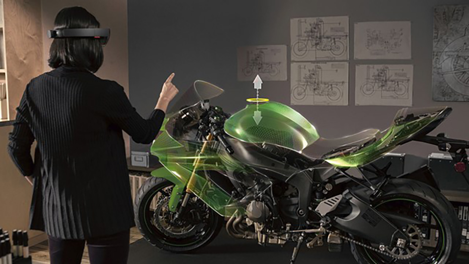
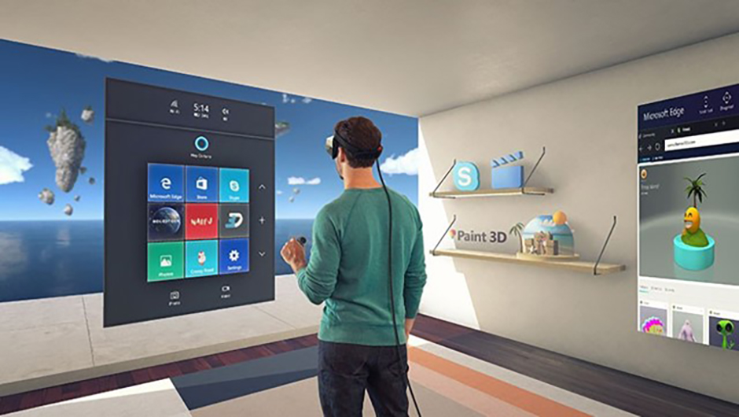

# Types of mixed reality apps

One of the advantages of developing apps for Windows Mixed Reality is the spectrum of experiences the platform can support. From fully immersive, virtual environments, to light information layering over a user’s current environment, Windows Mixed Reality provides a robust set of tools to bring any experience to life. It's important for an app maker to understand early in their development process as to where along this spectrum their experience lies. This decision will ultimately impact both the app design makeup and the technological path for development.

## Enhanced environment apps (HoloLens only)

One of the most powerful ways that mixed reality can bring value is letting developers place digital information or content in a user’s current environment. This approach is popular for apps where the contextual placement of digital content in the real world is paramount and keeping the user’s real world environment “present” during their experience is key. Users can also move between real world digital tasks with ease. This lends even more credence to the promise that the mixed reality apps the user sees are truly a part of their environment.

 
*Enhanced environment apps*

**Example uses**
* A mixed reality notepad style app that allows users to create and place notes around their environment
* A mixed reality television app placed in a comfortable spot for viewing
* A mixed reality cooking app placed above the kitchen island to help a cooking task
* A mixed reality app that gives users the feeling of “x-ray vision” (that is, a hologram placed on top of and mimics a real world object, while allowing the user to see “inside it” holographically)
* Mixed reality annotations placed throughout a factory to give worker’s necessary information
* Mixed reality way finding in an office space
* Mixed reality tabletop experiences (that is, board game style experiences)
* Mixed reality communication apps like Skype

## Blended environment apps

Given Windows Mixed Reality’s ability to recognize and map the user's environment, it's able to create a digital layer that can be overlaid on the user’s space. Thin layer respects the shape and boundaries of the user’s environment, but the app may choose to transform certain elements best suited to immerse the user in the app. This is called a blended environment app. Unlike an enhanced environment app, blended environment apps may only care enough about the environment to best use its makeup for encouraging specific user behavior (like encouraging movement or exploration) or by replacing elements with changes (a kitchen counter is skinned to show a different tile pattern). This type of experience may even transform an element into an entirely different object, but still keep the rough dimensions of the object as its base (a kitchen island is transformed into a dumpster for a crime thriller game).

 
*Blended environment apps*

**Example uses**
* A mixed reality interior design app that can paint walls, countertops, or floors in different colors and patterns
* A mixed reality app that allows an automotive designer to layer new design iterations for an upcoming car refresh on top of an existing car
* A bed is “covered” and replaced by a mixed reality fruit stand in children’s game
* A desk is “covered” and replaced with a mixed reality dumpster in a crime thriller game
* A hanging lantern is “covered” and replaced with signpost using roughly the same shape and dimension
* An app that allows users to blast holes in their real or immersive world walls, which reveal a magical world

## Immersive environment apps

Immersive environment apps are centered around an environment that completely changes the user’s world and can place them in a different time and space. These environments can feel real, creating immersive and thrilling experiences that are only limited by the app creator’s imagination. Unlike blended environment apps, once Windows Mixed Reality identifies the user’s space, an immersive environment app may totally disregard the user’s current environment and replace it whole stock with one of its own. These experiences may also separate time and space, meaning a user could walk the streets of Rome in an immersive experience, while remaining relatively still in their real world space. Context of the real world environment may not be important to an immersive environment app.

 
*Immersive environment apps*

**Example uses**
* An immersive app that lets a user tour a space separate from their own (that is, walk through a famous building, museum, popular city)
* An immersive app that orchestrates an event or scenario around the user (that is, a battle or a performance)

## See also

* [Development overview](../develop/development.md)
* [App model](../design/app-model.md)
* [App views](../design/app-views.md)
