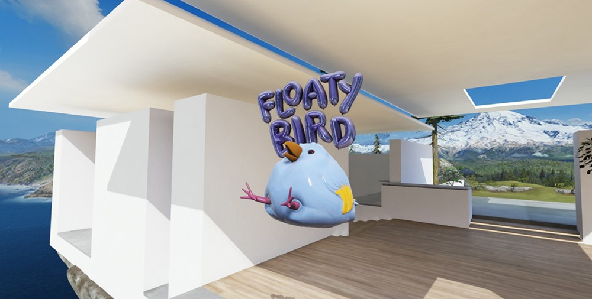
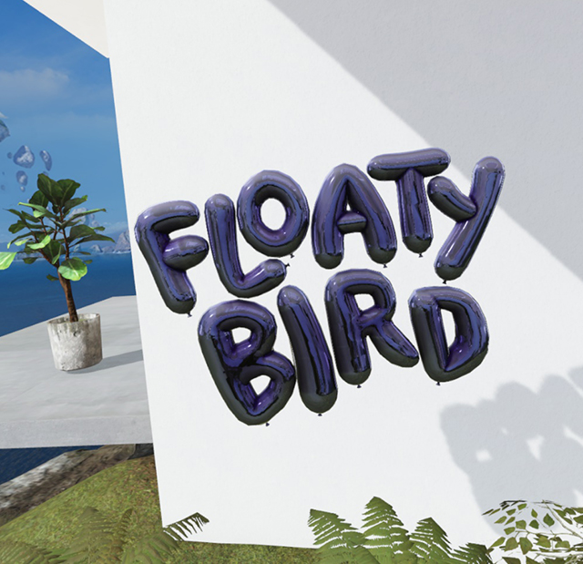
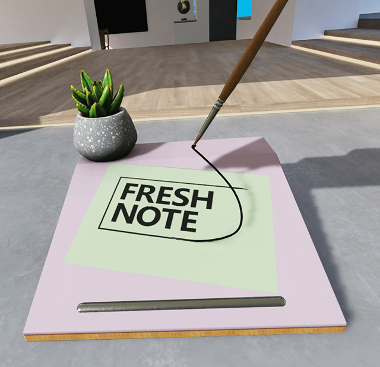
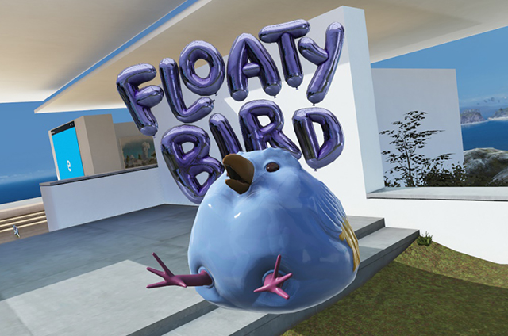
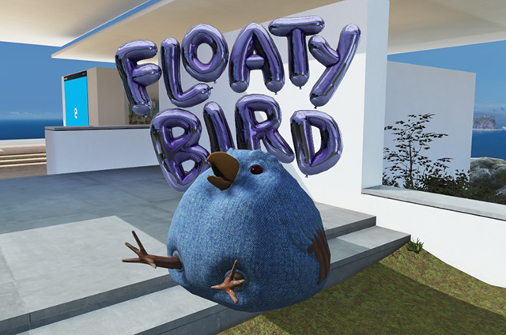
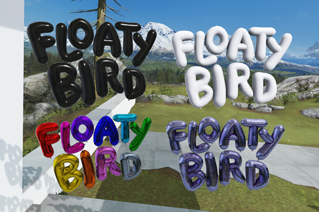

# 3D app launcher design guidance

When you put on a Windows Mixed Reality immersive (VR) headset, you enter the Windows Mixed Reality home. The home is visualized as a house on a cliff surrounded by mountains and water, but you can [choose other environments and even create your own](../design/add-custom-home-environments.md)). Within the home's space, a user is free to arrange and organize the 3D objects and apps that they care about any way they want. A **3D app launcher** is a “physical” object in the user’s mixed reality house that they can select to launch an app.

 
*Floaty Bird 3D app launcher example (fictional app)*

## 3D app launcher creation process

There are 3 steps to creating a 3D app launcher:

1. Designing and concepting (this article)
2. [Modeling and exporting](creating-3d-models-for-use-in-the-windows-mixed-reality-home.md)
3. Integrating it into your application:
    * [UWP apps](implementing-3d-app-launchers.md)
    * [Win32 apps](implementing-3d-app-launchers-win32.md)

## Design concepts

### Fantastic yet familiar

The Windows Mixed Reality environment your app launcher lives in is part familiar, part fantastical/sci-fi. The best launchers follow the rules of this world. Think of how you can take a familiar, representative object from your app, but bend some of the rules of actual reality. Magic will result.

### Intuitive

When you look at your app launcher, its purpose - to launch your app - should be obvious and shouldn’t cause any confusion. For example, be sure your launcher is an obvious-enough representative of your app that it won’t be confused for a piece of decor in the Cliff House. Your app launcher should invite people to touch/select it.

 
*Fresh Note 3D app launcher example (fictional app)*

### Home scale

3D app launchers live in the Cliff House and their default size should make sense with the other “physical” objects in the space. If you place your launcher beside, say, a house plant or some furniture, it should feel at home, size-wise. A good starting point is to see how it looks at 30 cubic centimeters, but remember that users can scale it up or down if they like.

### Own-able

The app launcher should feel like an object a person would be excited to have in their space. They’ll be virtually surrounding themselves with these things, so the launcher should feel like something the user thought was desirable enough to seek out and keep nearby.

 
*Astro Warp 3D app launcher example (fictional app)*

### Recognizable

Your 3D app launcher should instantly express “your app’s brand” to people who see it. If you have a star character or an especially identifiable object in your app, we recommend using that as a significant part of your design. In a mixed reality world, an object will draw more interest from users than just a logo alone. Recognizable objects communicate brand quickly and clearly.

### Volumetric

Your app deserves more than just putting your logo on a flat plane and calling it a day. Your launcher should feel like an exciting, 3D, physical object in the user’s space. A good approach is to imagine your app was going to have a balloon in the Macy’s Thanksgiving Day Parade. Ask yourself, what would really wow people as it came down the street? What would look great from all viewing angles?

:::row:::
    :::column:::
        
        *Logo only*
    :::column-end:::
    :::column:::
        
        *More recognizable with a character*
    :::column-end:::
:::row-end:::

:::row:::
    :::column:::
        
        *Flat approach, not surprisingly, feels flat*
    :::column-end:::
    :::column:::
        
        *Volumetric approach better showcases your app*
    :::column-end:::
:::row-end:::

## Tips for good 3D models

* When planning dimensions for your app launcher, shoot for roughly a 30-cm cube. So, a 1:1:1 size ratio.
* Models must be under 10,000 polygons. [Learn more about triangle counts and levels of details (LODs)](creating-3d-models-for-use-in-the-windows-mixed-reality-home.md#triangle-counts-and-levels-of-detail-lods)
* Test on an immersive headset.
* Build details into your model’s geometry where possible – don’t rely on textures for detail.
* Build “water tight” closed geometry. No holes that aren't modeled in.
* Use natural materials in your object. Imagine crafting it in the real world.
* Make sure your model reads well at different distances and sizes.
* When your model is ready to go, read the [exporting assets guidelines](creating-3d-models-for-use-in-the-windows-mixed-reality-home.md#asset-requirements-overview).

 
*Model with subtle details in the texture*

### What to avoid

* Don't use high-contrast details or small, busy patterns and textures.
* Don't use thin geometry – it doesn’t work well at a distance and will alias badly.
* Don't let parts of your model extend too much beyond the 1:1:1 size ratio. It will create scaling problems.

 
*Avoid high-contrast, small, busy patterns*

## How to handle type

* We recommend your type takes up about 1/3 of your app launcher (or more). Type is the main thing that gives people an idea that your launcher is, in fact, a launcher so it’s nice if it’s substantial.
* Avoid making type super wide – try to keep it within the confines of the app launchers core dimensions (more or less).
* Flat type can work, but it can be hard to view from certain angles and in certain environments. You might consider putting it a solid object or backdrop behind it to help with this.
* Adding dimension to your type feels nice in 3D. Shading the sides of the type a different, darker color can help with readability.

:::row:::
    :::column:::
        
        *Flat type without a backdrop can be hard to view from certain angles and in certain environments*
    :::column-end:::
    :::column:::
        
        *Type with a built-in backdrop can work well*
    :::column-end:::
    :::column:::
        
        *Extruded type can work well if you shade the sides*
    :::column-end:::
:::row-end:::

**Type colors that work**

* White
* Black
* Bright semi-saturated color

 
*Type colors that work*

### Colors to avoid

Type colors that cause trouble include:

* Mid-tones
* Gray
* Over-saturated colors or desaturated colors

 
*Type colors that cause trouble*

## Lighting

The lighting for your app launcher comes from the Cliff House environment. Be sure to test your launcher in several places throughout the house so it looks good in both light and shadows. The good news is, if you’ve followed the other design guidance in this document, your launcher should be in good shape for most lighting in the Cliff House.

Good places to test how your launcher looks in the various lights in the environment are the Studio, the Media Room, anywhere outside and on the Back Patio (the concrete area with the lawn). Another good test is to put it in half light and half shadow and see what it looks like.

 
*Make sure your launcher looks good in both light and shadows*

## Texturing

### Authoring your textures

The end format of your 3D app launcher will be a .glb file, which is made using the PBR (Physically Based Rendering) pipeline. This can be a tricky process - now is a good time to employ a technical artist if you haven't already. If you’re a brave DIY-er, taking the time to [research and learn PBR terminology](https://wiki.polycount.com/wiki/PBR) and what’s happening under the hood before you begin will help you avoid common mistakes. 

 
*Fresh Note 3D app launcher example (fictional app)*

### Recommended authoring tool

We recommend using [Substance Painter](https://www.allegorithmic.com/products/substance-painter) by Allegorithmic to author your final file. If you’re not familiar with authoring PBR shaders in Substance Painter, here’s a [tutorial](https://docs.allegorithmic.com/documentation/display/SPDOC/Tutorials).

(Alternately [3D-Coat](https://3dcoat.com/home/), [Quixel Suite 2](https://quixel.se/suite2/), or [Marmoset Toolbag](https://www.marmoset.co/toolbag/) would also work if you’re more familiar with one of these.)

### Best practices

* If your app launcher object was authored for PBR, it should be straightforward to convert it for the Cliff House environment.
* Our shader is expecting a Metal/Roughness work flow – The Unreal PBR shader is a close facsimile.
* When exporting your textures, keep the [recommended texture sizes](creating-3d-models-for-use-in-the-windows-mixed-reality-home.md#material-guidelines) in mind.
* Make sure to build your objects for real-time lighting—this means:
  * Avoid baked shadows – or painted shadows
  * Avoid baked lighting in the textures
  * Use one of the PBR material authoring packages to get the right maps generated for our shader

## See also

* [Create 3D models for use in the mixed reality home](creating-3d-models-for-use-in-the-windows-mixed-reality-home.md)
* [Implement 3D app launchers (UWP apps)](implementing-3d-app-launchers.md)
* [Implement 3D app launchers (Win32 apps)](implementing-3d-app-launchers-win32.md)
