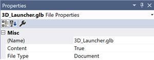

# Implement 3D app launchers (UWP apps)

> [!NOTE]
> This feature was added as part of the 2017 Fall Creators Update (RS3) for immersive headsets and is supported by HoloLens with the  Windows 10 April 2018 Update. Make sure your application is targeting a version of the Windows SDK greater than or equal to 10.0.16299 on immersive Headsets and 10.0.17125 on HoloLens. You can find the latest Windows SDK [here](https://developer.microsoft.com/windows/downloads/windows-10-sdk).

The [Windows Mixed Reality home](../discover/navigating-the-windows-mixed-reality-home.md) is the starting point where users land before launching applications. When creating a UWP application for Windows Mixed Reality, by default, apps are launched as 2D slates with their app's logo. When developing experiences for Windows Mixed Reality, a 3D launcher can optionally be defined to override the default 2D launcher for your application. In general, 3D launchers are recommended for launching immersive applications that take users out of the Windows Mixed Reality home. The default 2D launcher is preferred when the app is activated in place. You can also create a [3D deep link (secondaryTile)](#3d-deep-links-secondarytiles) as a 3D launcher to content within a 2D UWP app.

>[!VIDEO https://www.youtube.com/embed/TxIslHsEXno]

## 3D app launcher creation process

There are three steps to creating a 3D app launcher:
1. [Designing and concepting](3d-app-launcher-design-guidance.md)
2. [Modeling and exporting](creating-3d-models-for-use-in-the-windows-mixed-reality-home.md)
3. Integrating it into your application (this article)

3D assets to be used as launchers for your application should be authored using the [Windows Mixed Reality authoring guidelines](creating-3d-models-for-use-in-the-windows-mixed-reality-home.md) to ensure compatibility. Assets that fail to meet this authoring specification won't be rendered in the Windows Mixed Reality home.

## Configuring the 3D launcher

When you create a new project in Visual Studio, it creates a simple default tile that displays your app's name and logo. To replace this 2D representation with a custom 3D model edit the app manifest of your application to include the “MixedRealityModel” element as part of your default tile definition. To revert to the 2D launcher just remove the MixedRealityModel definition from the manifest.

### XML

First, locate the app package manifest in your current project. By default, the manifest will be named Package.appxmanifest. If you're using Visual Studio, then right-click the manifest in your solution viewer and select **View source** to open the xml for editing. 

At the top of the manifest, add the uap5 schema and include it as an ignorable namespace:

```xml
<Package xmlns:mp="http://schemas.microsoft.com/appx/2014/phone/manifest" 
         xmlns:uap="http://schemas.microsoft.com/appx/manifest/uap/windows10" 
         xmlns:uap2="http://schemas.microsoft.com/appx/manifest/uap/windows10/2" 
         xmlns:uap5="http://schemas.microsoft.com/appx/manifest/uap/windows10/5"
         IgnorableNamespaces="uap uap2 uap5 mp"
         xmlns="http://schemas.microsoft.com/appx/manifest/foundation/windows10">
```

Next specify the "MixedRealityModel" in the default tile for your application:

```xml
<Applications>
    <Application Id="App"
      Executable="$targetnametoken$.exe"
      EntryPoint="ExampleApp.App">
      <uap:VisualElements
        DisplayName="ExampleApp"
        Square150x150Logo="Assets\Logo.png"
        Square44x44Logo="Assets\SmallLogo.png"
        Description="ExampleApp"
        BackgroundColor="#464646">
        <uap:DefaultTile Wide310x150Logo="Assets\WideLogo.png" >
          <uap5:MixedRealityModel Path="Assets\My3DTile.glb" />
        </uap:DefaultTile>
        <uap:SplashScreen Image="Assets\SplashScreen.png" />
      </uap:VisualElements>
    </Application>
</Applications>
```

The MixedRealityModel element accepts a file path pointing to a 3D asset stored in your app package. Currently only 3D models delivered using the .glb file format and authored against the [Windows Mixed Reality 3D asset authoring instructions](creating-3d-models-for-use-in-the-windows-mixed-reality-home.md) are supported. Assets must be stored in the app package and animation isn't currently supported. If the “Path” parameter is left blank Windows will show the 2D slate instead of the 3D launcher. **Note:** the .glb asset must be marked as "Content" in your build settings before building and running your app.


<br>
*Select the .glb in your solution explorer and use the properties section to mark it as "Content" in the build settings*

### Bounding box

A bounding box can be used to optionally add an extra buffer region around the object. The bounding box is specified using a center point and extents, which indicate the distance from the center of the bounding box to its edges along each axis. Units for the bounding box can be mapped to 1 unit = 1 meter. If a bounding box isn't provided, then one will be automatically fitted to the mesh of the object. If the provided bounding box is smaller than the model, then it will be resized to fit the mesh.

Support for the bounding box attribute will come with the Windows RS4 update as a property on the MixedRealityModel element. To define a bounding box first at the top of the app manifest add the uap6 schema and include it as ignorable namespaces:

```xml
<Package xmlns:mp="http://schemas.microsoft.com/appx/2014/phone/manifest" 
         xmlns:uap="http://schemas.microsoft.com/appx/manifest/uap/windows10" 
         xmlns:uap2="http://schemas.microsoft.com/appx/manifest/uap/windows10/2" 
         xmlns:uap5="http://schemas.microsoft.com/appx/manifest/uap/windows10/5"
         xmlns:uap6="http://schemas.microsoft.com/appx/manifest/uap/windows10/6"
         IgnorableNamespaces="uap uap2 uap5 uap6 mp"
         xmlns="http://schemas.microsoft.com/appx/manifest/foundation/windows10">
```
Next, on the MixedRealityModel set the SpatialBoundingBox property to define the bounding box: 

```xml
        <uap:DefaultTile Wide310x150Logo="Assets\WideLogo.png" >
          <uap5:MixedRealityModel Path="Assets\My3DTile.glb">
              <uap6:SpatialBoundingBox  Center=”1,-2,3” Extents=”1,2,3” />
          </uap5:MixedRealityModel>
        </uap:DefaultTile>
```

### Using Unity

When working with Unity the project must be built and opened in Visual Studio before the App Manifest can be edited. 

>[!NOTE]
>The 3D launcher must be redefined in the manifest when building and deploying a new Visual Studio solution from Unity.

## 3D deep links (secondaryTiles)

> [!NOTE]
> This feature was added as part of the 2017 Fall Creators Update (RS3) for immersive (VR) headsets and as part of the April 2018 Update (RS4) for HoloLens. Make sure your application is targeting a version of the Windows SDK greater than or equal to 10.0.16299 on immersive (VR) headsets and 10.0.17125 on HoloLens. You can find the latest Windows SDK [here](https://developer.microsoft.com/windows/downloads/windows-10-sdk).

>[!IMPORTANT]
>3D deep links (secondaryTiles) only work with 2D UWP apps. You can, however, create a [3D app launcher](implementing-3d-app-launchers.md) to launch an exclusive app from the Windows Mixed Reality home.

Your 2D applications can be enhanced for Windows Mixed Reality by adding the ability to place 3D models from your app into the [Windows Mixed Reality home](../discover/navigating-the-windows-mixed-reality-home.md) as deep links to content within your 2D app, just like [2D secondary tiles](/windows/uwp/controls-and-patterns/tiles-and-notifications-secondary-tiles) on the Windows Start menu. For example, you can create 360° photospheres that link directly into a 360° photo viewer app, or let users place 3D content from a collection of assets that opens a details page about the author. These are just a couple ways to expand the functionality of your 2D application with 3D content.

### Creating a 3D “secondaryTile”

You can place 3D content from your application using “secondaryTiles” by defining a mixed reality model at creation time. Mixed reality models are created by referencing a 3D asset in your app package and optionally defining a bounding box. 

> [!NOTE]
> Creating “secondaryTiles” from within an exclusive view is not currently supported.

```cs
using Windows.UI.StartScreen;
using Windows.Foundation.Numerics;
using Windows.Perception.Spatial;

// Initialize the tile
SecondaryTile tile = new SecondaryTile("myTileId")
{
    DisplayName = "My Tile",
    Arguments = "myArgs"
};

tile.VisualElements.Square150x150Logo = new Uri("ms-appx:///Assets/MyTile/Square150x150Logo.png");

//Assign 3D model (only ms-appx and ms-appdata are allowed)
TileMixedRealityModel model = tile.VisualElements.MixedRealityModel;
model.Uri = new Uri("ms-appx:///Assets/MyTile/MixedRealityModel.glb");
model.ActivationBehavior = TileMixedRealityModelActivationBehavior.Default;
model.BoundingBox = new SpatialBoundingBox
{
    Center = new Vector3 { X = 1, Y = 0, Z = 0 },
    Extents = new Vector3 { X = 3, Y = 5, Z = 4 }
};

// And place it
await tile.RequestCreateAsync();
```

### Bounding box

A bounding box can be used to add an extra buffer region around the object. The bounding box is specified using a center point and extents, which indicate the distance from the center of the bounding box to its edges along each axis. Units for the bounding box can be mapped to 1 unit = 1 meter. If a bounding box isn't provided, one will be automatically fitted to the mesh of the object. If the provided bounding box is smaller than the model, it will be resized to fit the mesh.

### Activation behavior

> [!NOTE]
> This feature will be supported as of the Windows RS4 update. Make sure your application is targeting a version of the Windows SDK greater than or equal to 10.0.17125 if you plan to use this feature

You can define the activation behavior for a 3D secondaryTile to control how it reacts when a user selects it. This can be used to place 3D objects in the Mixed Reality home that are purely informative or decorative. The following activation behavior types are supported:
1. Default: When a user selects the 3D secondaryTile the app is activated
2. None: When the user selects the 3D secondaryTile nothing happens and the app isn't activated.

### Obtaining and updating an existing “secondaryTile”

Developers can get back a list of their existing secondary tiles, which includes the properties that they previously specified. They can also update the properties by changing the value and then calling UpdateAsync().

```cs
// Grab the existing secondary tile
SecondaryTile tile = (await SecondaryTile.FindAllAsync()).First();

Uri updatedUri = new Uri("ms-appdata:///local/MixedRealityUpdated.glb");

// See if the model needs updating
if (!tile.VisualElements.MixedRealityModel.Uri.Equals(updatedUri))
{
    // Update it
    tile.VisualElements.MixedRealityModel.Uri = updatedUri;

    // And apply the changes
    await tile.UpdateAsync();
}
```

### Checking that the user is in Windows Mixed Reality

3D deep links (secondaryTiles) can only be created while the view is being displayed in a Windows Mixed Reality headset. When your view isn't being presented in a Windows Mixed Reality headset, we recommend gracefully handling this by either hiding the entry point or showing an error message. You can check this by querying [IsCurrentViewPresentedOnHolographic()](/uwp/api/windows.applicationmodel.preview.holographic.holographicapplicationpreview#Windows_ApplicationModel_Preview_Holographic_HolographicApplicationPreview_IsCurrentViewPresentedOnHolographicDisplay_).

## Tile notifications

Tile notifications don't currently support sending an update with a 3D asset. This means that developers can't do the following:

* Push Notifications
* Periodic Polling
* Scheduled Notifications

For more information on the other tiles features and attributes and how they're used for 2D tiles, see the [Tiles for UWP Apps documentation](/windows/uwp/controls-and-patterns/tiles-and-notifications-creating-tiles).

## See also

* [Mixed reality model sample](https://github.com/Microsoft/Windows-universal-samples/tree/master/Samples/MixedRealityModel) containing a 3D app launcher.
* [3D app launcher design guidance](3d-app-launcher-design-guidance.md)
* [Creating 3D models for use in the Windows Mixed Reality home](creating-3d-models-for-use-in-the-windows-mixed-reality-home.md)
* [Implementing 3D app launchers (Win32 apps)](implementing-3d-app-launchers-win32.md)
* [Navigating the Windows Mixed Reality home](../discover/navigating-the-windows-mixed-reality-home.md)