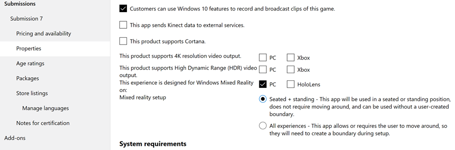

# Submitting an app to the Microsoft Store

> [!IMPORTANT]
> If you're submitting an Unreal application, make sure you follow the **[publishing instructions](../develop/unreal/unreal-publishing-to-store.md)** before continuing.

## Prerequisites

Both [HoloLens](/hololens/hololens1-hardware) and the Windows 10 PC powering your [immersive headset](../discover/immersive-headset-hardware-details.md) run Universal Windows Platform apps. Whether you're submitting an app that supports HoloLens, PC, or both, app submission goes through the [Partner Center](https://partner.microsoft.com/dashboard).

If you don't already have a Partner Center developer account, [sign up](https://developer.microsoft.com/store/register) for one before moving on. You can find more information about submission guidelines and checklists in this [app submissions article](/windows/uwp/publish/app-submissions).

> [!IMPORTANT]
> You won't be able to submit any applications to the Microsoft Store if your Partner Center developer account fails the employment verification check. Please contact the Partner Center [support team](https://developer.microsoft.com/windows/support) for more details.

## Packaging a Mixed Reality app

There are several steps to packaging a Mixed Reality application, including:

* Correctly preparing all image assets
* Choosing the tile image displayed in the HoloLens Start menu
* Setting the target and minimum Windows version for the app
* Setting the target device families in the app dependencies
* Adding metadata to associate the app with the Microsoft Store
* Creating an upload package

Each of these submission stages is covered in its own section below - we recommend going through them sequentially you don't leave any out on your first submission attempt.

### Prepare image assets included in the appx

The following image assets are required for the appx building tools to build your application into an appx package, which is required for submission to the Microsoft Store. You can learn more about [guidelines for tile and icon assets](/windows/uwp/app-resources/images-tailored-for-scale-theme-contrast) on MSDN.

| Required Asset | Recommended Scale | Image Format | Where is the asset displayed? | 
|----------|----------|----------|------------------|
| Square 71x71 Logo | Any |  PNG | N/A | 
| Square 150x150 Logo | 150x150 (100% scale) or 225x225 (150% scale) | PNG | Start pins and All Apps (if 310x310 isn't provided), Store Search Suggestions, Store Listing Page, Store Browse, Store Search | 
|  Wide 310x150 Logo |  Any  |  PNG  |  N/A | 
|  Store Logo |  75x75 (150% scale)  |  PNG  |  Partner Center, Report App, Write a Review, My Library | 
|  Splash Screen |  930x450 (150% scale)  |  PNG  |  2D app launcher (slate) | 

If you're developing for HoloLens, there are other recommended assets that you can take advantage of:

| Recommended Assets | Recommended Scale | Where is the asset displayed? | 
|----------|----------|----------|
|  Square 310x310 Logo |  310x310 (150% scale) |  Start pins and All Apps | 

### Live Tile requirements

The Start menu on HoloLens will use the largest included square tile image by default. Apps published by Microsoft have an optional 3D launcher, which you can add to your app by following the [3D app launcher implementation](implementing-3d-app-launchers.md) instructions.

### Specifying target and minimum version of Windows

If your Mixed Reality app includes features that are specific to a Windows version, it's important to specify the supported target and minimum platform versions.

**Pay special attention for apps targeting [Windows Mixed Reality immersive headsets](../discover/immersive-headset-hardware-details.md), which require at least the Windows 10 Fall Creators Update (10.0; Build 16299) to function properly.**

You'll be prompted to set the target and minimum version of Windows when you create a new Universal Windows Project in Visual Studio. For existing projects, you can change this setting in the **Project** menu by selecting the **<Your app name's> Properties** at the bottom of the drop-down menu.

<br>
*Setting minimum and target platform versions in Visual Studio*

### Specifying target device families

Windows Mixed Reality applications (for both [HoloLens](/hololens/hololens1-hardware) and [immersive headsets](../discover/immersive-headset-hardware-details.md)) are part of the Universal Windows Platform, so any app package with a **Windows.Universal** [target device family](/uwp/schemas/appxpackage/uapmanifestschema/element-targetdevicefamily) can run on HoloLens or Windows 10 PCs with immersive headsets. If you don't specify a target device family in your app manifest, you may inadvertently open your app up to unintended Windows 10 devices. Follow the steps below to specify the intended Windows 10 device family, then [double-check you've set the correct device families when you upload your app package in Partner Center for Microsoft Store submission.](submitting-an-app-to-the-microsoft-store.md#submitting-your-mixed-reality-app-to-the-store)

* To set this field in Visual Studio, right-click on the **Package.appxmanifest** and select **View Code**, then find the **TargetDeviceFamily Name** field. By default, it should look like the following entry:

```
<Dependencies>
   <TargetDeviceFamily Name="Windows.Universal" MinVersion="10.0.10240.0" MaxVersionTested="10.0.10586.0" />
</Dependencies>
```

* If you're creating a **HoloLens** app, you can make sure it's only installed on HoloLens by setting the target device family to **Windows.Holographic**: 

```
<Dependencies>
   <TargetDeviceFamily Name="Windows.Holographic" MinVersion="10.0.10240.0" MaxVersionTested="10.0.10586.0" />
</Dependencies>
```

* If your app requires **HoloLens 2** functionality, like eye or hand-tracking, you can make sure it's targeted to Windows versions 18362 or greater by setting the target device family to **Windows.Holographic** with a **MinVersion** of 10.0.18362.0:

```
<Dependencies>
   <TargetDeviceFamily Name="Windows.Holographic" MinVersion="10.0.18362.0" MaxVersionTested="10.0.18362.0" />
</Dependencies>
```

* If your app is created for **Windows Mixed Reality immersive headsets**, you can make sure it's only installed on Windows 10 PCs with the Windows 10 Fall Creators Update (necessary for Windows Mixed Reality) by setting the target device family to **Windows.Desktop** with a **MinVersion** of 10.0.16299.0:

```
<Dependencies>
   <TargetDeviceFamily Name="Windows.Desktop" MinVersion="10.0.16299.0" MaxVersionTested="10.0.16299.0" />
</Dependencies>
```

* Finally, if your app is intended to run on both **HoloLens** and **Windows Mixed Reality immersive headsets**, you can make sure the app is only available to those two device families and simultaneously ensure that each target has the correct minimum Windows version by including a line for each target device family with its respective MinVersion:

```
<Dependencies>
   <TargetDeviceFamily Name="Windows.Desktop" MinVersion="10.0.16299.0" MaxVersionTested="10.0.16299.0" />
   <TargetDeviceFamily Name="Windows.Holographic" MinVersion="10.0.10240.0" MaxVersionTested="10.0.10586.0" />
</Dependencies>
```

You can learn more about targeting device families by reading the [TargetDeviceFamily UWP documentation](/uwp/schemas/appxpackage/uapmanifestschema/element-targetdevicefamily).

### Associate app with the Store

When you associate your app with the Microsoft Store, the following values are downloaded to the current projects local app manifest file:

* Package Display Name
* Package Name
* Publisher ID
* Publisher Display Name
* Version

If you're overriding the default package.appxmanifest file with your own custom .xml file, you can’t associate your app with the Microsoft Store. Associating a custom manifest file with the Store will result in an error message.

You can also test purchase and notification scenarios by going to your Visual Studio solution and selecting **Project > Store > Associate App with the Store**.

### Creating an upload package

Follow guidelines at [Packaging Universal Windows apps for Windows 10](/previous-versions/windows/apps/hh454036(v=vs.140)#Anchor_2).

The final step of creating an upload package is validating the package using the [Windows App Certification Kit](#windows-app-certification-kit).

If you're adding a HoloLens-specific package to an existing product that's available on other Windows 10 device families, pay attention to: 

* [How version numbers may impact which packages are delivered to specific customers](/windows/uwp/publish/package-version-numbering)
* [How packages are distributed to different operating systems](/windows/uwp/publish/guidance-for-app-package-management)

The general guidance is that the package with the highest version number for a device is the one distributed by the Store.

In a scenario where there's a **Windows.Universal** package and a **Windows.Holographic** package, and the Windows.Universal package has a higher version number, a HoloLens user will download the higher version number Windows.Universal package instead of the Windows.Holographic package. 

In cases where the above scenario isn't the outcome you're looking for, there are several available solutions:

* Ensure your platform-specific packages, such as Windows.Holographic, always have a higher version number than your platform agnostic packages like Windows.Universal
* Don't package apps as Windows.Universal if you also have platform-specific packages - instead package the Windows.Universal package for the specific platforms you want it available on
* Create a single Windows.Universal package that works across all platforms. Support for this option isn't great right now so the above solutions are recommended.

>[!NOTE]
> To support your app on both HoloLens (1st Gen) and HoloLen 2, you need to upload two app packages; one containing x86 for HoloLens (1st Gen) and one containing ARM or ARM64 for HoloLens 2. 
> 
> If you include both ARM and ARM64 in your package, the ARM64 version will be the one used on HoloLens 2. 

>[!NOTE]
> You can declare a single package to be applicable to multiple target device families

## Testing your app

### Windows App Certification Kit

When you create app packages to submit to Partner Center through Visual Studio, the Create App Packages wizard prompts you to run the Windows App Certification Kit against the packages that get created. To have a smooth submission process to the Store, it's best to verify that the local copy of your app passes the [Windows App Certification Kit tests](/previous-versions/windows/apps/jj657973(v=win.10)) before submitting them to the Store. Running the Windows App Certification Kit on a remote HoloLens isn't currently supported.

### Run on all targeted device families

The Windows Universal Platform allows you to create a single application that runs across all of the Windows 10 device families. However, it doesn't guarantee that Universal Windows apps will just work on all device families. It's important to [test your app](../develop/advanced-concepts/testing-your-app-on-hololens.md) on each of your chosen device families to ensure a good experience.

## Submitting your Mixed Reality app to the Store

If you're submitting a Mixed Reality app that is based on a Unity project, see this [video](https://channel9.msdn.com/Blogs/One-Dev-Minute/How-to-publish-your-Unity-game-as-a-UWP-app) first.

In general, submitting a Windows Mixed Reality app that works on HoloLens or immersive headsets is just like submitting any UWP app to the Microsoft Store. Once you've [created your app by reserving its name](/windows/uwp/publish/create-your-app-by-reserving-a-name), follow the [UWP submission checklist](/windows/uwp/publish/app-submissions).

One of the first things you'll do is [select a category and subcategory](/windows/uwp/publish/category-and-subcategory-table) for your Mixed Reality experience. It's important that you **choose the most accurate category for your app**. Categories help merchandise your application in the right Store categories and ensure it shows up using relevant search queries. **Listing your VR title as a game won't result in better exposure for your app,** and may prevent it from showing up in categories that are more fitting and less crowded.

However, there are four key areas in the submission process where you'll want to make Mixed Reality-specific selections:
1. In the **[Product declarations](submitting-an-app-to-the-microsoft-store.md#mixed-reality-product-declarations)** section under [Properties](/windows/uwp/publish/enter-app-properties).
2. In the **[System requirements](submitting-an-app-to-the-microsoft-store.md#mixed-reality-system-requirements)** section under [Properties](/windows/uwp/publish/enter-app-properties).
3. In the **[Device family availability](submitting-an-app-to-the-microsoft-store.md#device-family-availability)** section under [Packages](/windows/uwp/publish/upload-app-packages).
4. In several of the **[Store listing page](submitting-an-app-to-the-microsoft-store.md#store-listing-page)** fields.

### Mixed Reality product declarations

On the **[Properties](/windows/uwp/publish/enter-app-properties)** page of the app submission process, you'll find several options related to Mixed Reality in the **[Product declarations](/windows/uwp/publish/app-declarations)** section.

<br>
Mixed Reality product declarations

First, you need to identify the device types for which your app offers a Mixed Reality experience. Identifying device types ensures that your app is included in Windows Mixed Reality collections in the Store.

Next to "This experience is designed for Windows Mixed Reality on:"
* Check the **PC** box if your app offers a VR experience when an immersive headset is connected to the user's PC. We recommend checking this box whether your app is set to run exclusively on an immersive headset or if it's a standard PC game or app offering a Mixed Reality mode or bonus content when a headset is connected.
* Check the **HoloLens** box only if your app offers a holographic experience when it's run on HoloLens.
* Check **both** boxes if your app offers a Mixed Reality experience on both device types.

If you selected "PC" above, you'll want to set the "Mixed Reality setup" (activity level). This only applies to Mixed Reality experiences that run on PCs connected to immersive headsets, as Mixed Reality apps on HoloLens are world-scale and the user doesn't define a boundary during setup.
* Choose **Seated + standing** if you designed your app to have the user stay in one position. For example, in a game where you're in control of an aircraft cockpit.
* Choose **All experiences** if your app is designed with the intention that the user walks around within a set boundary defined during setup. For example, might be a game where you side-step and duck to dodge attacks.

### Mixed Reality system requirements

On the **[Properties](/windows/uwp/publish/enter-app-properties)** page of the app submission process, you'll find several options related to Mixed Reality in the **[System requirements](/windows/uwp/publish/enter-app-properties#system-requirements)** section.

<br>
System requirements

In this section, you'll identify minimum (required) hardware and recommended (optional) hardware for your Mixed Reality app.

**Input hardware:**

Use the checkboxes to tell potential customers if your app supports **microphone** for [voice input](../design/voice-input.md)), **[Xbox controller or gamepad](../discover/hardware-accessories.md#bluetooth-gamepads)**, or **[Windows Mixed Reality motion controllers](../design/motion-controllers.md)**. This information will be surfaced on your app's product detail page in the Store and will help your app get included in the appropriate app/game collections. For example, a collection may exist for all games that support motion controllers.

Be thoughtful about selecting checkboxes for "minimum hardware" or "recommended hardware" for input types. 

For example: 
* If your game requires motion controllers, but accepts voice input via microphone, select the "minimum hardware" checkbox next to "Windows Mixed Reality motion controllers," but the "recommended hardware" checkbox next to "Microphone." 
* If your game can be played with either an Xbox controller, gamepad, or motion controllers, you might select the "minimum hardware" checkbox next to "Xbox controller or gamepad" and select the "recommended hardware" checkbox next to "Windows Mixed Reality motion controllers" as motion controllers will likely offer a step-up in experience from the gamepad.

**Windows Mixed Reality immersive headset:**

Indicating whether an immersive headset is required to use your app, or is optional, is critical to customer satisfaction and education.

If your app can *only* be used through an immersive headset, select the "minimum hardware" checkbox next to "Windows Mixed Reality immersive headset." This will be surfaced on your app's product detail page in Store as a warning above the purchase button so customers don't think they're purchasing an app that will function on their PC like a traditional desktop app.

If your app runs on the desktop like a traditional PC app, but offers a VR experience when an immersive headset is connected (whether the full content of your app is available, or only a portion), select the "recommended hardware" checkbox next to "Windows Mixed Reality immersive headset." No warning will be surfaced above the purchase button on your app's product detail page if your app functions as a traditional desktop app without an immersive headset connected.

**PC specifications:**

If you want your app to reach as many Windows Mixed Reality immersive headset users as possible, [target](../develop/advanced-concepts/understanding-performance-for-mixed-reality.md) the PC specifications for [Windows Mixed Reality PCs with integrated graphics](/windows/mixed-reality/enthusiast-guide/windows-mixed-reality-minimum-pc-hardware-compatibility-guidelines).

Whether your Mixed Reality app targets the minimum Windows Mixed Reality PC requirements, or needs a specific PC configuration like the dedicated GPU of a [Windows Mixed Reality Ultra PC](https://docs.microsoft.com/windows/mixed-reality/enthusiast-guide/windows-mixed-reality-minimum-pc-hardware-compatibility-guidelines, you should add the relevant PC specifications in the "minimum hardware" column.

If your Mixed Reality app is designed for better performance or offers higher-resolution graphics on a particular PC configuration or graphics card, you should include the relevant PC specifications in the "recommended hardware" column.

This only applies if your Mixed Reality app uses an immersive headset connected to a PC. If your Mixed Reality app only runs on HoloLens, you won't need to indicate PC specifications as HoloLens has only one hardware configuration.

### Device family availability

If you've [packaged your app correctly](https://docs.microsoft.com/windows/uwp/publish/app-package-requirements) in Visual Studio, uploading it on the Packages page should produce a table with the available device families.

<br>
Device family availability table

If your Mixed Reality app works on immersive headsets, then at least "Windows 10 Desktop" should be selected in the table. If your Mixed Reality app works on HoloLens, then at least "Windows 10 Holographic" should be selected. If your app runs on both Windows Mixed Reality headset types, both "Windows 10 Desktop" and "Windows 10 Holographic" should be selected.

>[!TIP]
>Many developers run into errors when uploading their app's package related to mismatches between the package manifest and your app/publisher account information in Partner Center. These errors can often be avoided by signing into Visual Studio with the same account associated with your Windows developer account (the one you use to sign into Partner Center). If you use the same account, you'll be able to associate your app with its identity in the Microsoft Store before you package it.

<br>
Associate your app with the Microsoft Store in Visual Studio

### Store listing page

On the [Store listing](/windows/uwp/publish/create-app-store-listings) page of the app submission process, there are several places you can add useful information about your Mixed Reality app.

>[!IMPORTANT]
>To ensure your app is correctly categorized by the Store and made discoverable to Windows Mixed Reality customers, you should add **"Windows Mixed Reality"** as one of your "Search terms" for the app (you can find search terms by expanding the "Shared fields" section).

<br>
Add "Windows Mixed Reality" to search terms

## Offering a free trial for your game or app

In many cases, your consumers will have limited to no experience with virtual reality before they buy a Windows Mixed Reality immersive headset. They may not know what to expect from intense games or be familiar with their own comfort threshold in immersive experiences. Many customers may also try a Windows Mixed Reality immersive headset on PCs that aren't badged as [Windows Mixed Reality PCs](/windows/mixed-reality/enthusiast-guide/windows-mixed-reality-minimum-pc-hardware-compatibility-guidelines). Because of these considerations, we strongly recommend you consider offering a [free trial](/windows/uwp/publish/set-app-pricing-and-availability#free-trial) for your paid Mixed Reality app or game.

## See also
* [What is Mixed Reality?](../discover/mixed-reality.md)
* [Development overview](../develop/development.md)
* [App views](../design/app-views.md)
* [Understanding Performance for Mixed Reality](../develop/advanced-concepts/understanding-performance-for-mixed-reality.md)
* [Performance Recommendations for Unity](../develop/unity/performance-recommendations-for-unity.md)
* [Testing your app on HoloLens](../develop/advanced-concepts/testing-your-app-on-hololens.md)
* [Windows Mixed Reality minimum PC hardware compatibility guidelines](/windows/mixed-reality/enthusiast-guide/windows-mixed-reality-minimum-pc-hardware-compatibility-guidelines)