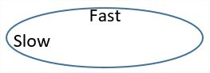
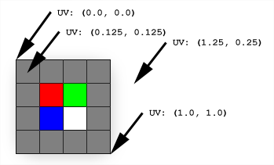
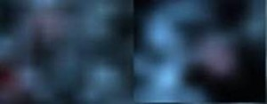
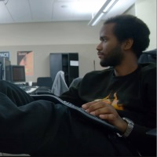

# Case study - Creating a galaxy in mixed reality

Before Microsoft HoloLens shipped, we asked our developer community what kind of app they'd like to see an experienced internal team build for the new device. More than 5000 ideas were shared, and after a 24-hour Twitter poll, the winner was an idea called [Galaxy Explorer](../develop/unity/galaxy-explorer.md).

Andy Zibits, the art lead on the project, and Karim Luccin, the team's graphics engineer, talk about the collaborative effort between art and engineering that led to the creation of an accurate, interactive representation of the Milky Way galaxy in Galaxy Explorer.

## The Tech

[Our team](../develop/unity/galaxy-explorer.md#meet-the-team) - made up of two designers, three developers, four artists, a producer, and one tester — had six weeks to build a fully functional app which would allow people to learn about and explore the vastness and beauty of our Milky Way Galaxy.

We wanted to take full advantage of the ability of HoloLens to render 3D objects directly in your living space, so we decided we wanted to create a realistic looking galaxy where people would be able to zoom in close and see individual stars, each on their own trajectories.

In the first week of development, we came up with a few goals for our representation of the Milky Way Galaxy: It needed to have depth, movement, and feel volumetric—full of stars that would help create the shape of the galaxy.

The problem with creating an animated galaxy that had billions of stars was that the sheer number of single elements that need updating would be too big per frame for HoloLens to animate using the CPU. Our solution involved a complex mix of art and science.

## Behind the scenes

To allow people to explore individual stars, our first step was to figure out how many particles we could render at once.

### Rendering particles

Current CPUs are great for processing serial tasks and up to a few parallel tasks at once (depending on how many cores they have), but GPUs are much more effective at processing thousands of operations in parallel. However, because they don’t usually share the same memory as the CPU, exchanging data between CPU<>GPU can quickly become a bottleneck. Our solution was to make a galaxy on the GPU, and it had to live completely on the GPU.

We started stress tests with thousands of point particles in various patterns. This allowed us to get the galaxy on HoloLens to see what worked and what didn’t.

### Creating the position of the stars

One of our team members had already written the C# code that would generate stars at their initial position. The stars are on an ellipse and their position can be described by (**curveOffset**, **ellipseSize**, **elevation**) where **curveOffset** is the angle of the star along the ellipse, **ellipseSize** is the dimension of the ellipse along X and Z, and elevation the proper elevation of the star within the galaxy. Thus, we can create a buffer ([Unity’s ComputeBuffer](https://docs.unity3d.com/ScriptReference/ComputeBuffer.html)) that would be initialized with each star attribute and send it on the GPU where it would live for the rest of the experience. To draw this buffer, we use [Unity’s DrawProcedural](https://docs.unity3d.com/ScriptReference/Graphics.DrawProcedural.html) which allows running a shader (code on a GPU) on an arbitrary set of points without having an actual mesh that represents the galaxy:

**CPU:**


```
GraphicsDrawProcedural(MeshTopology.Points, starCount, 1);
```

**GPU:**


```
v2g vert (uint index : SV_VertexID)
{

 // _Stars is the buffer we created that contains the initial state of the system
 StarDescriptor star = _Stars[index];
 …

}
```

We started with raw circular patterns with thousands of particles. This gave us the proof we needed that we could manage many particles AND run it at performant speeds, but we weren’t satisfied with the overall shape of the galaxy. To improve the shape, we attempted various patterns and particle systems with rotation. These were initially promising because the number of particles and performance stayed consistent, but the shape broke down near the center and the stars were emitting outwardly which wasn't realistic. We needed an emission that would allow us to manipulate time and have the particles move realistically, looping ever closer to the center of the galaxy.


We attempted various patterns and particle systems that rotated, like these.

Our team did some research about the way galaxies function and we made a custom particle system specifically for the galaxy so that we could move the particles on ellipses based on "[density wave theory](https://en.wikipedia.org/wiki/Density_wave_theory)," which theorizes that the arms of a galaxy are areas of higher density but in constant flux, like a traffic jam. It appears stable and solid, but the stars are actually moving in and out of the arms as they move along their respective ellipses. In our system, the particles never exist on the CPU—we generate the cards and orient them all on the GPU, so the whole system is simply initial state + time. It progressed like this:


Progression of particle system with GPU rendering


Once enough ellipses are added and are set to rotate, the galaxies began to form “arms” where the movement of stars converge. The spacing of the stars along each elliptical path was given some randomness, and each star got a bit of positional randomness added. This created a much more natural looking distribution of star movement and arm shape. Finally, we added the ability to drive color based on distance from center.

### Creating the motion of the stars

To animate the general star motion, we needed to add a constant angle for each frame and to get stars moving along their ellipses at a constant radial velocity. This is the primary reason for using **curveOffset**. This isn’t technically correct as stars will move faster along the long sides of the ellipses, but the general motion felt good.



Stars move faster on the long arc, slower on the edges.


With that, each star is fully described by (**curveOffset**, **ellipseSize**, **elevation**, **Age**) where **Age** is an accumulation of the total time that has passed since the scene was loaded.


```
float3 ComputeStarPosition(StarDescriptor star)
{

  float curveOffset = star.curveOffset + Age;
  
  // this will be coded as a “sincos” on the hardware which will compute both sides
  float x = cos(curveOffset) * star.xRadii;
  float z = sin(curveOffset) * star.zRadii;
   
  return float3(x, star.elevation, z);
  
}
```

This allowed us to generate tens of thousands of stars once at the start of the application, then we animated a singled set of stars along the established curves. Since everything is on the GPU, the system can animate all the stars in parallel at no cost to the CPU.


Here’s what it looks like when drawing white quads.


To make each quad face the camera, we used a geometry shader to transform each star position to a 2D rectangle on the screen that will contain our star texture.


Diamonds instead of quads.


Because we wanted to limit the overdraw (number of times a pixel will be processed) as much as possible, we rotated our quads so that they would have less overlap.

### Adding clouds

There are many ways to get a volumetric feeling with particles—from ray marching inside of a volume to drawing as many particles as possible to simulate a cloud. Real-time ray marching was going to be too expensive and hard to author, so we first tried building an imposter system using a method for rendering forests in games—with a lot of 2D images of trees facing the camera. When we do this in a game, we can have textures of trees rendered from a camera that rotates around, save all those images, and at runtime for each billboard card, select the image that matches the view direction. This doesn't work as well when the images are holograms. The difference between the left eye and the right eye make it so that we need a much higher resolution, or else it just looks flat, aliased, or repetitive.

On our second attempt, we tried having as many particles as possible. The best visuals were achieved when we additively drew particles and blurred them before adding them to the scene. The typical problems with that approach were related to how many particles we could draw at a single time and how much screen area they covered while still maintaining 60fps. Blurring the resulting image to get this cloud feeling was usually a very costly operation.


Without texture, this is what the clouds would look like with 2% opacity.


Being additive and having a lot of them means that we would have several quads on top of each other, repeatedly shading the same pixel. In the center of the galaxy, the same pixel has hundreds of quads on top of each other and this had a huge cost when being done full screen.

Doing full screen clouds and trying to blur them would have been a bad idea, so instead we decided to let the hardware do the work for us.

### A bit of context first

When using textures in a game the texture size will rarely match the area we want to use it in, but we can use different kind of texture filtering to get the graphic card to interpolate the color we want from the pixels of the texture ([Texture Filtering](/previous-versions/visualstudio/visual-studio-2015/debugger/point-bilinear-trilinear-and-anisotropic-texture-filtering-variants)). The filtering that interests us is [bilinear filtering](/windows/win32/direct3d9/bilinear-texture-filtering) which will compute the value of any pixel using the 4 nearest neighbors.




Using this property, we see that each time we try to draw a texture into an area twice as big, it blurs the result.

Instead of rendering to a full screen and losing those precious milliseconds we could be spending on something else, we render to a tiny version of the screen. Then, by copying this texture and stretching it by a factor of 2 several times, we get back to full screen while blurring the content in the process.


x3 upscale back to full resolution.


This allowed us to get the cloud part with only a fraction of the original cost. Instead of adding clouds on the full resolution, we only paint 1/64th of the pixels and just stretch the texture back to full resolution.



Left, with an upscale from 1/8th to full resolution; and right, with 3 upscale using power of 2.


Note that trying to go from 1/64th of the size to the full size in one go would look completely different, as the graphic card would still use 4 pixels in our setup to shade a bigger area and artifacts start to appear.

Then, if we add full resolution stars with smaller cards, we get the full galaxy:


Once we were on the right track with the shape, we added a layer of clouds, swapped out the temporary dots with ones we painted in Photoshop, and added some additional color. The result was a Milky Way Galaxy our art and engineering teams both felt good about and it met our goals of having depth, volume, and motion—all without taxing the CPU.


Our final Milky Way Galaxy in 3D.


### More to explore

We've open-sourced the code for the Galaxy Explorer app and made it available on [GitHub](https://github.com/Microsoft/GalaxyExplorer) for developers to build on.

Interested in finding out more about the development process for Galaxy Explorer? Check out all our past project updates on the [Microsoft HoloLens YouTube channel](https://www.youtube.com/playlist?list=PLZCHH_4VqpRj0Nl46J0LNRkMyBNU4knbL).

## About the authors

<table>
<tr>
<td width="60px"> </td>
<td><b>Karim Luccin</b> is a Software Engineer and fancy visuals enthusiast. He was the Graphics Engineer for Galaxy Explorer.</td>
</tr>
<tr>
<td width="60px"> </td>
<td><b>Andy Zibits</b> is an Art Lead and space enthusiast who managed the 3D modeling team for Galaxy Explorer and fought for even more particles.</td>
</tr>
</table>


## See also
* [Galaxy Explorer on GitHub](https://github.com/Microsoft/GalaxyExplorer)
* [Galaxy Explorer project updates on YouTube](https://www.youtube.com/playlist?list=PLZCHH_4VqpRj0Nl46J0LNRkMyBNU4knbL)